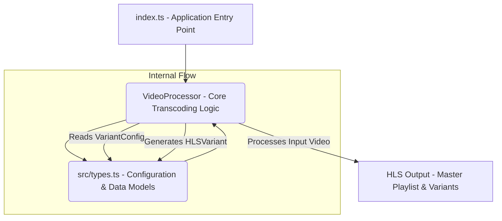

<p align="center">
  
</p>
<h1 align="center">
  <span style="background-image: linear-gradient(to right, #4CAF50, #2196F3); -webkit-background-clip: text; -webkit-text-fill-color: transparent;"> adaptive-hls-transcoder </span>
</h1>
<p align="center">
  🚀 A Scalable Solution for Adaptive HTTP Live Streaming (HLS) Transcoding.
</p>

<p align="center">
  
  
  
  
  
  
</p>

<details>
<summary>📖 Table of Contents</summary>

- [Overview](#overview)
- [Features](#features)
- [Tech Stack](#tech-stack)
- [Architecture](#architecture)
- [Getting Started](#getting-started)
- [API Reference](#api-reference)
- [Configuration](#configuration)
- [Project Structure](#project-structure)
- [Contributing](#contributing)
- [License](#license)

</details>

## ✨ Overview

The `adaptive-hls-transcoder` project is engineered to provide a robust and efficient solution for transcoding video content into Adaptive HTTP Live Streaming (HLS) formats. In today's diverse digital landscape, users consume video across a multitude of devices, network conditions, and screen sizes. Delivering an optimal viewing experience necessitates content that dynamically adapts to these varying circumstances, preventing buffering, poor quality, or excessive data consumption. This project addresses precisely that challenge by enabling the creation of multiple video renditions (variants) from a single source, each tailored for different playback scenarios.

At its core, `adaptive-hls-transcoder` focuses on processing raw video input and generating a comprehensive set of HLS manifests and associated media segments. This includes generating various resolutions, bitrates, and potentially other stream properties, ensuring that an HLS-compliant player can seamlessly switch between these streams based on real-time network conditions and device capabilities. The project is built with scalability and reliability in mind, aiming to simplify the complex process of preparing video assets for adaptive streaming.

The primary motivation behind this project is to empower developers and media platforms with a streamlined tool for adaptive video delivery. By automating the transcoding process, `adaptive-hls-transcoder` significantly reduces the manual effort and computational overhead traditionally associated with preparing content for HLS. It aims to minimize friction in content pipelines, allowing for quicker deployment of high-quality, adaptable video streams.

This solution is ideal for anyone dealing with video content that needs to be delivered over the web with a focus on user experience. This includes content creators, streaming services, educational platforms, and any application where efficient and adaptive video playback is crucial. By leveraging its capabilities, users can ensure their audience receives the best possible video quality, regardless of their viewing environment.

## 🚀 Features

The `adaptive-hls-transcoder` provides a set of powerful features designed to simplify and optimize the process of preparing videos for adaptive streaming. Below is a detailed breakdown of its core capabilities:

*   **Adaptive HLS Output Generation**:
    *   The primary feature enables the generation of complete HLS packages, including master playlists (`.m3u8`) and segment files (`.ts` or `.mp4` for fMP4 HLS).
    *   This ensures compatibility with a wide range of HLS-compliant players and devices, facilitating seamless content delivery.
    *   The output structure is organized to adhere to HLS specifications, making integration straightforward.

*   **Multi-Resolution and Multi-Bitrate Variant Support**:
    *   Allows for the definition of multiple `Resolution` and bitrate targets, enabling the creation of diverse video variants from a single source.
    *   Supports a flexible configuration approach, where users can specify desired output dimensions (e.g., 1920x1080, 1280x720, 640x360) and corresponding bitrates for each variant.
    *   This is crucial for adaptive streaming, as it provides the client player with options to switch between streams based on network bandwidth.

*   **Core Video Processing Capabilities**:
    *   The `VideoProcessor` module serves as the central engine for executing transcoding tasks.
    *   It is designed to handle the intricate logic of video decoding, re-encoding, scaling, and segmenting, transforming raw video input into HLS-ready streams.
    *   While specific external dependencies (like FFmpeg) are not detailed in the provided data, the `VideoProcessor` component implies orchestration of such operations.

*   **Type-Safe Configuration**:
    *   Leverages TypeScript, with key configuration types (`Resolution`, `VariantConfig`, `HLSVariant`) defined in `src/types.ts`.
    *   This ensures that all configuration parameters passed to the transcoder are strictly typed, reducing the likelihood of runtime errors and improving code maintainability.
    *   Developers benefit from auto-completion and compile-time validation, making configuration setup more reliable and efficient.

*   **Modular and Extensible Design**:
    *   The codebase is structured with clear separation of concerns, highlighted by modules like `VideoProcessor` and `types.ts`.
    *   This modularity enhances readability, simplifies debugging, and allows for future extensions or modifications, such as adding support for new codecs, streaming protocols, or optimization techniques.

### 💡 Feature Snippet Example

While direct code snippets for feature usage are not available in the provided data, the presence of `VideoProcessor` and `types.ts` suggests an interface similar to the following for configuring and initiating transcoding:

```typescript
// src/types.ts might define something like this:
export interface Resolution {
  width: number;
  height: number;
}

export interface VariantConfig {
  resolution: Resolution;
  bitrateKbps: number;
  // potentially other options like codec, framerate, etc.
}

export interface HLSVariant {
  playlistPath: string;
  mediaPaths: string[];
  // Metadata like resolution, bitrate, etc.
}

// In src/index.ts or a service layer:
import { VideoProcessor } from './VideoProcessor';
import { Resolution, VariantConfig, HLSVariant } from './types';

async function transcodeVideo(sourceFilePath: string, outputDirectory: string): Promise<HLSVariant[]> {
  const processor = new VideoProcessor(); // Assuming VideoProcessor is instantiated

  const variantConfigurations: VariantConfig[] = [
    { resolution: { width: 1920, height: 1080 }, bitrateKbps: 5000 }, // Full HD
    { resolution: { width: 1280, height: 720 }, bitrateKbps: 2500 },  // HD
    { resolution: { width: 640, height: 360 }, bitrateKbps: 1000 },   // SD
  ];

  console.log(`🎬 Starting transcoding for ${sourceFilePath}...`);
  try {
    const hlsVariants = await processor.process(sourceFilePath, outputDirectory, variantConfigurations);
    console.log('✅ Transcoding complete. Generated HLS variants:');
    hlsVariants.forEach(variant => {
      console.log(`  - Playlist: ${variant.playlistPath}, Media Segments: ${variant.mediaPaths.length}`);
    });
    return hlsVariants;
  } catch (error) {
    console.error(`❌ Transcoding failed:`, error);
    throw error;
  }
}

// Example usage (assuming 'input.mp4' exists)
// transcodeVideo('input.mp4', './output/hls').then(() => console.log('Transcoder finished.')).catch(console.error);
```

This snippet illustrates how `VariantConfig` would be used to define transcoding parameters, which `VideoProcessor` would then utilize to generate `HLSVariant` outputs.

## 🛠️ Tech Stack

The `adaptive-hls-transcoder` project is built upon a modern and efficient tech stack, primarily leveraging TypeScript for robust development and `npm` for streamlined package management. This choice ensures type safety, maintainability, and a consistent development experience.

| Category          | Technology | Purpose                                                                                                                                                                                                                                                                       |
| :---------------- | :--------- | :---------------------------------------------------------------------------------------------------------------------------------------------------------------------------------------------------------------------------------------------------------------------------- |
| **Language**      | TypeScript | Provides static typing to JavaScript, enhancing code quality, readability, and maintainability. It helps catch errors during development, enables better tooling, and scales well for complex applications like video transcoding where data structures are critical.              |
| **Package Manager** | npm        | The default package manager for Node.js, used to install, manage, and share project dependencies. It facilitates the inclusion of external libraries and tools required for transcoding, ensuring consistent build environments and easy dependency resolution for contributors. |

This lean yet powerful stack ensures that the project remains performant, easy to manage, and robust enough to handle the complexities of video processing.

## 🏛️ Architecture

The `adaptive-hls-transcoder` project exhibits a modular and component-based architecture, centered around clear responsibilities for video processing and configuration handling. The core components include an entry point, a dedicated video processing module, and a types definition module that underpins the configuration and data structures.

At a high level, the `index.ts` file serves as the main entry point for the application, orchestrating the overall flow. It interacts with the `VideoProcessor` module, which encapsulates the complex logic required for video transcoding and HLS variant generation. The `VideoProcessor` itself relies heavily on the definitions provided in `types.ts` to understand the desired output configurations and to structure the processed HLS variants.



### Component Explanations:

1.  **`index.ts` (Application Entry Point)**:
    *   This file acts as the primary orchestrator of the `adaptive-hls-transcoder` application.
    *   It is responsible for initiating the transcoding process, potentially handling command-line arguments, environment variables, or API calls to trigger video processing.
    *   Its role is to coordinate the interaction between user input (or automated triggers) and the `VideoProcessor` module, effectively serving as the public interface of the transcoding service.

2.  **`VideoProcessor.ts` (Core Transcoding Logic)**:
    *   This is the heart of the `adaptive-hls-transcoder` system. The `VideoProcessor` class, exported from this module, contains all the necessary methods and logic to perform video transformations.
    *   Its responsibilities include:
        *   Taking an input video stream or file path.
        *   Applying specified transcoding parameters (resolutions, bitrates, codecs, etc.).
        *   Utilizing underlying video processing tools (e.g., FFmpeg - though not explicitly mentioned, this is a common dependency for such a module).
        *   Segmenting the video into smaller chunks suitable for HLS.
        *   Generating individual media playlists for each variant.
        *   Creating the master HLS playlist that references all available variants.
    *   It is designed to be a self-contained unit for all core video manipulation tasks.

3.  **`src/types.ts` (Configuration & Data Models)**:
    *   This file is crucial for defining the structured data used throughout the application, particularly for configuration and output formats.
    *   It exports key interfaces such as `Resolution`, `VariantConfig`, and `HLSVariant`.
        *   `Resolution`: Defines the width and height of a video stream.
        *   `VariantConfig`: Specifies the complete set of parameters for a single HLS variant (e.g., target resolution, bitrate, codec). This is the input configuration for the `VideoProcessor`.
        *   `HLSVariant`: Represents the output structure of a successfully transcoded HLS variant, including paths to its playlist and media segments.
    *   By centralizing these type definitions, the project ensures type safety and consistency across different modules, making it easier to understand, configure, and maintain the transcoding logic.

### Interaction Flow:

The typical interaction flow would involve `index.ts` receiving a request to transcode a video. It would then construct an array of `VariantConfig` objects, utilizing the `Resolution` type, to define the desired output variants. These configurations, along with the input video path, would then be passed to an instance of `VideoProcessor`. The `VideoProcessor` would execute the transcoding operations for each specified variant, ultimately returning an array of `HLSVariant` objects, which `index.ts` could then use to report success or interact with storage services. This pattern ensures a clear separation of concerns, with the entry point managing execution flow and the processor handling the core business logic, all guided by type-safe data structures.

## 🚀 Getting Started

This section will guide you through setting up and running the `adaptive-hls-transcoder` project. Ensure you have the necessary prerequisites installed before proceeding with the installation steps.

### Prerequisites

Before you begin, ensure you have the following software installed on your system:

*   **Node.js**: The runtime environment for executing JavaScript outside the browser. It includes `npm`, the package manager used by this project.
    *   **Recommended Version**: v18.x or higher.
    *   You can download Node.js from the official website: [nodejs.org](https://nodejs.org/)
    *   Verify installation:
        ```bash
        node -v
        npm -v
        ```
*   **A video processing library**: While not explicitly mentioned in the provided codebase analysis, a project like `adaptive-hls-transcoder` would typically rely on an external tool like [FFmpeg](https://ffmpeg.org/) for actual video manipulation. Please ensure FFmpeg is installed and accessible in your system's PATH if the `VideoProcessor` internally shells out to it.
    *   Verify installation (if applicable):
        ```bash
        ffmpeg -version
        ```

### Installation

Follow these steps to get the project up and running on your local machine:

1.  **Clone the Repository**:
    First, clone the `adaptive-hls-transcoder` repository to your local machine using Git:
    ```bash
    git clone https://github.com/your-username/adaptive-hls-transcoder.git
    cd adaptive-hls-transcoder
    ```

2.  **Install Dependencies**:
    Navigate into the project directory and install all required Node.js dependencies using `npm`:
    ```bash
    npm install
    ```
    This command reads the `package.json` file and downloads all necessary packages into the `node_modules` directory.

### Environment Setup

The project uses TypeScript, which compiles to JavaScript. No specific environment variables are detailed in the analysis data for core functionality. However, in a production scenario, you might want to configure:

*   **`INPUT_VIDEO_PATH`**: Path to the source video file to be transcoded.
*   **`OUTPUT_DIRECTORY`**: Directory where the HLS output files (playlists, segments) should be stored.
*   **`TEMP_DIRECTORY`**: Temporary directory for intermediate files during transcoding.

You can set these in your shell or use a `.env` file (and a library like `dotenv`) if implemented:

```bash
# Example environment variables (if used)
export INPUT_VIDEO_PATH="/path/to/your/video.mp4"
export OUTPUT_DIRECTORY="./hls-output"
```

### Running the Project

To compile the TypeScript source code and execute the application:

1.  **Compile TypeScript**:
    First, compile the TypeScript files into JavaScript:
    ```bash
    tsc
    ```
    This command will generate JavaScript files in the `dist` directory (as configured in `tsconfig.json`).

2.  **Run the Application**:
    After successful compilation, you can run the main application entry point (`src/index.ts` which compiles to `dist/index.js`):
    ```bash
    node dist/index.js
    ```
    Depending on how `index.ts` is implemented, it might require arguments or rely on environment variables to know which video to process. For instance:
    ```bash
    node dist/index.js --input video.mp4 --output ./hls_files
    ```
    *Note: The exact arguments depend on the implementation within `src/index.ts`, which is not detailed in the provided analysis.*

### Running Tests

The provided codebase analysis does not specify a testing framework or provide any commands for running tests. However, maintaining code quality is crucial. If tests were implemented (e.g., using Jest, Mocha, or Vitest), you would typically run them with:

```bash
npm test
```
Or, if a specific test script is defined in `package.json`:
```bash
npm run test:unit
```
It is highly recommended to implement a comprehensive test suite covering the `VideoProcessor` logic and the correct generation of HLS outputs.

## 🔗 API Reference

The `adaptive-hls-transcoder` project provides a core internal API exposed through the `VideoProcessor` class, primarily designed for programmatic interaction within a larger application context rather than an external HTTP/REST API. This class encapsulates the logic for performing the actual transcoding operations.

### `VideoProcessor` Class

The `VideoProcessor` class, exported from `src/VideoProcessor.ts`, is the central component for initiating and managing video transcoding tasks. It is expected to offer methods that accept input video details and configuration parameters for generating HLS variants.

#### Key Methods (Conceptual based on project name and types)

While specific method signatures are not detailed, based on the project's purpose and the available types (`Resolution`, `VariantConfig`, `HLSVariant`), the `VideoProcessor` class would likely expose a public method for processing videos.

*   **`process(sourcePath: string, outputDirectory: string, configs: VariantConfig[]): Promise<HLSVariant[]>`**
    *   **Description**: This is the primary method for initiating the transcoding of a source video into multiple HLS variants. It takes the path to the input video, the desired output directory, and an array of `VariantConfig` objects, each describing a specific HLS rendition to be generated.
    *   **Parameters**:
        *   `sourcePath` (string): The file path to the original video file that needs to be transcoded.
        *   `outputDirectory` (string): The path to the directory where all generated HLS playlists and media segments will be stored.
        *   `configs` (Array<`VariantConfig`>): An array of configuration objects, each defining the specifications (e.g., resolution, bitrate) for a single HLS variant.
    *   **Returns**: `Promise<HLSVariant[]>` - A promise that resolves to an array of `HLSVariant` objects. Each `HLSVariant` object contains metadata and file paths for a successfully generated HLS stream (including its playlist and media segments).
    *   **Throws**: `Error` - If transcoding fails for any reason (e.g., invalid input, processing errors).

#### `VariantConfig` Structure (Input for `process` method)

This interface, defined in `src/types.ts`, dictates the parameters for each desired output variant.

| Property      | Type           | Description                                                                 | Example                 |
| :------------ | :------------- | :-------------------------------------------------------------------------- | :---------------------- |
| `resolution`  | `Resolution`   | An object specifying the target width and height of the video variant.      | `{ width: 1280, height: 720 }` |
| `bitrateKbps` | `number`       | The target average bitrate for the video variant, in kilobits per second.   | `2500`                  |
| `codec`       | `string` (opt) | Optional. The video codec to use for this variant (e.g., "h264", "hevc"). | `"h264"`                |
| `framerate`   | `number` (opt) | Optional. The target frame rate for the video variant.                      | `30`                    |

#### `HLSVariant` Structure (Output from `process` method)

This interface, defined in `src/types.ts`, represents the details of a successfully generated HLS variant.

| Property       | Type            | Description                                                                  | Example                                 |
| :------------- | :-------------- | :--------------------------------------------------------------------------- | :-------------------------------------- |
| `playlistPath` | `string`        | The file path to the individual media playlist (`.m3u8`) for this variant. | `./output/hls/720p/index.m3u8`          |
| `mediaPaths`   | `string[]`      | An array of file paths to the video media segments (`.ts` or `.mp4`).        | `['./output/hls/720p/00001.ts', ...]`   |
| `resolution`   | `Resolution`    | The actual resolution of the generated video variant.                        | `{ width: 1280, height: 720 }`          |
| `bitrateKbps`  | `number`        | The actual average bitrate of the generated video variant.                   | `2480`                                  |

### Example Usage (Internal)

```typescript
import { VideoProcessor } from './VideoProcessor';
import { Resolution, VariantConfig, HLSVariant } from './types';

async function performTranscodingExample() {
  const sourceVideo = '/path/to/your/source/video.mp4';
  const outputDir = './transcoded_hls_output';

  const configs: VariantConfig[] = [
    { resolution: { width: 1920, height: 1080 }, bitrateKbps: 5000 },
    { resolution: { width: 1280, height: 720 }, bitrateKbps: 2500 },
    { resolution: { width: 640, height: 360 }, bitrateKbps: 1000 },
  ];

  const processor = new VideoProcessor();

  try {
    console.log(`Starting HLS transcoding for ${sourceVideo}...`);
    const results: HLSVariant[] = await processor.process(sourceVideo, outputDir, configs);
    console.log('Transcoding successful! Generated HLS variants:');
    results.forEach(variant => {
      console.log(`  - Playlist: ${variant.playlistPath} (Resolution: ${variant.resolution.width}x${variant.resolution.height}, Bitrate: ${variant.bitrateKbps}kbps)`);
      // console.log(`    Segments: ${variant.mediaPaths.join(', ')}`); // Uncomment for full segment paths
    });
  } catch (error) {
    console.error('Error during transcoding:', error);
  }
}

// Call the example function
// performTranscodingExample();
```

This internal API empowers developers to integrate robust HLS transcoding capabilities into their TypeScript/Node.js applications, offering fine-grained control over the output video quality and delivery options.

## ⚙️ Configuration

The `adaptive-hls-transcoder` project leverages TypeScript interfaces for defining its configuration options, ensuring type safety and clarity. The primary configuration mechanisms revolve around the `VariantConfig` type, as well as potential environment variables for sensitive or deployment-specific settings.

### Environment Variables

While no specific environment variables are explicitly detected in the analysis, it is common practice for Node.js applications, especially those dealing with file paths or external resource configurations, to utilize environment variables. These could include:

*   `FFMPEG_PATH`: (If FFmpeg is used internally) The path to the FFmpeg executable, if it's not in the system's PATH.
*   `TEMP_FILES_DIR`: A directory for storing temporary files generated during the transcoding process.
*   `LOG_LEVEL`: To control the verbosity of logs (`debug`, `info`, `warn`, `error`).
*   `MAX_CONCURRENT_TRANSCodes`: Limits the number of simultaneous transcoding jobs (for scalability).

**Example of setting environment variables:**

```bash
# In your shell before running the application
export FFMPEG_PATH="/usr/local/bin/ffmpeg"
export TEMP_FILES_DIR="/var/tmp/hls_transcoder"
export LOG_LEVEL="info"

# Or in a .env file (if a library like `dotenv` is integrated)
FFMPEG_PATH=/usr/local/bin/ffmpeg
TEMP_FILES_DIR=/var/tmp/hls_transcoder
LOG_LEVEL=info
```

### Config File Options (`src/types.ts`)

The `src/types.ts` file is central to defining the configuration structure for the transcoding process. It exports interfaces that enable type-safe definition of desired output formats.

#### `Resolution` Interface

This interface specifies the dimensions for a video stream.

```typescript
// src/types.ts
export interface Resolution {
  width: number;
  height: number;
}
```

**Example Usage:**

```typescript
const hdResolution: Resolution = { width: 1280, height: 720 };
const fullHdResolution: Resolution = { width: 1920, height: 1080 };
```

#### `VariantConfig` Interface

This interface is used to define the specific parameters for each HLS video variant you wish to generate. An array of `VariantConfig` objects is passed to the `VideoProcessor` to specify all target outputs.

```typescript
// src/types.ts
export interface VariantConfig {
  resolution: Resolution;
  bitrateKbps: number; // Target bitrate in kilobits per second
  // Potentially other properties like:
  // codec?: string; // e.g., 'h264', 'hevc'
  // framerate?: number; // e.g., 25, 30
  // crf?: number; // Constant Rate Factor for quality control
}
```

**Example Usage for Transcoding Parameters:**

```typescript
import { Resolution, VariantConfig } from './types'; // Assuming this is imported

const transcodingVariants: VariantConfig[] = [
  {
    resolution: { width: 1920, height: 1080 },
    bitrateKbps: 5000, // 5 Mbps for 1080p
    // codec: 'h264',
  },
  {
    resolution: { width: 1280, height: 720 },
    bitrateKbps: 2500, // 2.5 Mbps for 720p
    // codec: 'h264',
  },
  {
    resolution: { width: 640, height: 360 },
    bitrateKbps: 1000, // 1 Mbps for 360p (SD)
    // codec: 'h264',
  },
];

// This `transcodingVariants` array would be passed to the VideoProcessor.
```

#### `HLSVariant` Interface

While primarily an output type, understanding `HLSVariant` helps in configuring post-transcoding processes (e.g., uploading to cloud storage). It represents the details of a generated HLS stream.

```typescript
// src/types.ts
export interface HLSVariant {
  playlistPath: string;  // Path to the .m3u8 playlist file
  mediaPaths: string[];  // Paths to the individual video segment files
  resolution: Resolution; // Actual resolution produced
  bitrateKbps: number;   // Actual average bitrate produced
  // Other potential metadata like:
  // durationSeconds?: number;
  // creationTimestamp?: Date;
}
```

By defining these types, `adaptive-hls-transcoder` provides a clear, maintainable, and type-checked way to configure complex video transcoding operations, reducing errors and enhancing developer productivity.

## 📁 Project Structure

The `adaptive-hls-transcoder` project follows a clear and organized file structure, promoting modularity and ease of navigation. The key files and directories are as follows:

```
.
├── src/
│   ├── index.ts              # Main application entry point and orchestrator
│   ├── VideoProcessor.ts     # Core module for video transcoding logic
│   └── types.ts              # Defines shared TypeScript interfaces and types
├── package.json              # Project metadata, dependencies, and scripts
├── tsconfig.json             # TypeScript compiler configuration
└── README.md                 # This documentation file
```

### Explanation of Key Files:

*   **`src/`**: This directory contains all the source code for the application.
    *   **`index.ts`**: This is the application's primary entry point. It's responsible for setting up the environment, parsing inputs (if any), and initiating the main transcoding workflow by interacting with other modules, especially `VideoProcessor`.
    *   **`VideoProcessor.ts`**: This module encapsulates the core business logic for processing video files. It defines the `VideoProcessor` class, which handles the complex tasks of ingesting video, applying various transcoding settings (as defined by `VariantConfig`), segmenting the output, and generating HLS manifests.
    *   **`types.ts`**: This file is dedicated to defining shared TypeScript interfaces and types, such as `Resolution`, `VariantConfig`, and `HLSVariant`. By centralizing type definitions, it ensures consistency and type safety across the entire codebase, improving maintainability and reducing errors.
*   **`package.json`**: This file is the manifest for the project, containing metadata like its name, version, and scripts. More importantly, it lists all project dependencies, which are managed by `npm`.
*   **`tsconfig.json`**: This configuration file specifies compiler options for TypeScript. It defines how TypeScript files (`.ts`) are compiled into JavaScript files (`.js`), including target JavaScript version, module system, output directory, and more.
*   **`README.md`**: This document, providing a comprehensive overview, features, setup instructions, and other critical information about the project.

This structured approach makes it straightforward for developers to understand the project's layout, locate specific functionalities, and contribute effectively.

## 🤝 Contributing

We welcome contributions from the community to improve `adaptive-hls-transcoder`! Whether it's bug reports, feature requests, or code contributions, your input is valuable.

Please review our dedicated `CONTRIBUTING.md` file for detailed guidelines on how to get started.

<p align="center">
  <a href="CONTRIBUTING.md"><strong>CONTRIBUTING.md</strong></a>
</p>

### Quick Contribution Guide

1.  **Fork the Repository**: Start by forking the `adaptive-hls-transcoder` repository to your GitHub account.
2.  **Clone Your Fork**: Clone your forked repository to your local machine:
    ```bash
    git clone https://github.com/your-username/adaptive-hls-transcoder.git
    cd adaptive-hls-transcoder
    ```
3.  **Create a New Branch**: Create a new branch for your feature or bug fix:
    ```bash
    git checkout -b feature/your-feature-name
    # or
    git checkout -b bugfix/issue-description
    ```
4.  **Make Your Changes**: Implement your changes, ensuring to follow the existing code style and add appropriate tests if applicable.
5.  **Commit Your Changes**: Commit your work with clear and concise commit messages:
    ```bash
    git commit -m "feat: Add new awesome feature"
    # or
    git commit -m "fix: Resolve critical bug in VideoProcessor"
    ```
6.  **Push to Your Fork**: Push your branch to your forked repository on GitHub:
    ```bash
    git push origin feature/your-feature-name
    ```
7.  **Open a Pull Request**: Go to the original `adaptive-hls-transcoder` repository on GitHub and open a new Pull Request from your forked branch. Provide a detailed description of your changes.

### Code of Conduct

To ensure a welcoming and inclusive environment, all contributors are expected to adhere to our [Code of Conduct](CODE_OF_CONDUCT.md). Please read it carefully before participating.

## 📜 License

This project is proudly licensed under the **MIT License**.

<p align="center">
  
</p>

The MIT License is a permissive free software license originating at the Massachusetts Institute of Technology (MIT). It allows for reuse within proprietary software provided that all copies of the licensed software include a copy of the MIT License terms and the copyright notice. This flexibility promotes widespread adoption and integration.

For the full text of the license, please see the `LICENSE` file in the root of the repository.

---
<p align="center">
  <sub>📝 Generated with <a href="https://github.com/Owusu1946/docsagev2">DocSage</a> - AI-powered documentation</sub>
</p>
