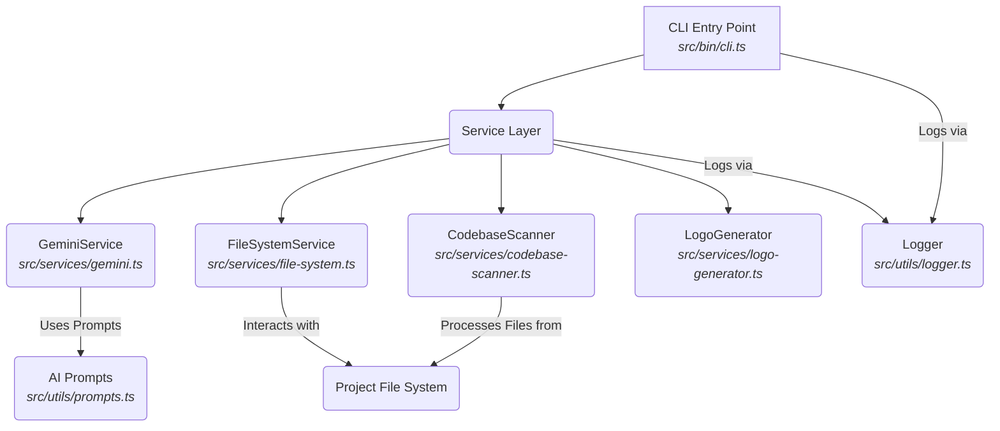

<p align="center">
  
</p>
<h1 align="center">
  
</h1>
<p align="center">
  An advanced AI-powered CLI tool for generating comprehensive documentation from your codebase.
</p>

<p align="center">
  <a href="https://www.npmjs.com/package/docsagev2" target="_blank">
    
  </a>
  <a href="https://www.npmjs.com/package/docsagev2" target="_blank">
    
  </a>
  <a href="./LICENSE" target="_blank">
    
  </a>
  
  
  
  
</p>

<details>
<summary>📖 Table of Contents</summary>

- [Overview](#overview)
- [Features](#features)
- [Tech Stack](#tech-stack)
- [Architecture](#architecture)
- [Getting Started](#getting-started)
- [API Reference](#api-reference)
- [Configuration](#configuration)
- [Project Structure](#project-structure)
- [Contributing](#contributing)
- [License](#license)

</details>

---

## 👋 Overview

`docsagev2` is a robust and intelligent command-line interface (CLI) tool meticulously engineered to automate the generation of essential project documentation. Leveraging the power of cutting-edge AI, specifically integrating with services like Gemini, it processes your codebase to produce high-quality, contextually relevant `README.md`, `CONTRIBUTING.md`, and `LICENSE` files. This project aims to significantly streamline the documentation process, empowering developers and project maintainers to focus on code rather than the often-tedious task of manual document creation.

The project addresses a common pain point in software development: the lack of comprehensive and up-to-date documentation. By analyzing the project's structure, files, and even key content, `docsagev2` intelligently infers the project's purpose, features, and technical stack. This analysis forms the basis for rich, detailed, and accurate documentation, ensuring that every project comes with a robust set of introductory and governance documents from the outset.

What sets `docsagev2` apart is its deep integration with the codebase itself. Instead of relying on generic templates, it utilizes a sophisticated codebase scanner to build a dependency graph and understand the project's essence. This enables it to generate documentation that is not only well-structured but also highly specific to your project's nuances. Furthermore, its ability to generate custom logos adds a unique branding touch, making your project stand out.

This tool is designed for a wide audience, including solo developers, open-source project maintainers, and development teams of all sizes. Anyone looking to enhance their project's discoverability, onboarding experience, and maintainability through automated, AI-driven documentation will find `docsagev2` an invaluable asset. It reduces human error, promotes consistency across multiple projects, and ultimately saves precious development time, allowing teams to deliver more polished and professional projects faster.

## ✨ Features

`docsagev2` comes packed with a suite of powerful features designed to make documentation generation effortless and intelligent.

| Feature Category | Feature Name                  | Description                                                                                                                                                                                                                                                                                                                                                                                                                                                   | Example Usage                                                                                                                                                                                                                                                                                                      |
| :--------------- | :---------------------------- | :------------------------------------------------------------------------------------------------------------------------------------------------------------------------------------------------------------------------------------------------------------------------------------------------------------------------------------------------------------------------------------------------------------------------------------------------------------- | :----------------------------------------------------------------------------------------------------------------------------------------------------------------------------------------------------------------------------------------------------------------------------------------------------------------- |
| **AI Generation** | **Comprehensive README**      | Automatically generates a detailed `README.md` by analyzing the project's structure, purpose, features, and dependencies. It leverages AI prompts (`README_PROMPT` from `src/utils/prompts.ts`) to craft an engaging and informative overview.                                                                                                                                                                                                                    | ```bash<br>npx docsagev2 generate --type readme<br>```                                                                                                                                                                                                                                                               |
|                  | **Contributing Guide**        | Produces a standard `CONTRIBUTING.md` file, outlining guidelines for potential contributors. This ensures consistency and clarity for anyone wishing to get involved, using `CONTRIBUTING_PROMPT` for AI guidance.                                                                                                                                                                                                                                              | ```bash<br>npx docsagev2 generate --type contributing<br>```                                                                                                                                                                                                                                                        |
|                  | **License File**              | Generates a `LICENSE` file based on the specified license (e.g., MIT, as used in this README). It utilizes `LICENSE_PROMPT` to ensure legal accuracy and proper formatting.                                                                                                                                                                                                                                                                                          | ```bash<br>npx docsagev2 generate --type license --license MIT<br>```                                                                                                                                                                                                                                             |
| **Codebase Analysis** | **Project Structure Scanning** | Scans the entire project directory to understand its layout and identify key files and folders. This information is crucial for generating accurate documentation and is handled by `src/services/file-system.ts`.                                                                                                                                                                                                                                               | _Internal operation invoked by the CLI._ <br>The `getProjectStructure` function recursively lists files and directories.                                                                                                                                                                                                  |
|                  | **Key File Content Extraction** | Extracts and summarizes content from important project files (`package.json`, `tsconfig.json`, `src/services/*.ts`, etc.) to provide context for the AI model. This intelligent content retrieval is managed by `src/services/file-system.ts`.                                                                                                                                                                                                                       | _Internal operation invoked by the CLI._ <br>The `getKeyFilesContent` function reads and processes file data to inform the AI.                                                                                                                                                                                          |
|                  | **Dependency Graph Generation** | Analyzes file imports and exports to construct a dependency graph, providing a deeper understanding of how components interact within the codebase. This sophisticated analysis is carried out by `src/services/codebase-scanner.ts`.                                                                                                                                                                                                                              | _Internal operation invoked by the CLI._ <br>The `DependencyGraph` and `DependencyEdge` structures map relationships.                                                                                                                                                                                               |
| **Utility & Integration** | **AI Model Integration**      | Seamlessly integrates with AI models (specifically Google Gemini via `src/services/gemini.ts`) to process codebase information and generate human-like documentation text based on sophisticated prompts.                                                                                                                                                                                                                                                        | _Requires `GEMINI_API_KEY` to be set in the environment._ <br>The `GeminiService` handles all interactions with the AI API for content generation.                                                                                                                                                                        |
|                  | **Custom Logo Generation**    | Offers the unique ability to generate a project-specific logo based on provided options or inferred project themes. This visual asset (`src/services/logo-generator.ts`) can be a powerful branding element for your repository.                                                                                                                                                                                                                                  | ```typescript<br>// Example of logo options (from src/services/logo-generator.ts)<br>interface LogoOptions {<br>  text: string;<br>  color?: string;<br>  backgroundColor?: string;<br>  shape?: 'circle' | 'square';<br>}<br>// Invoked internally by CLI to generate assets/logo.svg<br>``` |
|                  | **Structured Logging**        | Implements a structured logging system (`src/utils/logger.ts`) to provide clear, actionable feedback during the documentation generation process, aiding in debugging and understanding execution flow.                                                                                                                                                                                                                                                              | ```typescript<br>// Example usage within the codebase<br>import { logger } from '../utils/logger';<br>logger.info('Starting documentation generation...');<br>```                                                                                                                                         |
|                  | **TypeScript Support**        | Entirely built with TypeScript, ensuring type safety, better code maintainability, and improved developer experience. The `tsconfig.json` file dictates compilation rules.                                                                                                                                                                                                                                                                                         | `tsconfig.json` defines how the TypeScript project is compiled.                                                                                                                                                                                                                                    |

## 🛠️ Tech Stack

`docsagev2` is built with a modern and efficient technology stack, primarily focused on TypeScript for robust development and npm for package management.

| Category          | Technology     | Purpose                                                                                                     |
| :---------------- | :------------- | :---------------------------------------------------------------------------------------------------------- |
| **Language**      | TypeScript     | Provides type safety, enhanced tooling, and better maintainability for a complex codebase.                  |
| **Package Manager** | npm            | Manages project dependencies, scripts, and package publishing.                                              |
| **AI Integration**| Gemini Service | Facilitates communication with Google's Gemini AI for natural language generation and content creation.     |
| **Core Services** | File System API| Interacts with the local file system for reading project files, scanning directories, and writing output.   |
|                   | Codebase Scanner| Analyzes project files to identify dependencies, structure, and key elements for AI contextualization.      |
|                   | Logo Generator | Programmatically creates and outputs SVG logo files based on configuration or AI insights.                  |
| **Utilities**     | Logger         | Provides structured, configurable logging for debugging, tracking execution, and user feedback.             |
|                   | Prompts        | Stores predefined AI prompts used to guide the Gemini service in generating specific documentation types.   |
| **CLI Framework** | Node.js (implied) | The underlying runtime environment for executing the TypeScript application.                                |

## 📐 Architecture

The `docsagev2` project adheres to a clear and modular architecture, primarily utilizing a **Service Layer** pattern to separate concerns and promote reusability. This design ensures that core business logic, such as AI interaction, file system operations, and codebase analysis, is encapsulated within dedicated services, which are then orchestrated by the command-line interface.

### Architectural Diagram



### Component Explanation

*   **CLI Entry Point (`src/bin/cli.ts`)**: This is the user-facing interface of `docsagev2`. It parses command-line arguments, validates input, and orchestrates calls to the underlying Service Layer based on the user's request (e.g., generating a README, contributing guide, or license). It acts as the primary client of the services.

*   **Service Layer**: This core layer encapsulates the main business logic of the application. Each service is responsible for a specific domain of functionality, promoting a clear separation of concerns.

    *   **`GeminiService` (`src/services/gemini.ts`)**: Manages all interactions with the external AI model (implied to be Google Gemini). It takes structured input, formats it according to specific AI prompts, sends requests to the AI API, and processes the AI's responses for documentation generation. It utilizes `src/utils/prompts.ts` to fetch the appropriate prompt for the content to be generated.

    *   **`FileSystemService` (`src/services/file-system.ts`)**: Handles all file system operations. This includes reading file contents, recursively listing project structures, and writing generated documentation files back to the disk. Key functions like `getProjectStructure`, `readFileContent`, and `getKeyFilesContent` are exposed here to provide data to other services.

    *   **`CodebaseScanner` (`src/services/codebase-scanner.ts`)**: This service is responsible for the deep analysis of the project's source code. It builds a `FileNode` representation of files and directories and can construct a `DependencyGraph` by analyzing import/export statements. This detailed understanding of the codebase is then fed to the `GeminiService` for highly contextual documentation.

    *   **`LogoGenerator` (`src/services/logo-generator.ts`)**: A specialized service dedicated to creating and outputting SVG logo files. It takes `LogoOptions` and produces a visual asset, often based on project name or inferred themes, providing a unique branding element.

*   **Utilities (`src/utils`)**: These modules provide cross-cutting concerns and helper functions used by the services.

    *   **`AI Prompts` (`src/utils/prompts.ts`)**: Stores the predefined, structured prompts that guide the AI model for generating specific types of documentation (e.g., `README_PROMPT`, `CONTRIBUTING_PROMPT`, `LICENSE_PROMPT`). This centralizes prompt management and makes them easily modifiable.

    *   **`Logger` (`src/utils/logger.ts`)**: Provides a unified logging mechanism for the entire application. It allows for structured logging, making it easier to track the application's flow, debug issues, and provide informative feedback to the user.

### Interaction Flow

1.  The user executes a command via `src/bin/cli.ts`.
2.  The CLI determines the requested action (e.g., `generate readme`).
3.  It then calls upon the `FileSystemService` to scan the project and gather relevant code snippets and the project structure.
4.  The `CodebaseScanner` further processes this information to understand dependencies.
5.  This synthesized information, along with the appropriate prompt from `src/utils/prompts.ts`, is passed to the `GeminiService`.
6.  The `GeminiService` interacts with the external AI, receives the generated content, and returns it.
7.  Optionally, if logo generation is requested, the `LogoGenerator` is invoked.
8.  Finally, the CLI uses the `FileSystemService` to write the generated documentation and/or logo files to the project directory.
9.  Throughout this process, the `Logger` is utilized to provide progress updates and error messages.

This service-oriented architecture ensures high modularity, testability, and maintainability, allowing for easy expansion and integration of new features or AI models in the future.

## 🚀 Getting Started

To get `docsagev2` up and running, follow these step-by-step instructions. This guide will help you install the necessary prerequisites, set up your environment, and execute the tool to generate documentation for your projects.

### Prerequisites

Before you begin, ensure you have the following software installed on your system:

*   **Node.js**: The runtime environment for `docsagev2`. While no specific version is provided, it's generally recommended to use a recent LTS (Long Term Support) version.
    *   Check if Node.js is installed:
        ```bash
        node -v
        ```
    *   If not installed, download it from [nodejs.org](https://nodejs.org/).
*   **npm**: The package manager for Node.js, which comes bundled with Node.js installations.
    *   Check if npm is installed:
        ```bash
        npm -v
        ```

### Installation

Clone the repository and install the project dependencies:

1.  **Clone the repository**:
    ```bash
    git clone https://github.com/Owusu1946/docsagev2.git
    cd docsagev2
    ```
2.  **Install dependencies**:
    ```bash
    npm install
    ```
3.  **Compile TypeScript**:
    Since `docsagev2` is built with TypeScript, you'll need to compile the source code.
    ```bash
    npm run build
    ```
    This command will create a `dist/` directory containing the compiled JavaScript files.

### Environment Setup

`docsagev2` relies on external AI services for content generation. You'll need to configure your API key.

1.  **Obtain a Gemini API Key**:
    *   If you're using Google Gemini (as implied by `src/services/gemini.ts`), obtain an API key from the Google AI Studio or Google Cloud Console.
2.  **Create a `.env` file**:
    Create a file named `.env` in the root directory of the `docsagev2` project.
    ```bash
    touch .env
    ```
3.  **Add your API Key**:
    Add your Gemini API key to the `.env` file:
    ```
    GEMINI_API_KEY=YOUR_GEMINI_API_KEY
    ```
    **Note**: Replace `YOUR_GEMINI_API_KEY` with your actual key. Ensure this file is excluded from version control (e.g., via `.gitignore`).

### Running the Project

After installation and environment setup, you can run `docsagev2` using its command-line interface.

1.  **Navigate to your project**:
    Change directory to the project for which you want to generate documentation. For example, if you want to generate documentation for a project named `my-awesome-app` located at `~/projects/my-awesome-app`, navigate into that directory.
2.  **Execute the CLI tool**:
    You can use `npx` to run the compiled CLI tool from the `docsagev2` project without globally installing it, or run directly from the `dist` directory.

    *   **Example: Generate a `README.md`**:
        ```bash
        node dist/src/bin/cli.js generate --type readme --output ./README.md --project-path .
        ```
        This command will analyze the current directory (`.`) and generate a `README.md` file in the same location.

    *   **Example: Generate a `CONTRIBUTING.md`**:
        ```bash
        node dist/src/bin/cli.js generate --type contributing --output ./CONTRIBUTING.md --project-path .
        ```

    *   **Example: Generate a `LICENSE` (MIT)**:
        ```bash
        node dist/src/bin/cli.js generate --type license --license MIT --output ./LICENSE --project-path .
        ```

    *   **Example: Generate a Logo**:
        ```bash
        node dist/src/bin/cli.js generate --type logo --output ./assets/logo.svg --project-path . --logo-text "MyApp" --logo-color "#007ACC"
        ```
        *(Note: The `logo-text` and `logo-color` options are illustrative based on `LogoOptions` from `src/services/logo-generator.ts` and may vary based on final CLI implementation.)*

### Running Tests

The provided codebase analysis does not explicitly list any test files or test commands. However, standard Node.js projects typically use a test runner like Jest or Mocha. If tests were implemented, you would typically run them with:

```bash
npm test
```
Please refer to the project's `package.json` for specific test scripts, if any are added in future iterations. For now, there are no specific test instructions provided.

## 🔗 API Reference

`docsagev2` is primarily a CLI tool and does not expose a public REST API. Its functionality is accessed programmatically through its internal services and executed via the command-line interface (`src/bin/cli.ts`). However, for developers looking to understand its internal workings or potentially integrate its components, here's an overview of the key internal "API" provided by its Service Layer.

These are not external HTTP endpoints but rather TypeScript classes and functions that orchestrate the documentation generation process.

### Internal Services (Programmatic Interfaces)

#### `GeminiService` (from `src/services/gemini.ts`)
This service is responsible for all interactions with the AI model.

*   **Exports**: `GeminiService` class
*   **Purpose**: Orchestrates sending prompts to the AI model and retrieving generated content.
*   **Key Methods (conceptual)**:
    ```typescript
    class GeminiService {
      /**
       * Initializes the GeminiService with the API key.
       * @param apiKey The API key for the Gemini model.
       */
      constructor(apiKey: string);

      /**
       * Generates content based on a given prompt and contextual data.
       * @param promptType The type of documentation to generate (e.g., 'README', 'CONTRIBUTING').
       * @param projectContext Detailed information about the project (structure, key file content, etc.).
       * @returns A promise that resolves with the generated text content.
       */
      generateContent(promptType: string, projectContext: any): Promise<string>;
    }
    ```

#### `FileSystemService` (from `src/services/file-system.ts`)
Manages all file system read/write operations for the project.

*   **Exports**: `getProjectStructure`, `readFileContent`, `getKeyFilesContent` functions
*   **Purpose**: Provides utilities to interact with the local file system.
*   **Key Methods**:
    ```typescript
    /**
     * Recursively retrieves the structure of a project directory.
     * @param projectPath The root path of the project.
     * @returns A promise resolving to a tree-like structure of files and directories.
     */
    function getProjectStructure(projectPath: string): Promise<any>;

    /**
     * Reads the content of a specified file.
     * @param filePath The path to the file to read.
     * @returns A promise resolving to the file's content as a string.
     */
    function readFileContent(filePath: string): Promise<string>;

    /**
     * Reads and aggregates content from key project files for AI context.
     * @param projectPath The root path of the project.
     * @param keyFiles An array of relative paths to key files.
     * @returns A promise resolving to an object containing content of key files.
     */
    function getKeyFilesContent(projectPath: string, keyFiles: string[]): Promise<any>;
    ```

#### `CodebaseScanner` (from `src/services/codebase-scanner.ts`)
Analyzes the codebase to understand its internal structure and dependencies.

*   **Exports**: `FileNode`, `DependencyEdge`, `DependencyGraph` classes/interfaces
*   **Purpose**: Builds an abstract representation of the codebase's architecture.
*   **Key Classes/Methods (conceptual)**:
    ```typescript
    interface FileNode {
      path: string;
      isDirectory: boolean;
      // ... other metadata
    }

    interface DependencyEdge {
      source: string; // path of the importing file
      target: string; // path of the imported file
      type: 'import' | 'require';
    }

    class DependencyGraph {
      /**
       * Constructs a dependency graph by analyzing project files.
       * @param projectPath The root path of the project.
       * @returns A graph representation of file dependencies.
       */
      buildGraph(projectPath: string): Promise<DependencyGraph>;
      // ... methods to query dependencies, find entry points, etc.
    }
    ```

#### `LogoGenerator` (from `src/services/logo-generator.ts`)
Handles the creation of project logos.

*   **Exports**: `LogoOptions`, `GeneratedLogo` interfaces; `generateLogo` function.
*   **Purpose**: Programmatically creates SVG logos based on configurable options.
*   **Key Interfaces & Function**:
    ```typescript
    interface LogoOptions {
      text: string;
      color?: string;
      backgroundColor?: string;
      shape?: 'circle' | 'square' | 'none';
      // ... other visual properties
    }

    interface GeneratedLogo {
      svgContent: string;
      // ... other metadata like file path
    }

    /**
     * Generates an SVG logo based on the provided options.
     * @param options Configuration for the logo (text, colors, shape).
     * @returns A promise resolving to the generated logo content.
     */
    function generateLogo(options: LogoOptions): Promise<GeneratedLogo>;
    ```

These internal interfaces form the backbone of `docsagev2`'s functionality, allowing for modular development and clear responsibility assignment within the application.

## ⚙️ Configuration

`docsagev2` is configurable primarily through environment variables for sensitive information like API keys, and through command-line arguments for specific generation options.

### Environment Variables

Environment variables are crucial for securing sensitive data and allowing flexible deployment without hardcoding credentials.

| Variable Name   | Description                                                                                                                                                                     | Example Value              | Required |
| :-------------- | :------------------------------------------------------------------------------------------------------------------------------------------------------------------------------ | :------------------------- | :------- |
| `GEMINI_API_KEY`| Your personal API key for authenticating with the Google Gemini AI service. This key enables `docsagev2` to send requests and receive AI-generated content.                     | `AIzaSyB...`               | Yes      |
| `NODE_ENV`      | Specifies the environment the application is running in. Typically used for conditional logging or behavior. While not explicitly used in the provided analysis, it's standard. | `development`, `production`| No       |

#### Example `.env` file:
To configure these variables, create a `.env` file in the root directory of the project where you are running `docsagev2` (or in the root of `docsagev2` itself if running locally for development).

```dotenv
# .env
GEMINI_API_KEY=your_super_secret_gemini_api_key_here
NODE_ENV=development
```

**Important**: Never commit your `.env` file to version control. Add `.env` to your `.gitignore` file.

### Command-Line Interface (CLI) Options

When running `docsagev2` via `src/bin/cli.ts`, you can pass various command-line arguments to control its behavior and specify generation parameters. While the exact arguments depend on the CLI implementation, common patterns based on the project's capabilities would include:

*   `--type <documentType>`: Specifies the type of document to generate (`readme`, `contributing`, `license`, `logo`).
*   `--output <filePath>`: Defines the path where the generated document or asset should be saved.
*   `--project-path <path>`: The root directory of the project to be analyzed for documentation generation. Defaults to the current working directory.
*   `--license <licenseType>`: (For `type=license`) Specifies the SPDX identifier for the license (e.g., `MIT`, `GPL-3.0`).
*   `--logo-text <text>`: (For `type=logo`) The primary text to display on the logo.
*   `--logo-color <hexCode>`: (For `type=logo`) The color for the logo's text or primary element (e.g., `#007ACC`).
*   `--logo-background <hexCode>`: (For `type=logo`) The background color for the logo.

#### Example Usage with CLI Options:
```bash
# Generate a detailed README for a project located at '../my-project'
node dist/src/bin/cli.js generate --type readme --output ../my-project/README.md --project-path ../my-project

# Generate a CONTRIBUTING.md file in the current directory
node dist/src/bin/cli.js generate --type contributing --output ./CONTRIBUTING.md --project-path .

# Generate an MIT LICENSE file
node dist/src/bin/cli.js generate --type license --license MIT --output ./LICENSE --project-path .
```

### `tsconfig.json`

The `tsconfig.json` file is a standard configuration file for TypeScript projects. While not directly influencing runtime behavior like environment variables, it's critical for the development and build process of `docsagev2`.

*   **`compilerOptions`**: Defines how TypeScript code is compiled into JavaScript (e.g., target ECMAScript version, module system, strictness checks).
*   **`include` / `exclude`**: Specifies which files TypeScript should consider or ignore during compilation.

#### Example `tsconfig.json` (conceptual based on typical project setups):
```json
{
  "compilerOptions": {
    "target": "es2018",                     /* Specify ECMAScript target version */
    "module": "commonjs",                  /* Specify module code generation */
    "outDir": "./dist",                    /* Redirect output structure to the directory */
    "rootDir": "./src",                    /* Specify the root directory of input files */
    "strict": true,                        /* Enable all strict type-checking options */
    "esModuleInterop": true,               /* Enables emit interoperability between CommonJS and ES Modules */
    "skipLibCheck": true,                  /* Skip type checking of declaration files */
    "forceConsistentCasingInFileNames": true, /* Ensure that casing of paths are consistent */
    "declaration": true,                   /* Generates corresponding '.d.ts' file. */
    "sourceMap": true                      /* Generates corresponding '.map' file. */
  },
  "include": [
    "src/**/*"
  ],
  "exclude": [
    "node_modules",
    "**/*.spec.ts"
  ]
}
```
This configuration ensures that `docsagev2` is built correctly, maintaining type safety and producing clean JavaScript output in the `dist` directory.

## 📁 Project Structure

The `docsagev2` project is organized into a clear and logical structure, separating concerns across different directories for enhanced maintainability and scalability.

```
.
├── assets/
│   └── logo.svg                     # 🎨 Project logo generated or used by docsagev2.
├── src/                             # 📦 Source code directory.
│   ├── bin/                         # 🚀 Executable scripts.
│   │   └── cli.ts                   #    The main command-line interface entry point.
│   ├── services/                    # ⚙️ Business logic services.
│   │   ├── codebase-scanner.ts      #    Service for analyzing codebase structure and dependencies.
│   │   ├── file-system.ts           #    Service for file system interactions (read, write, scan).
│   │   ├── gemini.ts                #    Service for integrating with the Gemini AI model.
│   │   └── logo-generator.ts        #    Service for generating project logos.
│   └── utils/                       # 🔧 Utility functions and helpers.
│       ├── logger.ts                #    Structured logging utility.
│       └── prompts.ts               #    Collection of AI prompts for documentation generation.
├── CONTRIBUTING.md                  # 🤝 Guidelines for contributors to this project.
├── CODE_OF_CONDUCT.md               # 📜 Code of Conduct for maintaining a positive community.
├── LICENSE                          # 📄 License file detailing terms of use for this project.
├── package.json                     # 📝 Project metadata and npm script configurations.
├── README.md                        # 📖 This comprehensive README file.
└── tsconfig.json                    # 🛠️ TypeScript compiler configuration.
```

## 🤝 Contributing

We welcome contributions to `docsagev2`! Whether it's reporting bugs, suggesting new features, or submitting pull requests, your input is highly valued.

Please refer to our dedicated [CONTRIBUTING.md](./CONTRIBUTING.md) guide for detailed instructions on how to set up your development environment, propose changes, and adhere to our coding standards.

### Quick Contribution Guide

1.  **Fork the repository**: Start by forking the `docsagev2` repository to your GitHub account.
2.  **Clone your fork**:
    ```bash
    git clone https://github.com/your-username/docsagev2.git
    cd docsagev2
    ```
3.  **Create a new branch**: Always create a new branch for your feature or bug fix.
    ```bash
    git checkout -b feature/your-feature-name
    ```
4.  **Make your changes**: Implement your features or fixes, ensuring to follow the project's coding style and best practices.
5.  **Test your changes**: Run any existing tests and add new ones if necessary to cover your changes. (Refer to [Running Tests](#running-tests)).
6.  **Commit your changes**: Write clear and concise commit messages.
    ```bash
    git commit -m "feat: Add new awesome feature"
    ```
7.  **Push to your fork**:
    ```bash
    git push origin feature/your-feature-name
    ```
8.  **Open a Pull Request**: Submit a pull request from your branch to the `main` branch of the original `docsagev2` repository.

### Code of Conduct

To ensure a welcoming and inclusive environment for everyone, `docsagev2` adheres to a [Code of Conduct](./CODE_OF_CONDUCT.md). We expect all contributors and community members to uphold these principles.

## 📄 License

`docsagev2` is open-source software licensed under the **MIT License**.

[](./LICENSE)

This means you are free to use, copy, modify, merge, publish, distribute, sublicense, and/or sell copies of the software, subject to the conditions outlined in the [LICENSE](./LICENSE) file. This license provides a clear and permissive framework for both commercial and non-commercial use, promoting broad adoption and community involvement.

---
<p align="center">
  <sub>📝 Generated with <a href="https://github.com/Owusu1946/docsagev2">DocSage</a> - AI-powered documentation</sub>
</p>
