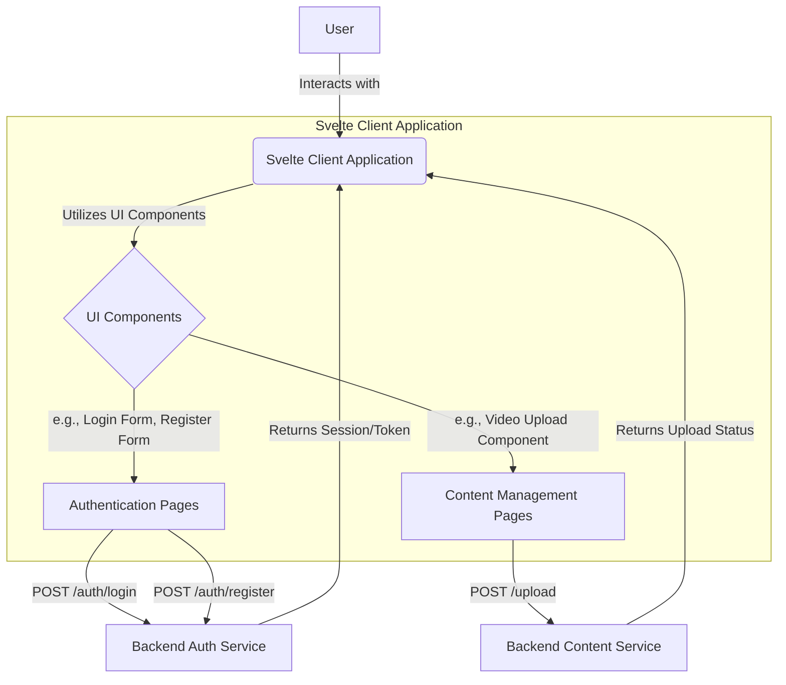

<div align="center">
  
  <h1>
    
  </h1>
  <p>🚀 A robust, component-driven client application for seamless content management and user authentication.</p>

  <!-- Badges -->
  <p>
    
    
    
    
    
    
    
    
    
    
    
  </p>
</div>

<details>
<summary>📖 Table of Contents</summary>

- [Overview](#overview)
- [Features](#features)
- [Tech Stack](#tech-stack)
- [Architecture](#architecture)
- [Getting Started](#getting-started)
- [API Reference](#api-reference)
- [Configuration](#configuration)
- [Project Structure](#project-structure)
- [Contributing](#contributing)
- [License](#license)

</details>

## 🌟 Overview

The `tap-wance-client` project is a sophisticated, client-side application built with Svelte, designed to deliver an intuitive and dynamic user experience. It serves as the frontend interface for interacting with various backend services, primarily focusing on user authentication and content management functionalities, such as video uploads. Leveraging a modern tech stack, this application prioritizes performance, maintainability, and developer experience.

At its core, `tap-wance-client` is engineered to provide a seamless user journey, from account creation and login to engaging with application content. The architecture is heavily component-based, allowing for modular development and easy reusability of UI elements across the application. This approach ensures consistency in design and behavior, while also facilitating rapid feature development and easier debugging.

This client application differentiates itself through its strong emphasis on developer tooling and best practices. The integration of TypeScript guarantees type safety, leading to fewer runtime errors and improved code quality. ESLint and Prettier ensure a consistent code style across the entire codebase, fostering collaboration and readability. Furthermore, Tailwind CSS provides a highly customizable and efficient utility-first CSS framework, enabling rapid and responsive UI development without sacrificing design flexibility.

The `tap-wance-client` is ideally suited for developers looking for a robust Svelte starter project that includes authentication flows, content interaction capabilities, and a well-defined component library. It's also for end-users who require an efficient and visually appealing interface to manage their content and interact with a modern web service. Its comprehensive set of UI components, combined with structured API interactions, makes it a powerful foundation for a wide range of web applications.

## ✨ Features

The `tap-wance-client` offers a rich set of features, carefully crafted to provide a comprehensive and engaging user experience. These features are built upon a robust component-based architecture, ensuring reusability and maintainability.

### 🔐 User Authentication & Account Management

The application provides a complete flow for user authentication, enabling users to securely access and manage their accounts.

| Feature         | Description                                                                                                                                                                                                                                                                  |
| :-------------- | :--------------------------------------------------------------------------------------------------------------------------------------------------------------------------------------------------------------------------------------------------------------------------- |
| **User Login**  | Allows existing users to securely log into their accounts using their credentials (email and password). Integrates with the backend `/auth/login` endpoint.                                                                                                                   |
| **Registration** | Provides a user-friendly interface for new users to create accounts by providing essential information such as email, display name, and password. This feature interacts with the backend `/auth/register` endpoint to create new user profiles. |

### 🎬 Content Management

Designed to facilitate the upload and potential display of media content, with a clear focus on video assets.

| Feature         | Description                                                                                                                                                                                                                                                                                                                                                                                               |
| :-------------- | :-------------------------------------------------------------------------------------------------------------------------------------------------------------------------------------------------------------------------------------------------------------------------------------------------------------------------------------------------------------------------------------------------------- |
| **Video Upload** | Supports the uploading of video files to the server. This feature is integrated within the application's UI, likely featuring drag-and-drop functionality based on `video-dnd.svelte` and interacting with the `/upload` API endpoint to handle the file transfer and storage. This provides a direct method for users to contribute or manage their media content within the platform. |

### 🎨 Rich User Interface Components

The codebase includes a highly modular and reusable set of UI components, essential for building diverse and interactive interfaces. These components are located under `src/lib/components/ui/` and are built with Svelte, styled using Tailwind CSS, and typed with TypeScript.

<details>
<summary>📚 Detailed UI Components</summary>

The project leverages a comprehensive library of UI components to ensure a consistent and high-quality user experience. Each component is designed for reusability and flexibility.

| Component Category | Component Names                                                                                                                                                                                                                                                                                        | Purpose                                                                                                                                                                                                                                                                                                                                                                                                                                                                                                                                                          |
| :----------------- | :----------------------------------------------------------------------------------------------------------------------------------------------------------------------------------------------------------------------------------------------------------------------------------------------------- | :--------------------------------------------------------------------------------------------------------------------------------------------------------------------------------------------------------------------------------------------------------------------------------------------------------------------------------------------------------------------------------------------------------------------------------------------------------------------------------------------------------------------------------------------------------------------------------------------------------------------------------------------------------------------------------------------------------------------------------------------------------------------------------------------------------------------------------------------------------------------------------------------------------------------------------------------------------------------------------------------------------------------------------------------------------------------------------------------------------------------------------------------------------------------------------------------------------------------------------------------------------------------------------------------------------------------------------------------------------------------------------------------------------------------------------------------------------------------------------------------------------------------------------------------------------------------------------------------------------------------------------------------------------------------------------------------------------------------------------------------------------------------------------------------------------------------------------------------------------------------------------------------------------------------------------------------------------------------------------------------------------------------------------------------------------------------------------------------------------------------------------------------------------------------------------------------------------------------------------------------------------------------------------------------------------------------------------------------------------------------------------------------------------------------------------------------------------------------------------------------------------------------------------------------------------------------------------------------------------------------------------------------------------------------------------------------------------------------------------------------------------------------------------------------------------------------------------------------------------------------------------------------------------------------------------------------------------------------------------------------------------------------------------------------------------------------------------------------------------------------------------------------------------------------------------------------------------------------------------------------------------------------------------------------------------------------------------------------------------------------------------------------------------------------------------------------------------------------------------------------------------------------------------------------------------------------------------------------------------------------------------------------------------------------------------------------------------------------------------------------------------------------------------------------------------------------------------------------------------------------------------------------------------------------------------------------------------------------------------------------------------------------------------------------------------------------------------------------------------------------------------------------------------------------------------------------------------------------------------------------------------------------------------------------------------------------------------------------------------------------------------------------------------------------------------------------------------------------------------------------------------------------------------------------------------------------------------------------------------------------------------------------------------------------------------------------------------------------------------------------------------------------------------------------------------------------------------------------------------------------------------------------------------------------------------------------------------------------------------------------------------------------------------------------------------------------------------------------------------------------------------------------------------------------------------------------------------------------------------------------------------------------------------------------------------------------------------------------------------------------------------------------------------------------------------------------------------------------------------------------------------------------------------------------------------------------------------------------------------------------------------------------------------------------------------------------------------------------------------------------------------------------------------------------------------------------------------------------------------------------------------------------------------------------------------------------------------------------------------------------------------------------------------------------------------------------------------------------------------------------------------------------------------------------------------------------------------------------------------------------------------------------------------------------------------------------------------------------------------------------------------------------------------------------------------------------------------------------------------------------------------------------------------------------------------------------------------------------------------------------------------------------------------------------------------------------------------------------------------------------------------------------------------------------------------------------------------------------------------------------------------------------------------------------------------------------------------------------------------------------------------------------------------------------------------------------------------------------------------------------------------------------------------------------------------------------------------------------------------------------------------------------------------------------------------------------------------------------------------------------------------------------------------------------------------------------------------------------------------------------------------------------------------------------------------------------------------------------------------------------------------------------------------------------------------------------------------------------------------------------------------------------------------------------------------------------------------------------------------------------------------------------------------------------------------------------------------------------------------------------------------------------------------------------------------------------------------------------------------------------------------------------------------------------------------------------------------------------------------------------------------------------------------------------------------------------------------------------------------------------------------------------------------------------------------------------------------------------------------------------------------------------------------------------------------------------------------------------------------------------------------------------------------------------------------------------------------------------------------------------------------------------------------------------------------------------------------------------------------------------------------------------------------------------------------------------------------------------------------------------------------------------------------------------------------------------------------------------------------------------------------------------------------------------------------------------------------------------------------------------------------------------------------------------------------------------------------------------------------------------------------------------------------------------------------------------------------------------------------------------------------------------------------------------------------------------------------------------------------------------------------------------------------------------------------------------------------------------------------------------------------------------------------------------------------------------------------------------------------------------------------------------------------------------------------------------------------------------------------------------------------------------------------------------------------------------------------------------------------------------------------------------------------------------------------------------------------------------------------------------------------------------------------------------------------------------------------------------------------------------------------------------------------------------------------------------------------------------------------------------------------------------------------------------------------------------------------------------------------------------------------------------------------------------------------------------------------------------------------------------------------------------------------------------------------------------------------------------------------------------------------------------------------------------------------------------------------------------------------------------------------------------------------------------------------------------------------------------------------------------------------------------------------------------------------------------------------------------------------------------------------------------------------------------------------------------------------------------------------------------------------------------------------------------------------------------------------------------------------------------------------------------------------------------------------------------------------------------------------------------------------------------------------------------------------------------------------------------------------------------------------------------------------------------------------------------------------------------------------------------------------------------------------------------------------------------------------------------------------------------------------------------------------------------------------------------------------------------------------------------------------------------------------------------------------------------------------------------------------------------------------------------------------------------------------------------------------------------------------------------------------------------------------------------------------------------------------------------------------------------------------------------------------------------------------------------------------------------------------------------------------------------------------------------------------------------------------------------------------------------------------------------------------------------------------------------------------------------------------------------------------------------------------------------------------------------------------------------------------------------------------------------------------------------------------------------------------------------------------------------------------------------------------------------------------------------------------------------------------------------------------------------------------------------------------------------------------------------------------------------------------------------------------------------------------------------------------------------------------------------------------------------------------------------------------------------------------------------------------------------------------------------------------------------------------------------------------------------------------------------------------------------------------------------------------------------------------------------------------------------------------------------------------------------------------------------------------------------------------------------------------------------------------------------------------------------------------------------------------------------------------------------------------------------------------------------------------------------------------------------------------------------------------------------------------------------------------------------------------------------------------------------------------------------------------------------------------------------------------------------------------------------------------------------------------------------------------------------------------------------------------------------------------------------------------------------------------------------------------------------------------------------------------------------------------------------------------------------------------------------------------------------------------------------------------------------------------------------------------------------------------------------------------------------------------------------------------------------------------------------------------------------------------------------------------------------------------------------------------------------------------------------------------------------------------------------------------------------------------------------------------------------------------------------------------------------------------------------------------------------------------------------------------------------------------------------------------------------------------------------------------------------------------------------------------------------------------------------------------------------------------------------------------------------------------------------------------------------------------------------------------------------------------------------------------------------------------------------------------------------------------------------------------------------------------------------------------------------------------------------------------------------------------------------------------------------------------------------------------------------------------------------------------------------------------------------------------------------------------------------------------------------------------------------------------------------------------------------------------------------------------------------------------------------------------------------------------------------------------------------------------------------------------------------------------------------------------------------------------------------------------------------------------------------------------------------------------------------------------------------------------------------------------------------------------------------------------------------------------------------------------------------------------------------------------------------------------------------------------------------------------------------------------------------------------------------------------------------------------------------------------------------------------------------------------------------------------------------------------------------------------------------------------------------------------------------------------------------------------------------------------------------------------------------------------------------------------------------------------------------------------------------------------------------------------------------------------------------------------------------------------------------------------------------------------------------------------------------------------------------------------------------------------------------------------------------------------------------------------------------------------------------------------------------------------------------------------------------------------------------------------------------------------------------------------------------------------------------------------------------------------------------------------------------------------------------------------------------------------------------------------------------------------------------------------------------------------------------------------------------------------------------------------------------------------------------------------------------------------------------------------------------------------------------------------------------------------------------------------------------------------------------------------------------------------------------------------------------------------------------------------------------------------------------------------------------------------------------------------------------------------------------------------------------------------------------------------------------------------------------------------------------------------------------------------------------------------------------------------------------------------------------------------------------------------------------------------------------------------------------------------------------------------------------------------------------------------------------------------------------------------------------------------------------------------------------------------------------------------------------------------------------------------------------------------------------------------------------------------------------------------------------------------------------------------------------------------------------------------------------------------------------------------------------------------------------------------------------------------------------------------------------------------------------------------------------------------------------------------------------------------------------------------------------------------------------------------------------------------------------------------------------------------------------------------------------------------------------------------------------------------------------------------------------------------------------------------------------------------------------------------------------------------------------------------------------------------------------------------------------------------------------------------------------------------------------------------------------------------------------------------------------------------------------------------------------------------------------------------------------------------------------------------------------------------------------------------------------------------------------------------------------------------------------------------------------------------------------------------------------------------------------------------------------------------------------------------------------------------------------------------------------------------------------------------------------------------------------------------------------------------------------------------------------------------------------------------------------------------------------------------------------------------------------------------------------------------------------------------------------------------------------------------------------------------------------------------------------------------------------------------------------------------------------------------------------------------------------------------------------------------------------------------------------------------------------------------------------------------------------------------------------------------------------------------------------------------------------------------------------------------------------------------------------------------------------------------------------------------------------------------------------------------------------------------------------------------------------------------------------------------------------------------------------------------------------------------------------------------------------------------------------------------------------------------------------------------------------------------------------------------------------------------------------------------------------------------------------------------------------------------------------------------------------------------------------------------------------------------------------------------------------------------------------------------------------------------------------------------------------------------------------------------------------------------------------------------------------------------------------------------------------------------------------------------------------------------------------------------------------------------------------------------------------------------------------------------------------------------------------------------------------------------------------------------------------------------------------------------------------------------------------------------------------------------------------------------------------------------------------------------------------------------------------------------------------------------------------------------------------------------------------------------------------------------------------------------------------------------------------------------------------------------------------------------------------------------------------------------------------------------------------------------------------------------------------------------------------------------------------------------------------------------------------------------------------------------------------------------------------------------------------------------------------------------------------------------------------------------------------------------------------------------------------------------------------------------------------------------------------------------------------------------------------------------------------------------------------------------------------------------------------------------------------------------------------------------------------------------------------------------------------------------------------------------------------------------------------------------------------------------------------------------------------------------------------------------------------------------------------------------------------------------------------------------------------------------------------------------------------------------------------------------------------------------------------------------------------------------------------------------------------------------------------------------------------------------------------------------------------------------------------------------------------------------------------------------------------------------------------------------------------------------------------------------------------------------------------------------------------------------------------------------------------------------------------------------------------------------------------------------------------------------------------------------------------------------------------------------------------------------------------------------------------------------------------------------------------------------------------------------------------------------------------------------------------------------------------------------------------------------------------------------------------------------------------------------------------------------------------------------------------------------------------------------------------------------------------------------------------------------------------------------------------------------------------------------------------------------------------------------------------------------------------------------------------------------------------------------------------------------------------------------------------------------------------------------------------------------------------------------------------------------------------------------------------------------------------------------------------------------------------------------------------------------------------------------------------------------------------------------------------------------------------------------------------------------------------------------------------------------------------------------------------------------------------------------------------------------------------------------------------------------------------------------------------------------------------------------------------------------------------------------------------------------------------------------------------------------------------------------------------------------------------------------------------------------------------------------------------------------------------------------------------------------------------------------------------------------------------------------------------------------------------------------------------------------------------------------------------------------------------------------------------------------------------------------------------------------------------------------------------------------------------------------------------------------------------------------------------------------------------------------------------------------------------------------------------------------------------------------------------------------------------------------------------------------------------------------------------------------------------------------------------------------------------------------------------------------------------------------------------------------------------------------------------------------------------------------------------------------------------------------------------------------------------------------------------------------------------------------------------------------------------------------------------------------------------------------------------------------------------------------------------------------------------------------------------------------------------------------------------------------------------------------------------------------------------------------------------------------------------------------------------------------------------------------------------------------------------------------------------------------------------------------------------------------------------------------------------------------------------------------------------------------------------------------------------------------------------------------------------------------------------------------------------------------------------------------------------------------------------------------------------------------------------------------------------------------------------------------------------------------------------------------------------------------------------------------------------------------------------------------------------------------------------------------------------------------------------------------------------------------------------------------------------------------------------------------------------------------------------------------------------------------------------------------------------------------------------------------------------------------------------------------------------------------------------------------------------------------------------------------------------------------------------------------------------------------------------------------------------------------------------------------------------------------------------------------------------------------------------------------------------------------------------------------------------------------------------------------------------------------------------------------------------------------------------------------------------------------------------------------------------------------------------------------------------------------------------------------------------------------------------------------------------------------------------------------------------------------------------------------------------------------------------------------------------------------------------------------------------------------------------------------------------------------------------------------------------------------------------------------------------------------------------------------------------------------------------------------------------------------------------------------------------------------------------------------------------------------------------------------------------------------------------------------------------------------------------------------------------------------------------------------------------------------------------------------------------------------------------------------------------------------------------------------------------------------------------------------------------------------------------------------------------------------------------------------------------------------------------------------------------------------------------------------------------------------------------------------------------------------------------------------------------------------------------------------------------------------------------------------------------------------------------------------------------------------------------------------------------------------------------------------------------------------------------------------------------------------------------------------------------------------------------------------------------------------------------------------------------------------------------------------------------------------------------------------------------------------------------------------------------------------------------------------------------------------------------------------------------------------------------------------------------------------------------------------------------------------------------------------------------------------------------------------------------------------------------------------------------------------------------------------------------------------------------------------------------------------------------------------------------------------------------------------------------------------------------------------------------------------------------------------------------------------------------------------------------------------------------------------------------------------------------------------------------------------------------------------------------------------------------------------------------------------------------------------------------------------------------------------------------------------------------------------------------------------------------------------------------------------------------------------------------------------------------------------------------------------------------------------------------------------------------------------------------------------------------------------------------------------------------------------------------------------------------------------------------------------------------------------------------------------------------------------------------------------------------------------------------------------------------------------------------------------------------------------------------------------------------------------------------------------------------------------------------------------------------------------------------------------------------------------------------------------------------------------------------------------------------------------------------------------------------------------------------------------------------------------------------------------------------------------------------------------------------------------------------------------------------------------------------------------------------------------------------------------------------------------------------------------------------------------------------------------------------------------------------------------------------------------------------------------------------------------------------------------------------------------------------------------------------------------------------------------------------------------------------------------------------------------------------------------------------------------------------------------------------------------------------------------------------------------------------------------------------------------------------------------------------------------------------------------------------------------------------------------------------------------------------------------------------------------------------------------------------------------------------------------------------------------------------------------------------------------------------------------------------------------------------------------------------------------------------------------------------------------------------------------------------------------------------------------------------------------------------------------------------------------------------------------------------------------------------------------------------------------------------------------------------------------------------------------------------------------------------------------------------------------------------------------------------------------------------------------------------------------------------------------------------------------------------------------------------------------------------------------------------------------------------------------------------------------------------------------------------------------------------------------------------------------------------------------------------------------------------------------------------------------------------------------------------------------------------------------------------------------------------------------------------------------------------------------------------------------------------------------------------------------------------------------------------------------------------------------------------------------------------------------------------------------------------------------------------------------------------------------------------------------------------------------------------------------------------------------------------------------------------------------------------------------------------------------------------------------------------------------------------------------------------------------------------------------------------------------------------------------------------------------------------------------------------------------------------------------------------------------------------------------------------------------------------------------------------------------------------------------------------------------------------------------------------------------------------------------------------------------------------------------------------------------------------------------------------------------------------------------------------------------------------------------------------------------------------------------------------------------------------------------------------------------------------------------------------------------------------------------------------------------------------------------------------------------------------------------------------------------------------------------------------------------------------------------------------------------------------------------------------------------------------------------------------------------------------------------------------------------------------------------------------------------------------------------------------------------------------------------------------------------------------------------------------------------------------------------------------------------------------------------------------------------------------------------------------------------------------------------------------------------------------------------------------------------------------------------------------------------------------------------------------------------------------------------------------------------------------------------------------------------------------------------------------------------------------------------------------------------------------------------------------------------------------------------------------------------------------------------------------------------------------------------------------------------------------------------------------------------------------------------------------------------------------------------------------------------------------------------------------------------------------------------------------------------------------------------------------------------------------------------------------------------------------------------------------------------------------------------------------------------------------------------------------------------------------------------------------------------------------------------------------------------------------------------------------------------------------------------------------------------------------------------------------------------------------------------------------------------------------------------------------------------------------------------------------------------------------------------------------------------------------------------------------------------------------------------------------------------------------------------------------------------------------------------------------------------------------------------------------------------------------------------------------------------------------------------------------------------------------------------------------------------------------------------------------------------------------------------------------------------------------------------------------------------------------------------------------------------------------------------------------------------------------------------------------------------------------------------------------------------------------------------------------------------------------------------------------------------------------------------------------------------------------------------------------------------------------------------------------------------------------------------------------------------------------------------------------------------------------------------------------------------------------------------------------------------------------------------------------------------------------------------------------------------------------------------------------------------------------------------------------------------------------------------------------------------------------------------------------------------------------------------------------------------------------------------------------------------------------------------------------------------------------------------------------------------------------------------------------------------------------------------------------------------------------------------------------------------------------------------------------------------------------------------------------------------------------------------------------------------------------------------------------------------------------------------------------------------------------------------------------------------------------------------------------------------------------------------------------------------------------------------------------------------------------------------------------------------------------------------------------------------------------------------------------------------------------------------------------------------------------------------------------------------------------------------------------------------------------------------------------------------------------------------------------------------------------------------------------------------------------------------------------------------------------------------------------------------------------------------------------------------------------------------------------------------------------------------------------------------------------------------------------------------------------------------------------------------------------------------------------------------------------------------------------------------------------------------------------------------------------------------------------------------------------------------------------------------------------------------------------------------------------------------------------------------------------------------------------------------------------------------------------------------------------------------------------------------------------------------------------------------------------------------------------------------------------------------------------------------------------------------------------------------------------------------------------------------------------------------------------------------------------------------------------------------------------------------------------------------------------------------------------------------------------------------------------------------------------------------------------------------------------------------------------------------------------------------------------------------------------------------------------------------------------------------------------------------------------------------------------------------------------------------------------------------------------------------------------------------------------------------------------------------------------------------------------------------------------------------------------------------------------------------------------------------------------------------------------------------------------------------------------------------------------------------------------------------------------------------------------------------------------------------------------------------------------------------------------------------------------------------------------------------------------------------------------------------------------------------------------------------------------------------------------------------------------------------------------------------------------------------------------------------------------------------------------------------------------------------------------------------------------------------------------------------------------------------------------------------------------------------------------------------------------------------------------------------------------------------------------------------------------------------------------------------------------------------------------------------------------------------------------------------------------------------------------------------------------------------------------------------------------------------------------------------------------------------------------------------------------------------------------------------------------------------------------------------------------------------------------------------------------------------------------------------------------------------------------------------------------------------------------------------------------------------------------------------------------------------------------------------------------------------------------------------------------------------------------------------------------------------------------------------------------------------------------------------------------------------------------------------------------------------------------------------------------------------------------------------------------------------------------------------------------------------------------------------------------------------------------------------------------------------------------------------------------------------------------------------------------------------------------------------------------------------------------------------------------------------------------------------------------------------------------------------------------------------------------------------------------------------------------------------------------------------------------------------------------------------------------------------------------------------------------------------------------------------------------------------------------------------------------------------------------------------------------------------------------------------------------------------------------------------------------------------------------------------------------------------------------------------------------------------------------------------------------------------------------------------------------------------------------------------------------------------------------------------------------------------------------------------------------------------------------------------------------------------------------------------------------------------------------------------------------------------------------------------------------------------------------------------------------------------------------------------------------------------------------------------------------------------------------------------------------------------------------------------------------------------------------------------------------------------------------------------------------------------------------------------------------------------------------------------------------------------------------------------------------------------------------------------------------------------------------------------------------------------------------------------------------------------------------------------------------------------------------------------------------------------------------------------------------------------------------------------------------------------------------------------------------------------------------------------------------------------------------------------------------------------------------------------------------------------------------------------------------------------------------------------------------------------------------------------------------------------------------------------------------------------------------------------------------------------------------------------------------------------------------------------------------------------------------------------------------------------------------------------------------------------------------------------------------------------------------------------------------------------------------------------------------------------------------------------------------------------------------------------------------------------------------------------------------------------------------------------------------------------------------------------------------------------------------------------------------------------------------------------------------------------------------------------------------------------------------------------------------------------------------------------------------------------------------------------------------------------------------------------------------------------------------------------------------------------------------------------------------------------------------------------------------------------------------------------------------------------------------------------------------------------------------------------------------------------------------------------------------------------------------------------------------------------------------------------------------------------------------------------------------------------------------------------------------------------------------------------------------------------------------------------------------------------------------------------------------------------------------------------------------------------------------------------------------------------------------------------------------------------------------------------------------------------------------------------------------------------------------------------------------------------------------------------------------------------------------------------------------------------------------------------------------------------------------------------------------------------------------------------------------------------------------------------------------------------------------------------------------------------------------------------------------------------------------------------------------------------------------------------------------------------------------------------------------------------------------------------------------------------------------------------------------------------------------------------------------------------------------------------------------------------------------------------------------------------------------------------------------------------------------------------------------------------------------------------------------------------------------------------------------------------------------------------------------------------------------------------------------------------------------------------------------------------------------------------------------------------------------------------------------------------------------------------------------------------------------------------------------------------------------------------------------------------------------------------------------------------------------------------------------------------------------------------------------------------------------------------------------------------------------------------------------------------------------------------------------------------------------------------------------------------------------------------------------------------------------------------------------------------------------------------------------------------------------------------------------------------------------------------------------------------------------------------------------------------------------------------------------------------------------------------------------------------------------------------------------------------------------------------------------------------------------------------------------------------------------------------------------------------------------------------------------------------------------------------------------------------------------------------------------------------------------------------------------------------------------------------------------------------------------------------------------------------------------------------------------------------------------------------------------------------------------------------------------------------------------------------------------------------------------------------------------------------------------------------------------------------------------------------------------------------------------------------------------------------------------------------------------------------------------------------------------------------------------------------------------------------------------------------------------------------------------------------------------------------------------------------------------------------------------------------------------------------------------------------------------------------------------------------------------------------------------------------------------------------</summary>

```svelte
<!-- Example: A Textarea component from src/lib/components/ui/textarea/textarea.svelte -->
<script lang="ts">
  import { cn } from '$lib/utils';
  let className: string = '';
  export { className as class };
</script>

<textarea
  class={cn(
    'flex min-h-[80px] w-full rounded-md border border-input bg-background px-3 py-2 text-sm ring-offset-background placeholder:text-muted-foreground focus-visible:outline-none focus-visible:ring-2 focus-visible:ring-ring focus-visible:ring-offset-2 disabled:cursor-not-allowed disabled:opacity-50',
    className
  )}
  {...$$restProps}
></textarea>
```
</details>

### ⚙️ Application Layout & Navigation

The project includes core components for structuring the application's layout, facilitating intuitive navigation.

| Feature       | Description                                                                                                                                                                                                                                                                                                                                                                                                                    |
| :------------ | :----------------------------------------------------------------------------------------------------------------------------------------------------------------------------------------------------------------------------------------------------------------------------------------------------------------------------------------------------------------------------------------------------------------------------- |
| **Sidebar**   | Provides a foundational element for application navigation and content organization. Components like `sidebar.svelte` and `sidebar-content.svelte` suggest a dynamic, collapsible, or expandable sidebar that can house links, user information, or context-specific menus, enhancing the overall user experience by keeping core functionalities easily accessible. |

## 🛠️ Tech Stack

The `tap-wance-client` project is built with a modern and efficient tech stack, ensuring high performance, maintainability, and a smooth developer experience.

| Category          | Technology  | Purpose                                                                                                                                                                                                                                                                                                                                                                                                                                                                                                                                                                                                                                                                                     |
| :---------------- | :---------- | :------------------------------------------------------------------------------------------------------------------------------------------------------------------------------------------------------------------------------------------------------------------------------------------------------------------------------------------------------------------------------------------------------------------------------------------------------------------------------------------------------------------------------------------------------------------------------------------------------------------------------------------------------------------------------------------ |
| **Framework**     | Svelte      | A radical new approach to building user interfaces. Unlike traditional frameworks that do the bulk of their work in the browser, Svelte shifts that work into a compile step that happens when you build your app. This results in highly optimized, vanilla JavaScript bundles and exceptional performance, making the client application extremely fast and responsive.                                                                                                                                                                                                                                                                                                                                                            |
| **Build Tool**    | Vite        | A next-generation frontend tooling that provides an extremely fast development experience. Vite leverages native ES modules in the browser during development and uses Rollup for bundling in production, offering rapid hot module replacement (HMR) and optimized builds for the Svelte application.                                                                                                                                                                                                                                                                                                                                                                                               |
| **Language**      | TypeScript  | A superset of JavaScript that adds static types. By enforcing type safety during development, TypeScript significantly reduces common runtime errors, improves code readability, and enhances refactoring capabilities, leading to more robust and maintainable code for the client application.                                                                                                                                                                                                                                                                                                                                                                                                                     |
| **Styling**       | Tailwind CSS | A utility-first CSS framework that enables rapid UI development by providing low-level utility classes directly in your HTML. This approach allows for highly customizable designs without writing custom CSS, ensuring a consistent and responsive aesthetic across the application while minimizing bundle size.                                                                                                                                                                                                                                                                                                                                                                                  |
| **Linter**        | ESLint      | A static code analysis tool for identifying problematic patterns found in JavaScript code. ESLint helps enforce coding standards, catch potential bugs early, and maintain code quality and consistency across the entire `tap-wance-client` project, especially valuable in a team environment.                                                                                                                                                                                                                                                                                                                                                                                                             |
| **Code Formatter** | Prettier    | An opinionated code formatter that enforces a consistent style by parsing your code and re-printing it with its own rules. Integrating Prettier with ESLint ensures that all code in the project adheres to a single, uniform style, eliminating stylistic debates and speeding up development by automating formatting tasks.                                                                                                                                                                                                                                                                                                                                                                                        |
| **Package Manager** | npm         | The default package manager for Node.js, used for installing, managing, and publishing JavaScript packages. In `tap-wance-client`, npm handles all project dependencies, scripts, and ensures that developers can easily set up and run the project with consistent environments.                                                                                                                                                                                                                                                                                                                                                                                                                               |

## 🏗️ Architecture

The `tap-wance-client` project primarily follows a **Component-Based Architecture**, a highly effective pattern for building modern, modular, and maintainable user interfaces. This approach is intrinsically tied to the Svelte framework, where the application is decomposed into independent, reusable UI components.

### Component-Based Architecture Explained

In a component-based architecture, the entire user interface is constructed from small, self-contained units called components. Each component encapsulates its own logic, template, and styling, making it highly modular and easy to manage.

*   **Reusability**: Components like those found in `src/lib/components/ui/` (e.g., `textarea.svelte`, `table.svelte`, `button.svelte`) are designed to be generic and can be used across different parts of the application or even in other projects.
*   **Modularity**: Each component focuses on a single responsibility, simplifying development, testing, and maintenance. For example, a `sidebar.svelte` component manages only the sidebar's display and interactions.
*   **Scalability**: New features can be developed by combining existing components or creating new ones without affecting other parts of the system.
*   **Readability**: The application's structure becomes more intuitive, as developers can easily understand how different parts of the UI are built and interact.

### Interaction Flow

The Svelte client application interacts with a backend system via HTTP requests, primarily for authentication and content management.



1.  **User Interaction**: A user interacts with the `Svelte Client Application` through its web interface.
2.  **UI Components**: The application is composed of various `UI Components` (e.g., buttons, forms, tables) that render the interface and handle local state.
3.  **Authentication Pages**: For actions like login and registration, dedicated pages (`/auth/login`, `/auth/register`) composed of UI components gather user credentials. These pages then dispatch HTTP `POST` requests to the `/auth/login` and `/auth/register` endpoints.
4.  **Content Management Pages**: For actions such as uploading videos, components like `upload-video.svelte` are used. These pages send `POST` requests to the `/upload` endpoint.
5.  **Backend Services**: The requests are handled by respective `Backend Auth Service` and `Backend Content Service`.
6.  **Response Handling**: The backend responds, for instance, with a session ID (`connect.sid`) or authentication token for login, or a status for content upload. The client application then updates its state and UI accordingly.

This architectural approach, coupled with Svelte's compilation step, ensures a highly efficient and modular client application capable of handling complex interactions with backend services effectively.

## 🚀 Getting Started

Follow these instructions to set up and run the `tap-wance-client` project on your local machine.

### Prerequisites

Before you begin, ensure you have the following software installed on your system:

*   **Node.js**: Version 16.x or higher.
    *   You can download it from [nodejs.org](https://nodejs.org/).
    *   Verify installation:
        ```bash
        node -v
        ```
*   **npm**: Version 8.x or higher (usually comes bundled with Node.js).
    *   Verify installation:
        ```bash
        npm -v
        ```
*   **Git**: For cloning the repository.
    *   You can download it from [git-scm.com](https://git-scm.com/).
    *   Verify installation:
        ```bash
        git --version
        ```

### Installation

To get the project up and running, follow these steps:

1.  **Clone the repository**:
    ```bash
    git clone https://github.com/YourOrg/tap-wance-client.git
    cd tap-wance-client
    ```

2.  **Install dependencies**:
    This command will download and install all the necessary Node.js packages listed in `package.json`.
    ```bash
    npm install
    ```

### Environment Setup

The application might require certain environment variables, especially for API endpoints or secret keys. While specific environment variables were not detailed in the analysis, it's common practice for client applications to use a `.env` file for configuration.

1.  **Create an environment file**:
    Create a file named `.env` in the root directory of the project.
    ```bash
    touch .env
    ```

2.  **Add environment variables**:
    Populate the `.env` file with any necessary variables. For example, if your backend API is hosted at a specific URL:
    ```dotenv
    VITE_PUBLIC_API_BASE_URL=http://localhost:3000/api
    ```
    *Note: Replace the URL with your actual backend API URL. The `VITE_PUBLIC_` prefix is typical for Vite to expose variables to client-side code.*

### Running the Project

Once the dependencies are installed and environment variables are set, you can start the development server:

```bash
npm run dev
```

This command will:
*   Start the Vite development server.
*   Compile the Svelte application.
*   Provide a URL (usually `http://localhost:5173`) where you can access the application in your browser.
*   Offer Hot Module Replacement (HMR) for instant updates as you make changes to the code.

### Running Tests

The provided codebase analysis does not explicitly list any testing frameworks or specific test scripts (`test` in `package.json`). Therefore, formal automated tests are not detected as part of this project setup.

*   If tests were to be implemented in the future, they would typically be run using a command like `npm test` or specific commands for frameworks like Vitest or Playwright.

## 🔗 API Reference

The `tap-wance-client` application interacts with a backend API to perform various operations, including user authentication and content uploads. Below is a comprehensive list of the identified API endpoints and example usage.

### Authentication Endpoints

These endpoints are crucial for user registration and login, managing user sessions or tokens.

| Method | Path               | Description                                                                     | Authentication |
| :----- | :----------------- | :------------------------------------------------------------------------------ | :------------- |
| `GET`  | `/auth`            | Checks current authentication status or retrieves session information.            | Session/Token  |
| `POST` | `/auth/login`      | Authenticates a user with provided credentials.                                 | None           |
| `POST` | `/auth/register`   | Registers a new user account.                                                   | None           |
| `GET`  | `/auth/login`      | Retrieves login-related information (e.g., form fields for email/password).      | None           |
| `GET`  | `/auth/register`   | Retrieves registration-related information (e.g., form fields for email/display name/password). | None           |
| `GET`  | `connect.sid`      | Specifically related to session management (e.g., reading session ID from cookies). | Session        |
| `GET`  | `email`            | Used to retrieve or validate an email (likely within `/auth/register` or `/auth/login` context). | Contextual     |
| `GET`  | `displayName`      | Used to retrieve or validate a display name (likely within `/auth/register` context). | Contextual     |
| `GET`  | `password`         | Used to retrieve or validate a password (likely within `/auth/register` or `/auth/login` context). | Contextual     |

#### Example: Register a New User (`POST /auth/register`)

Registers a new user account with the system.

**Request:**

```http
POST /auth/register
Host: api.yourdomain.com
Content-Type: application/json

{
  "email": "user@example.com",
  "displayName": "TestUser",
  "password": "securePassword123"
}
```

**Response (Success):**

```http
HTTP/1.1 201 Created
Content-Type: application/json

{
  "message": "User registered successfully!",
  "userId": "uuid-123-abc",
  "email": "user@example.com"
}
```

**Response (Error - User Exists):**

```http
HTTP/1.1 409 Conflict
Content-Type: application/json

{
  "message": "User with this email already exists."
}
```

#### Example: User Login (`POST /auth/login`)

Authenticates an existing user and returns a session token or cookie.

**Request:**

```http
POST /auth/login
Host: api.yourdomain.com
Content-Type: application/json

{
  "email": "user@example.com",
  "password": "securePassword123"
}
```

**Response (Success):**

```http
HTTP/1.1 200 OK
Content-Type: application/json
Set-Cookie: connect.sid=s%3Ayour-session-id.xyz; Path=/; HttpOnly; SameSite=Lax

{
  "message": "Login successful!",
  "user": {
    "id": "uuid-123-abc",
    "email": "user@example.com",
    "displayName": "TestUser"
  },
  "token": "eyJhbGciOiJIUzI1NiIsInR5cCI6IkpXVCJ9..."
}
```

**Response (Error - Invalid Credentials):**

```http
HTTP/1.1 401 Unauthorized
Content-Type: application/json

{
  "message": "Invalid email or password."
}
```

### Content Management Endpoints

This endpoint facilitates the uploading of user-generated content, specifically video files.

| Method | Path    | Description                         | Authentication |
| :----- | :------ | :---------------------------------- | :------------- |
| `POST` | `/upload` | Uploads a video file to the server. | Session/Token  |

#### Example: Upload Video (`POST /upload`)

Uploads a video file. This typically involves a `multipart/form-data` content type.

**Request:**

```http
POST /upload
Host: api.yourdomain.com
Content-Type: multipart/form-data; boundary=---boundary123

---boundary123
Content-Disposition: form-data; name="video"; filename="my_awesome_video.mp4"
Content-Type: video/mp4

<binary content of my_awesome_video.mp4>
---boundary123--
```

**Response (Success):**

```http
HTTP/1.1 200 OK
Content-Type: application/json

{
  "message": "Video uploaded successfully!",
  "videoId": "video-xyz-789",
  "fileName": "my_awesome_video.mp4",
  "url": "https://cdn.yourdomain.com/videos/my_awesome_video.mp4"
}
```

**Response (Error - File Too Large):**

```http
HTTP/1.1 413 Payload Too Large
Content-Type: application/json

{
  "message": "File size exceeds the limit."
}
```

### Authentication Details

The application appears to support a session-based or token-based authentication mechanism. The presence of `connect.sid` suggests the use of session cookies, typically managed by a backend server (like Express.js with `express-session`). After a successful login, the server likely sets a `connect.sid` cookie, and subsequent requests would automatically include this cookie to maintain the authenticated session. For modern SPAs, a `token` (e.g., JWT) in the response is also common, which the client stores and sends in an `Authorization` header (`Bearer Token`) for protected routes.

## ⚙️ Configuration

The `tap-wance-client` project is configurable through various mechanisms, including environment variables and specific configuration files, allowing developers to adapt the application to different deployment environments and specific needs.

### Environment Variables

Environment variables are used to manage sensitive information and deployment-specific settings without embedding them directly into the codebase. For this project, variables are typically prefixed with `VITE_PUBLIC_` to be exposed to the client-side bundle by Vite.

| Variable Name           | Description                                                                                                                                                                                                                                                                         | Example Value                 |
| :---------------------- | :---------------------------------------------------------------------------------------------------------------------------------------------------------------------------------------------------------------------------------------------------------------------------------- | :---------------------------- |
| `VITE_PUBLIC_API_BASE_URL` | The base URL for the backend API that the client application communicates with. This is crucial for directing API calls to the correct server.                                                                                                                                | `http://localhost:3000/api`   |
| `VITE_PUBLIC_APP_NAME`     | An optional variable to define the application's name, which might be used for display purposes in the UI or logs.                                                                                                                                                                  | `TapWance Client`             |
| `VITE_PUBLIC_DEBUG_MODE`   | A boolean flag (e.g., `true` or `false`) to enable or disable debugging features or verbose logging in the development environment.                                                                                                                                                   | `true`                        |

**Usage:**

To configure these variables, create a `.env` file in the root directory of your project (as described in [Getting Started](#environment-setup)) and add the key-value pairs.

```dotenv
VITE_PUBLIC_API_BASE_URL=https://api.tapwance.com/
VITE_PUBLIC_APP_NAME="TapWance Production"
VITE_PUBLIC_DEBUG_MODE=false
```

Vite automatically loads environment variables from `.env` files. Variables prefixed with `VITE_PUBLIC_` are exposed to your client-side Svelte code, for example: `import.meta.env.VITE_PUBLIC_API_BASE_URL`.

### Configuration Files

The project leverages standard configuration files for various tools and build processes.

#### `vite.config.ts`

This file is the configuration entry point for Vite, the build tool used by the project. It defines how Svelte components are compiled, how assets are handled, and various development server options.

**Purpose:**
*   Configures Svelte plugin for Vite.
*   Defines build options (output directory, chunking, minification).
*   Sets up development server proxies, HMR, and port.
*   Specifies global variables or aliases.

**Example (simplified):**

```typescript
import { sveltekit } from '@sveltejs/kit/vite';
import { defineConfig } from 'vite';

export default defineConfig({
  plugins: [sveltekit()],
  server: {
    port: 5173,
    // proxy: {
    //   '/api': {
    //     target: 'http://localhost:3000',
    //     changeOrigin: true,
    //     rewrite: (path) => path.replace(/^\/api/, ''),
    //   },
    // },
  },
  build: {
    outDir: 'dist',
  },
});
```
*Note: The actual `vite.config.ts` might be `svelte.config.js` or similar for SvelteKit, which abstracts Vite configuration.*

#### `tsconfig.json`

The TypeScript configuration file (`tsconfig.json`) dictates how the TypeScript compiler processes the `.ts` and `.svelte` (via `svelte-preprocess`) files in the project.

**Purpose:**
*   Specifies compiler options (e.g., `target`, `module`, `strict`).
*   Defines root directories and output directories.
*   Includes or excludes files from compilation.
*   Sets up path aliases (e.g., `@lib/*` mapping to `src/lib/*`).

**Example (simplified):**

```json
{
  "compilerOptions": {
    "esModuleInterop": true,
    "forceConsistentCasingInFileNames": true,
    "moduleResolution": "bundler",
    "resolveJsonModule": true,
    "skipLibCheck": true,
    "sourceMap": true,
    "strict": true,
    "target": "ESNext",
    "paths": {
      "$lib": ["./src/lib"],
      "$lib/*": ["./src/lib/*"]
    }
  },
  "include": ["src/**/*.d.ts", "src/**/*.ts", "src/**/*.js", "src/**/*.svelte"],
  "exclude": ["node_modules"]
}
```

#### `package.json`

This file defines project metadata, scripts, and dependencies. It's the central configuration for npm.

**Purpose:**
*   Lists all project dependencies (`dependencies` for runtime, `devDependencies` for development/build).
*   Defines `scripts` for common tasks like `dev`, `build`, `lint`.
*   Includes project metadata like `name`, `version`, `license`.

**Example (simplified):**

```json
{
  "name": "tap-wance-client",
  "version": "1.0.0",
  "private": true,
  "type": "module",
  "scripts": {
    "dev": "vite dev",
    "build": "vite build",
    "preview": "vite preview",
    "lint": "prettier --check . && eslint --ignore-path .gitignore .",
    "format": "prettier --write ."
  },
  "devDependencies": {
    "@sveltejs/adapter-auto": "^3.0.0",
    "@sveltejs/kit": "^2.0.0",
    "@sveltejs/vite-plugin-svelte": "^3.0.0",
    "@types/eslint": "^8.56.0",
    "@types/node": "^20.11.20",
    "@typescript-eslint/eslint-plugin": "^7.0.0",
    "@typescript-eslint/parser": "^7.0.0",
    "autoprefixer": "^10.4.17",
    "eslint": "^8.56.0",
    "eslint-config-prettier": "^9.1.0",
    "eslint-plugin-svelte": "^2.35.1",
    "postcss": "^8.4.35",
    "prettier": "^3.1.1",
    "prettier-plugin-svelte": "^3.1.2",
    "prettier-plugin-tailwindcss": "^0.5.11",
    "svelte": "^4.2.7",
    "svelte-check": "^3.6.0",
    "tailwindcss": "^3.4.1",
    "tslib": "^2.4.1",
    "typescript": "^5.0.0",
    "vite": "^5.0.3"
  },
  "dependencies": {
    // runtime dependencies would go here
  }
}
```

## 📂 Project Structure

The project follows a standard SvelteKit (or similar Svelte application) directory structure, promoting organization and maintainability.

```
.
├── .vscode/                               # VSCode editor configuration files (settings, extensions)
├── node_modules/                          # Installed Node.js packages and dependencies
├── src/                                   # All application source code
│   ├── app.d.ts                           # Global type definitions for SvelteKit
│   ├── app.html                           # Main HTML template file
│   ├── lib/                               # Reusable utilities, API clients, and UI components
│   │   ├── api/                           # API service integration
│   │   │   └── index.ts                   # API client exports (e.g., getAllVideos)
│   │   ├── components/                    # Generic and reusable Svelte components
│   │   │   └── ui/                        # UI library components (e.g., Shadcn-svelte style)
│   │   │       ├── badge/                 # Badge component (Root, variants)
│   │   │       │   └── index.ts
│   │   │       ├── button/                # Button component (Root, Props, Events)
│   │   │       │   └── index.ts
│   │   │       ├── card/                  # Card component (Root, Content, HeadingLevel)
│   │   │       │   └── index.ts
│   │   │       ├── dialog/                # Dialog/Modal component (Root, Title, Portal)
│   │   │       │   └── index.ts
│   │   │       ├── dropdown-menu/         # Dropdown menu components (Root, Item, Sub)
│   │   │       │   └── index.ts
│   │   │       ├── form/                  # Form related components (Field, Control, Label)
│   │   │       │   └── index.ts
│   │   │       ├── input/                 # Input field components (Root, events)
│   │   │       │   └── index.ts
│   │   │       ├── label/                 # Label component (Root)
│   │   │       │   └── index.ts
│   │   │       ├── progress/              # Progress indicator component (Root)
│   │   │       │   └── index.ts
│   │   │       ├── scroll-area/           # Scroll area component (Root, Scrollbar)
│   │   │       │   └── index.ts
│   │   │       ├── separator/             # Separator component (Root)
│   │   │       │   └── index.ts
│   │   │       ├── sheet/                 # Sheet/Drawer component (Root, Portal, Side)
│   │   │       │   └── index.ts
│   │   │       ├── table/                 # Table components (Root, Body, Caption, Cell, Footer, Head, Header, Row)
│   │   │       │   └── index.ts
│   │   │       └── textarea/              # Textarea component (Root, events)
│   │   │           └── index.ts
│   │   └── utils.ts                       # Utility functions (e.g., `cn` for class merging)
│   └── routes/                            # Defines the application's pages and API routes
│       ├── (app)/                         # Group of routes for the main application layout
│       │   ├── +layout.server.ts          # Server-side logic for the main app layout (e.g., auth check)
│       │   ├── +layout.svelte             # Main layout component for authenticated users
│       │   ├── components/                # Components specific to the app layout
│       │   │   ├── sidebar-content.svelte # Content within the sidebar
│       │   │   └── sidebar.svelte         # Main sidebar component
│       │   └── content/                   # Content-related pages
│       │       └── components/            # Components for content pages
│       │           ├── upload-video.svelte# Component for video upload functionality
│       │           └── video-dnd.svelte   # Component for video drag-and-drop
│       └── (auth)/                        # Group of routes for authentication flows
│           ├── +layout.svelte             # Layout component for authentication pages
│           ├── login/                     # Login page
│           │   ├── +page.server.ts        # Server-side logic for login page (e.g., handle form submission)
│           │   └── +page.svelte           # Client-side login page
│           └── register/                  # Registration page
│               ├── +page.server.ts        # Server-side logic for registration page
│               └── +page.svelte           # Client-side registration page
├── static/                                # Static assets (images, fonts, favicons)
├── tailwind.config.ts                     # Tailwind CSS configuration
├── tsconfig.json                          # TypeScript compiler configuration
├── vite.config.ts                         # Vite build tool configuration
├── .eslintrc.cjs                          # ESLint configuration
├── .gitignore                             # Specifies intentionally untracked files to ignore
├── .prettierignore                        # Specifies files for Prettier to ignore
├── .npmrc                                 # npm configuration file
├── package.json                           # Project metadata and dependencies
└── README.md                              # This file
```

## 🤝 Contributing

We welcome contributions from everyone! Whether it's reporting a bug, suggesting a new feature, or submitting a pull request, your input is valuable.

To make contributing as smooth as possible, please review our [CONTRIBUTING.md](CONTRIBUTING.md) guide (if available). It outlines the process for making contributions, including how to set up your development environment, run tests, and adhere to our coding standards.

### Quick Contribution Guide

1.  **Fork the Repository**: Start by forking the `tap-wance-client` repository to your GitHub account.
2.  **Clone Your Fork**:
    ```bash
    git clone https://github.com[YOUR_USERNAME]/tap-wance-client.git
    cd tap-wance-client
    ```
3.  **Create a New Branch**:
    ```bash
    git checkout -b feature/your-feature-name
    ```
4.  **Make Your Changes**: Implement your feature or bug fix.
5.  **Format Your Code**: Ensure your code adheres to our style guidelines using Prettier.
    ```bash
    npm run format
    ```
6.  **Lint Your Code**: Check for any linting errors using ESLint.
    ```bash
    npm run lint
    ```
7.  **Commit Your Changes**: Write clear, concise commit messages.
    ```bash
    git commit -m "feat: Add new feature"
    ```
8.  **Push to Your Fork**:
    ```bash
    git push origin feature/your-feature-name
    ```
9.  **Open a Pull Request**: Go to the original `tap-wance-client` repository on GitHub and open a new Pull Request. Provide a detailed description of your changes.

### Code of Conduct

Please note that this project is released with a [Code of Conduct](CODE_OF_CONDUCT.md) (if available). By participating in this project, you agree to abide by its terms. We are committed to fostering an open and welcoming environment.

## 📄 License

This project is licensed under the **MIT License**.


The MIT License is a permissive free software license, meaning it permits reuse of software provided all copies of the software include a copy of the MIT License terms and the copyright notice. This project is provided "as is", without warranty of any kind, express or implied.

---
<p align="center">
  <sub>📝 Generated with <a href="https://github.com/Owusu1946/docsagev2">DocSage</a> - AI-powered documentation</sub>
</p>