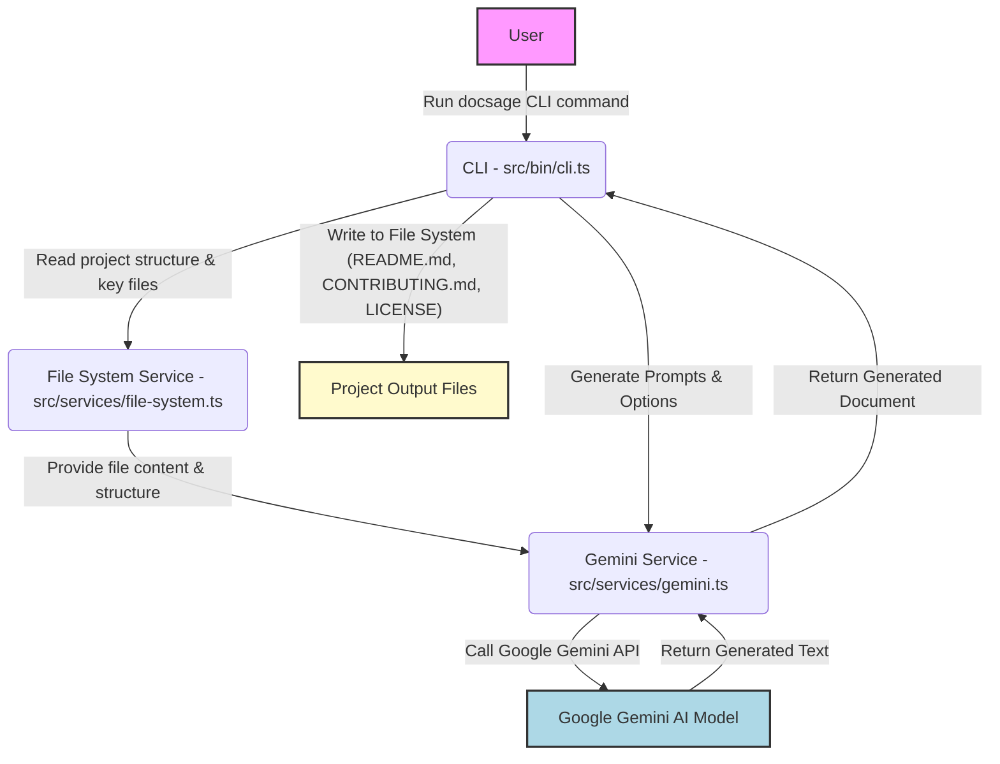

<p align="center">
  
</p>

<h1 align="center">DocSage v2 📝✨</h1>

<p align="center">
  <strong>An AI-powered CLI tool that automatically generates professional README.md, CONTRIBUTING.md, and LICENSE files using Google Gemini AI.</strong>
</p>

<p align="center">
  <!-- Version Badge -->
  <a href="https://www.npmjs.com/package/docsagev2">
    
  </a>
  <!-- License Badge -->
  <a href="./LICENSE">
    
  </a>
  <!-- TypeScript Badge -->
  
  <!-- Node.js Badge -->
  
  <!-- Google Gemini AI Badge -->
  
  <!-- GitHub Repo Size -->
  
</p>

---

## 📖 Table of Contents

*   [🌟 Overview](#-overview)
*   [🚀 Features](#-features)
*   [🏗️ Architecture](#️-architecture)
*   [⚙️ Prerequisites](#️-prerequisites)
*   [🛠️ Installation](#️-installation)
*   [💡 Usage](#-usage)
*   [🔧 Configuration](#-configuration)
*   [📊 Database Schema](#-database-schema)
*   [🖥️ API Reference](#️-api-reference)
*   [tech Stack](#tech-stack)
*   [🤝 Contributing](#-contributing)
*   [📜 License](#-license)
*   [🗺️ Roadmap](#️-roadmap)
*   [🙏 Acknowledgements](#-acknowledgements)

---

## 🌟 Overview

`docsagev2` is a powerful and intuitive Command Line Interface (CLI) tool designed to streamline the documentation process for software projects. Leveraging the advanced capabilities of Google Gemini AI, it automatically generates high-quality, professional `README.md`, `CONTRIBUTING.md`, and `LICENSE` files. This tool solves the common pain point of developers spending valuable time on boilerplate documentation, ensuring consistency, accuracy, and best practices across projects. With `docsagev2`, you can kickstart your project with robust documentation in seconds, allowing you to focus on coding.

## 🚀 Features

`docsagev2` offers a comprehensive set of features to automate and enhance your project's documentation:

*   **AI-Powered Content Generation**: Utilizes Google Gemini AI for intelligent and context-aware document generation.
*   **README.md Generation**: Automatically creates a professional and comprehensive `README.md` file, including sections like Overview, Features, Architecture diagrams (Mermaid), Installation, Usage, and more.
*   **CONTRIBUTING.md Generation**: Generates detailed `CONTRIBUTING.md` guidelines, covering bug reporting, feature requests, development setup, code style, and pull request workflows.
*   **LICENSE File Generation**: Easily generates various types of license files (e.g., MIT, ISC) with correct copyright information.
*   **Project Structure Analysis**: Intelligently analyzes your project's file structure and key file contents (`package.json`, `tsconfig.json`, etc.) to tailor the generated documentation.
*   **Customizable Output**: Supports various configuration options for styling, included sections, diagram types, and more, providing flexible documentation tailored to your needs.
*   **Mermaid Diagram Support**: Seamlessly integrates Mermaid.js syntax for generating architecture, ERD, and contributing flow diagrams directly within your Markdown files.
*   **Developer-Friendly CLI**: An easy-to-use command-line interface built with `Commander.js` and `Inquirer.js` for an interactive experience.
*   **TypeScript-First**: Developed entirely in TypeScript for robust, scalable, and maintainable code.

## 🏗️ Architecture

The `docsagev2` CLI operates by orchestrating several key components to generate documentation. At its core, it interacts with the Google Gemini AI model, providing project context and specific prompts to produce desired output.



**Component Breakdown:**

*   **CLI (`src/bin/cli.ts`)**: The entry point for `docsagev2`. It handles user input, parses commands and options, and orchestrates the documentation generation process by calling the `GeminiService`.
*   **File System Service (`src/services/file-system.ts`)**: Responsible for interacting with the local file system. It reads project structure, identifies key files, and extracts their content, providing crucial context for the AI.
*   **Gemini Service (`src/services/gemini.ts`)**: The core AI integration layer. It constructs prompts based on user options and project context, sends requests to the Google Gemini API, and processes the AI's responses.
*   **Google Gemini AI Model**: The external AI service that performs the actual text generation, leveraging its large language model capabilities to produce coherent and relevant documentation.
*   **Project Output Files**: The final generated `README.md`, `CONTRIBUTING.md`, and `LICENSE` files written back to the user's project directory.

## ⚙️ Prerequisites

Before you can use `docsagev2`, ensure you have the following installed:

*   **Node.js**: Version 18.x or higher. You can download it from [nodejs.org](https://nodejs.org/).
*   **npm** (Node Package Manager) or **Yarn**: Usually comes bundled with Node.js.
*   **Google Gemini API Key**: `docsagev2` requires access to the Google Gemini API. You will need to obtain an API key from the [Google AI Studio](https://makersuite.google.com/app/apikey).

## 🛠️ Installation

Follow these steps to get `docsagev2` up and running on your system:

1.  **Install `docsagev2` globally**:

    ```bash
    npm install -g docsagev2
    # OR
    yarn global add docsagev2
    ```

2.  **Set up your Google Gemini API Key**:
    `docsagev2` expects your API key to be available as an environment variable named `GEMINI_API_KEY`.

    *   **For Linux/macOS**: Add the following line to your `~/.bashrc`, `~/.zshrc`, or `~/.profile` file:

        ```bash
        export GEMINI_API_KEY="YOUR_GEMINI_API_KEY"
        ```

        Then, reload your shell configuration:
        ```bash
        source ~/.bashrc # or ~/.zshrc, ~/.profile
        ```

    *   **For Windows (Command Prompt)**:

        ```cmd
        setx GEMINI_API_KEY "YOUR_GEMINI_API_KEY"
        ```

        You will need to open a new command prompt window for the variable to take effect.

    *   **For Windows (PowerShell)**:

        ```powershell
        [System.Environment]::SetEnvironmentVariable('GEMINI_API_KEY', 'YOUR_GEMINI_API_KEY', 'User')
        ```

        Restart your PowerShell session for the variable to take effect.

    Replace `YOUR_GEMINI_API_KEY` with the actual API key you obtained from Google AI Studio.

## 💡 Usage

Navigate to your project's root directory in your terminal and run `docsage` to generate your documentation.

### Basic Usage

To generate a README.md with default settings:

```bash
docsage readme
```

### Generating All Document Types

You can use the `--all` option to generate `README.md`, `CONTRIBUTING.md`, and `LICENSE` files at once:

```bash
docsage --all
```

This command will prompt you for additional options, such as the license type.

### Generating Specific Documents

*   **README.md**:
    ```bash
    docsage readme --style Professional --badges --arch --erd --contrib-flow
    ```
    *   `--style <style>`: Specify the tone (e.g., `Professional`, `Informative`, `Concise`).
    *   `--badges`: Include Shields.io badges.
    *   `--arch`: Include a Mermaid architecture diagram.
    *   `--erd`: Include a Mermaid ERD diagram (if applicable).
    *   `--contrib-flow`: Include a Mermaid contributing flow diagram.
    *   `--sections <section1,section2>`: Specify particular sections to include (e.g., `Overview,Features`).

*   **CONTRIBUTING.md**:
    ```bash
    docsage contributing --coc ContributorCovenant
    ```
    *   `--coc <type>`: Specify the Code of Conduct (e.g., `ContributorCovenant`, `None`).
    *   `--templates`: Include issue/PR templates as examples.

*   **LICENSE**:
    ```bash
    docsage license --type MIT --author "Your Name"
    ```
    *   `--type <license>`: Specify the license type (e.g., `MIT`, `ISC`, `Apache-2.0`).
    *   `--author <name>`: Specify the copyright holder.

### Merged Documentation Output

You can generate all documents (README, Contributing, License) merged into a single `README.md` file using the `--merge` option. This is useful for projects that prefer to keep all primary documentation in one place.

```bash
docsage --merge --type MIT --author "Owusu1946"
```

This will generate a `README.md` that includes detailed contributing guidelines and the full license text within its respective sections.

For a full list of commands and options, run:

```bash
docsage --help
```

## 🔧 Configuration

`docsagev2` is primarily configured via command-line options.

*   **`GEMINI_API_KEY`**: This environment variable is mandatory for the tool to authenticate with the Google Gemini API.
*   **CLI Options**: Each command (`readme`, `contributing`, `license`) accepts various flags to customize the output. Refer to the `Usage` section or run `docsage <command> --help` for details.

### Example Configuration Options

| Option             | Command     | Description                                                          | Example Value                     |
| :----------------- | :---------- | :------------------------------------------------------------------- | :-------------------------------- |
| `--style`          | `readme`    | Tone of writing for the README.                                      | `Professional`, `Informative`     |
| `--badges`         | `readme`    | Include Shields.io badges.                                           | `true` / `false`                  |
| `--arch`           | `readme`    | Include Mermaid Architecture diagram.                                | `true` / `false`                  |
| `--erd`            | `readme`    | Include Mermaid ERD diagram (if applicable).                         | `true` / `false`                  |
| `--contrib-flow`   | `readme`    | Include Mermaid Contributing Flow diagram.                           | `true` / `false`                  |
| `--sections`       | `readme`    | Comma-separated list of specific sections to include.                | `Overview,Installation,Tech Stack`|
| `--coc`            | `contributing`| Specify Code of Conduct type.                                        | `Contributor Covenant`, `None`    |
| `--templates`      | `contributing`| Include example issue/PR templates.                                  | `true` / `false`                  |
| `--type`           | `license`   | Specify the license type.                                            | `MIT`, `ISC`, `Apache-2.0`        |
| `--author`         | `license`   | Copyright holder for the license.                                    | `"John Doe"`                      |
| `--merge`          | `all`       | Generate all docs into a single README (includes full contributing & license). | `true` / `false`                  |

## 📊 Database Schema

This project is a CLI tool and does not utilize a traditional database. Therefore, a database schema is not applicable.

```mermaid
erDiagram
    %% Not applicable for this CLI tool, as it does not utilize a database.
    %% This section is included to adhere to the requested structure.
```

## 🖥️ API Reference

`docsagev2` is primarily a CLI tool and does not expose a public programmatic API for external applications to consume directly. Its "API" is its set of command-line interfaces.

### CLI Commands

The main entry point for `docsagev2` is the `docsage` command, which supports the following subcommands:

| Command           | Description                                                                                                                                                                                                            | Options (e.g., `docsage <command> --help`)                                                                             |
| :---------------- | :--------------------------------------------------------------------------------------------------------------------------------------------------------------------------------------------------------------------- | :--------------------------------------------------------------------------------------------------------------------- |
| `docsage readme`  | Generates a `README.md` file for the current project. This is the primary command for project overview and setup documentation.                                                                                       | `--style`, `--badges`, `--arch`, `--erd`, `--contrib-flow`, `--sections`                                           |
| `docsage contributing` | Generates a `CONTRIBUTING.md` file, providing guidelines for how others can contribute to your project.                                                                                                                | `--coc`, `--templates`                                                                                                 |
| `docsage license` | Generates a `LICENSE` file based on a specified open-source license type.                                                                                                                                             | `--type`, `--author`                                                                                                   |
| `docsage --all`   | An interactive shortcut to generate `README.md`, `CONTRIBUTING.md`, and `LICENSE` files sequentially, prompting for necessary options.                                                                                | `--merge`, `--type`, `--author` (for License options when `--all` is used)                                            |
| `docsage --merge` | Generates a single `README.md` file that includes detailed contributing guidelines and the full license text within its sections.                                                                                   | `--type`, `--author`, `--style`, `--badges`, `--arch`, `--erd`, `--contrib-flow`, `--sections`                         |
| `docsage --help`  | Displays general help information, including available commands and global options.                                                                                                                                    | N/A                                                                                                                    |
| `docsage <command> --help` | Displays detailed help for a specific subcommand, listing its specific options.                                                                                                                                | N/A                                                                                                                    |

## Tech Stack

`docsagev2` is built with a modern and robust tech stack to deliver a seamless and efficient experience:

*   **Programming Language**:
    *   [TypeScript](https://www.typescriptlang.org/): A strongly typed superset of JavaScript that compiles to plain JavaScript. Enhances code quality and maintainability.
*   **Runtime Environment**:
    *   [Node.js](https://nodejs.org/): A JavaScript runtime built on Chrome's V8 JavaScript engine.
*   **AI Integration**:
    *   [@google/generative-ai](https://github.com/google/generative-ai-js): Official JavaScript SDK for interacting with Google Gemini AI.
*   **CLI Frameworks**:
    *   [Commander.js](https://github.com/tj/commander.js): A robust command-line interface framework for Node.js.
    *   [Inquirer.js](https://github.com/SBoudrias/Inquirer.js): A collection of common interactive command-line user interfaces.
*   **Utilities & Enhancements**:
    *   [Chalk](https://github.com/chalk/chalk): Terminal string styling done right.
    *   [Ora](https://github.com/sindresorhus/ora): Elegant terminal spinner.
    *   [Dotenv](https://github.com/motdotla/dotenv): Loads environment variables from a `.env` file.
    *   [Figlet](https://github.com/patorjk/figlet.js/): Creates ASCII art from text.
    *   [Glob](https://github.com/isaacs/node-glob): Find files matching patterns.
    *   [Diff](https://github.com/kpdecker/jsdiff): A JavaScript text diffing library.
    *   [Boxen](https://github.com/sindresorhus/boxen): Create boxes in the terminal.
    *   [Gradient-String](https://github.com/sindresorhus/gradient-string): Apply beautiful gradients to terminal strings.

## 🤝 Contributing

We welcome contributions to `docsagev2`! Whether it's bug reports, feature requests, or code contributions, your help is greatly appreciated.

Please refer to our dedicated [CONTRIBUTING.md](CONTRIBUTING.md) file for detailed guidelines on how to get involved.

```mermaid
gitGraph
    commit
    commit id: "Initial commit"
    branch develop
    checkout develop
    commit id: "Feature A initial"
    branch feature/add-readme-options
    checkout feature/add-readme-options
    commit id: "Implement --arch option"
    commit id: "Add --erd option"
    checkout develop
    merge feature/add-readme-options tag: "v1.1.0"
    commit id: "Bugfix for file reading"
    branch feature/unified-docs
    checkout feature/unified-docs
    commit id: "Develop --merge logic"
    commit id: "Integrate license text"
    checkout develop
    merge feature/unified-docs tag: "v1.2.0"
    branch main
    checkout main
    merge develop id: "Release v1.2.0"
    commit id: "Prepare for v1.3.0"
```

## 📜 License

This project is licensed under the **ISC License**.

You are free to use, modify, and distribute this software under the terms of the ISC License. For the full license text, please see the [LICENSE](LICENSE) file in this repository.

## 🗺️ Roadmap

We have exciting plans for the future of `docsagev2`! Here's a glimpse of what's on the horizon:

*   **More Document Types**: Support for generating `CHANGELOG.md`, `SECURITY.md`, `CODE_OF_CONDUCT.md` (separate from CONTRIBUTING.md), and project-specific documentation.
*   **Custom Templates**: Allow users to provide their own markdown templates for AI to fill, offering even greater customization.
*   **Configuration File Support**: Introduce a `docsage.json` or similar config file for persistent project-specific settings, reducing CLI argument verbosity.
*   **Integration with CI/CD**: Provide GitHub Actions or other CI/CD pipeline integrations for automatic documentation updates.
*   **Language Support**: Extend generation capabilities to multiple human languages.
*   **Enhanced Diagramming**: More complex and diverse Mermaid diagram types based on project context (e.g., state diagrams, class diagrams).
*   **Interactive Preview**: A local server or command to preview generated Markdown before saving.

## 🙏 Acknowledgements

`docsagev2` wouldn't be possible without the incredible work of the open-source community and Google's advancements in AI. We extend our sincere thanks to:

*   **Google Gemini AI**: For providing the powerful large language models that drive the core generation capabilities.
*   **All open-source library maintainers**: Especially those behind Node.js, TypeScript, Commander.js, Inquirer.js, Chalk, Ora, and many others, whose tools form the foundation of this project.

---
<p align="center">
  <sub>📝 Generated with <a href="https://github.com/Owusu1946/docsagev2">DocSage</a> - AI-powered documentation</sub>
</p>