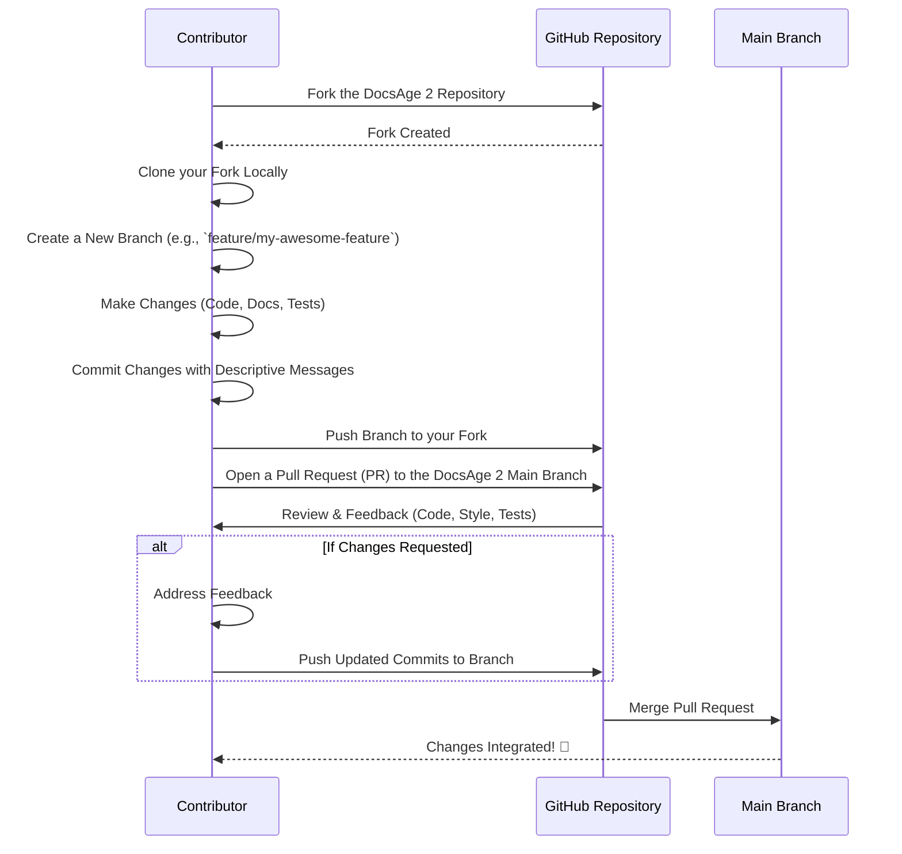

<p align="center">
  <a href="https://github.com/your-username/docsage2">
    
  </a>
</p>

<h1 align="center">
  DocsAge 2 🚀
</h1>

<p align="center">
  Supercharge your project documentation with AI! DocsAge 2 is a powerful CLI tool that leverages Google's Generative AI to automatically create professional READMEs, CONTRIBUTING guidelines, and LICENSE files tailored to your project.
</p>

<p align="center">
  <!-- Version Badge -->
  
  <!-- License Badge -->
  
  <!-- Built With Badges -->
  
  
  
  
</p>

---

## 📝 Table of Contents
- [✨ Overview](#-overview)
- [🌟 Features](#-features)
- [🏗️ Architecture](#%EF%B8%8F-architecture)
- [⚙️ Prerequisites](#%EF%B8%8F-prerequisites)
- [🚀 Installation](#-installation)
- [📖 Usage](#-usage)
- [🛠️ Configuration](#%EF%B8%8F-configuration)
- [🗄️ Database Schema](#%F0%97%97%84%EF%B8%8F-database-schema)
- [📞 API Reference](#%F0%9F%93%9E-api-reference)
- [🛠️ Tech Stack](#%EF%B8%8F-tech-stack)
- [🤝 Contributing](#-contributing)
- [📄 License](#-license)
- [🗺️ Roadmap](#%F0%9F%93%B2-roadmap)
- [🙏 Acknowledgements](#-acknowledgements)

---

## ✨ Overview

In the fast-paced world of software development, creating and maintaining comprehensive project documentation can often feel like a tedious chore, frequently postponed or overlooked. Poor documentation leads to slower onboarding, increased maintenance costs, and a fragmented understanding of project goals.

**DocsAge 2** is here to transform this challenge into an opportunity. By leveraging the advanced capabilities of Google's Generative AI, DocsAge 2 automates the creation of essential project documentation, including `README.md`, `CONTRIBUTING.md`, and `LICENSE` files. It intelligently analyzes your project's structure, dependencies, and key files to generate tailored, professional-grade markdown content, allowing you to focus on coding while ensuring your project is well-documented from the start.

Say goodbye to documentation roadblocks and hello to instant, high-quality project insights!

---

## 🌟 Features

DocsAge 2 provides a suite of features designed to streamline your documentation workflow:

| Feature                   | Description                                                                                                                                              |
| :------------------------ | :------------------------------------------------------------------------------------------------------------------------------------------------------- |
| **AI-Powered Generation** | Utilizes Google's Gemini AI to understand project context and generate intelligent, relevant documentation.                                                |
| **`README.md` Generation**| Creates comprehensive `README.md` files with sections like Overview, Features, Installation, Usage, and more. Supports custom sections, badges, and diagrams. |
| **`CONTRIBUTING.md`**     | Generates detailed `CONTRIBUTING.md` guidelines, including development environment setup, coding standards, and pull request processes.                      |
| **`LICENSE` Generation**  | Automatically generates a `LICENSE` file based on `package.json` specifications or defaults to MIT License if none is specified.                           |
| **Smart Content Analysis**| Scans project structure and key files (`package.json`, `tsconfig.json`, source files) to infer project details and tech stack.                           |
| **Visual Elements**       | Integrates Mermaid.js for architecture diagrams, ERDs, and contributing flowcharts to enhance clarity and visual appeal.                                  |
| **CLI Interface**         | Easy-to-use command-line interface for quick document generation and customization.                                                                     |
| **Configurable Output**   | Offers options to customize generation style (e.g., Professional, Engaging), inclusion of badges, and specific documentation sections.                    |

---

## 🏗️ Architecture

DocsAge 2 operates as a client-side CLI application that interacts with the Google Generative AI API to produce documentation. The architecture is modular, ensuring clear separation of concerns from user interaction to AI processing and file output.

```mermaid
graph TD
    subgraph User Interaction
        A[User] --> B(CLI: src/bin/cli.ts)
    end

    subgraph Core Logic
        B -- "Initiates Generation Request" --> C(Docsage CLI Commands)
        C -- "Fetches Project Context" --> D(File System Service: src/services/file-system.ts)
        C -- "Prepares Prompts & Options" --> E(Gemini Service: src/services/gemini.ts)
    end

    subgraph AI Layer
        E -- "Sends API Request" --> F[Google Generative AI API]
        F -- "Returns Generated Text" --> E
    end

    subgraph Output
        E -- "Provides Generated Content" --> C
        C -- "Writes to File System" --> G[Generated Documentation Files<br>(README.md, CONTRIBUTING.md, LICENSE)]
    end

    D -- "Provides Project Structure & Key Files" --> E
    B -- "Displays Progress/Output" --> H[Console Output]
```

**Flow Description:**
1.  **User Interaction**: The user executes `docsage` commands through the CLI.
2.  **CLI Core**: `src/bin/cli.ts` (powered by Commander.js) parses commands and options, then delegates to specific generation logic.
3.  **File System Service**: `src/services/file-system.ts` is responsible for scanning the current working directory to retrieve project structure and content of key files.
4.  **Gemini Service**: `src/services/gemini.ts` orchestrates the interaction with the Google Generative AI API. It constructs detailed prompts using the project context from the file system service and the user's specified options.
5.  **Google Generative AI API**: Processes the prompt and generates the requested markdown content.
6.  **Output**: The generated content is returned to the CLI, which then writes it to the appropriate documentation files (e.g., `README.md`) in the project's root directory.

---

## ⚙️ Prerequisites

Before you can use DocsAge 2, ensure you have the following installed:

*   **Node.js**: Version 18 or higher.
    *   [Download Node.js](https://nodejs.org/)
*   **npm** or **Yarn**: Package managers for Node.js, typically installed with Node.js.
*   **Google Gemini API Key**: An API key from the Google Cloud Platform for accessing the Gemini API.
    *   [Get your Gemini API Key](https://ai.google.dev/)
    *   Set this as an environment variable named `GEMINI_API_KEY`.

    ```bash
    export GEMINI_API_KEY="YOUR_API_KEY_HERE"
    # Or in a .env file:
    # GEMINI_API_KEY="YOUR_API_KEY_HERE"
    ```

---

## 🚀 Installation

Install DocsAge 2 globally via npm to make it available as a command-line tool across your system:

```bash
npm install -g docsage2
```

To verify the installation, run:

```bash
docsage --version
```
You should see `1.0.0` or a newer version number.

---

## 📖 Usage

DocsAge 2 provides a straightforward command-line interface. Navigate to your project's root directory and use the `docsage` command followed by the desired documentation type.

### Basic Usage

To see all available commands and options:

```bash
docsage --help
```

### Generating a `README.md`

Automatically generate a `README.md` for your current project:

```bash
docsage readme
```

**Customization Options for `readme`:**

| Option                    | Alias | Description                                                                         | Default    | Example Usage                                |
| :------------------------ | :---- | :---------------------------------------------------------------------------------- | :--------- | :------------------------------------------- |
| `--style <style>`         | `-s`  | Set the writing style (e.g., `Professional`, `Engaging`, `Concise`).              | `Professional` | `docsage readme -s Engaging`                 |
| `--no-badges`             |       | Exclude Shields.io badges from the README.                                          | `false`    | `docsage readme --no-badges`                 |
| `--sections <sections>`   | `-S`  | Comma-separated list of sections to include (e.g., `Overview,Features,Usage`).      | All        | `docsage readme -S Overview,Installation`    |
| `--no-architecture`       |       | Exclude the Mermaid Architecture Diagram.                                           | `false`    | `docsage readme --no-architecture`           |
| `--no-erd`                |       | Exclude the Mermaid Entity-Relationship Diagram (if applicable).                    | `false`    | `docsage readme --no-erd`                    |
| `--no-contributing-flow`  |       | Exclude the Mermaid Contributing Flow Diagram.                                      | `false`    | `docsage readme --no-contributing-flow`      |
| `--output <filename>`     | `-o`  | Specify an output filename for the README (e.g., `docs/PROJECT_README.md`).        | `README.md`| `docsage readme -o temp-README.md`           |

**Example: Generate a concise README without badges and only specific sections**

```bash
docsage readme --style Concise --no-badges -S Overview,Installation,Usage,TechStack
```

### Generating `CONTRIBUTING.md`

Create a `CONTRIBUTING.md` file with guidelines for contributors:

```bash
docsage contributing
```

**Customization Options for `contributing`:**

| Option                | Alias | Description                                                               | Default       | Example Usage                                |
| :-------------------- | :---- | :------------------------------------------------------------------------ | :------------ | :------------------------------------------- |
| `--output <filename>` | `-o`  | Specify an output filename for the CONTRIBUTING guidelines.             | `CONTRIBUTING.md` | `docsage contributing -o docs/CONTRIBUTE.md` |

### Generating `LICENSE`

Generate a `LICENSE` file for your project. DocsAge 2 will try to infer the license type from your `package.json` or default to MIT.

```bash
docsage license
```

**Customization Options for `license`:**

| Option                | Alias | Description                                                        | Default       | Example Usage                         |
| :-------------------- | :---- | :----------------------------------------------------------------- | :------------ | :------------------------------------ |
| `--author <name>`     | `-a`  | Specify the copyright holder for the license.                      | `The Maintainers` | `docsage license -a "Acme Corp"`      |
| `--output <filename>` | `-o`  | Specify an output filename for the LICENSE (e.g., `LICENSE.txt`). | `LICENSE`     | `docsage license -o custom-LICENSE`   |

---

## 🛠️ Configuration

DocsAge 2 is primarily configured via command-line options and environment variables.

### Environment Variables

*   `GEMINI_API_KEY`: **(Required)** Your Google Gemini API key. DocsAge 2 will not function without this. It should be set in your environment or in a `.env` file in the directory where you run the command.

    ```dotenv
    GEMINI_API_KEY=your_google_gemini_api_key_here
    ```

### Command-Line Arguments

As detailed in the [Usage](#-usage) section, various command-line flags allow you to fine-tune the output:
- `--style`: Controls the tone and verbosity.
- `--no-badges`: Omits Shields.io badges.
- `--sections`: Specifies which content sections to include.
- `--no-architecture`, `--no-erd`, `--no-contributing-flow`: Controls the inclusion of Mermaid diagrams.
- `--output`: Redirects output to a custom filename.

---

## 🗄️ Database Schema

DocsAge 2 is a lightweight command-line utility and does not utilize a traditional database. It operates by reading local file system data and interacting with external AI APIs. Therefore, there is no database schema or Entity-Relationship Diagram (ERD) relevant to this project.

---

## 📞 API Reference

DocsAge 2 is a command-line interface (CLI) tool designed for direct user interaction, not a library or a server-side API that exposes endpoints for other applications to consume.

It *internally* interacts with the **Google Generative AI API** to perform its core documentation generation tasks. Details of the Google Generative AI API can be found in their official documentation:

*   [Google Generative AI Developer Website](https://ai.google.dev/)
*   [Google Generative AI Node.js Client Library](https://github.com/google/generative-ai-js)

DocsAge 2 provides its functionality solely through its CLI commands, as outlined in the [Usage](#-usage) section.

---

## 🛠️ Tech Stack

DocsAge 2 is built with a modern and efficient technology stack, primarily focused on Node.js and TypeScript for a robust command-line experience.

*   **TypeScript**: A typed superset of JavaScript that compiles to plain JavaScript, enhancing code quality and maintainability.
*   **Node.js**: A powerful JavaScript runtime environment, ideal for building server-side applications and command-line tools.
*   **Commander.js**: A robust and user-friendly CLI framework for Node.js, making command parsing and option handling simple.
*   **Inquirer.js**: An elegant toolkit for creating interactive command-line prompts, improving user experience.
*   **@google/generative-ai**: The official Node.js client library for interacting with Google's Generative AI (Gemini) models.
*   **dotenv**: A zero-dependency module that loads environment variables from a `.env` file into `process.env`.
*   **chalk**: A library for styling terminal strings, adding colors and effects to console output.
*   **figlet**: Generates ASCII art from text, used for decorative banners in the CLI.
*   **gradient-string**: Adds colorful gradients to terminal strings for enhanced visual appeal.
*   **boxen**: Creates boxes around text, useful for highlighting messages in the terminal.
*   **ora**: A tiny terminal spinner, indicating ongoing operations for better user feedback.
*   **glob**: A utility for finding files matching specific patterns, used for analyzing project structure.

---

## 🤝 Contributing

We welcome contributions to DocsAge 2! Whether it's bug reports, feature requests, or code contributions, your help is valuable. Please refer to our `CONTRIBUTING.md` file for detailed guidelines on how to contribute effectively.

Here's a simplified flow for contributing to DocsAge 2:



---

## 📄 License

This project is licensed under the **ISC License**.

```
ISC License

Copyright (c) 2024, The Maintainers

Permission to use, copy, modify, and/or distribute this software for any
purpose with or without fee is hereby granted, provided that the above
copyright notice and this permission notice appear in all copies.

THE SOFTWARE IS PROVIDED "AS IS IS" AND THE AUTHOR DISCLAIMS ALL WARRANTIES
WITH REGARD TO THIS SOFTWARE INCLUDING ALL IMPLIED WARRANTIES OF
MERCHANTABILITY AND FITNESS. IN NO EVENT SHALL THE AUTHOR BE LIABLE FOR
ANY SPECIAL, DIRECT, INDIRECT, OR CONSEQUENTIAL DAMAGES OR ANY DAMAGES
WHATSOEVER RESULTING FROM LOSS OF USE, DATA OR PROFITS, WHETHER IN AN
ACTION OF CONTRACT, NEGLIGENCE OR OTHER TORTIOUS ACTION, ARISING OUT OF
OR IN CONNECTION WITH THE USE OR PERFORMANCE OF THIS SOFTWARE.

```

---

## 🗺️ Roadmap

DocsAge 2 is continually evolving! Here are some features and enhancements we plan to implement in the future:

*   **Support for more documentation types**: Generate `CHANGELOG.md`, `CODE_OF_CONDUCT.md`, `SECURITY.md`.
*   **Customizable templates**: Allow users to provide their own markdown templates for generation.
*   **Integration with more AI models**: Support for other LLMs beyond Google Gemini.
*   **Interactive configuration wizard**: A more guided CLI experience for initial setup and complex options.
*   **Plugin system**: Enable community-driven plugins for custom document sections or output formats.
*   **Web UI (stretch goal)**: A simple web interface for generating documentation without the CLI.

---

## 🙏 Acknowledgements

We extend our sincere gratitude to:

*   **Google's Generative AI Team**: For providing the powerful Gemini models that are at the core of DocsAge 2.
*   **The Open-Source Community**: For the invaluable libraries and tools (Node.js, TypeScript, Commander.js, Inquirer.js, etc.) that make this project possible.
*   **Contributors**: To everyone who has contributed ideas, bug reports, or code.
*   **Users**: For trying out DocsAge 2 and providing feedback!