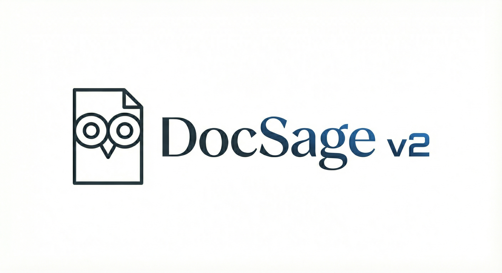
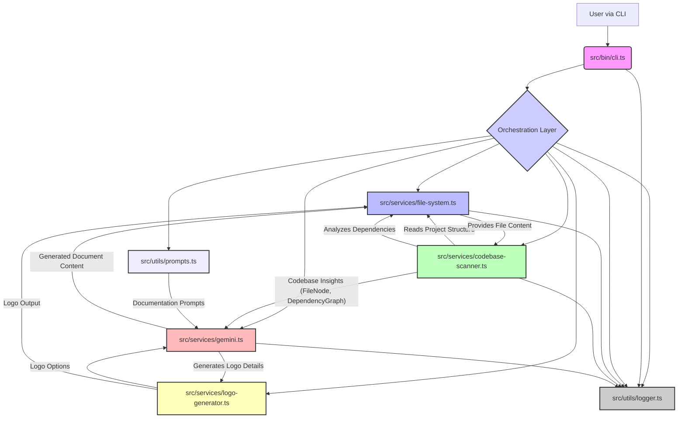

<p align="center">
  
</p>
<h1 align="center">
  <a href="#" style="text-decoration: none;">
    <span style="background: linear-gradient(to right, #007bff, #17a2b8); -webkit-background-clip: text; -webkit-text-fill-color: transparent;">DocSage v2</span>
  </a>
</h1>
<p align="center">
  <strong>🚀 AI-Powered Documentation Generator for Modern Codebases 🚀</strong>
</p>

<p align="center">
  <a href="https://www.npmjs.com/package/docsagev2" target="_blank">
    
  </a>
  <a href="https://github.com/Owusu1946/docsagev2/blob/main/LICENSE" target="_blank">
    
  </a>
  
  
  
  
</p>

<details>
<summary>📖 Table of Contents</summary>

- [Overview](#overview)
- [Features](#features)
- [Tech Stack](#tech-stack)
- [Architecture](#architecture)
- [Getting Started](#getting-started)
- [API Reference](#api-reference)
- [Configuration](#configuration)
- [Project Structure](#project-structure)
- [Contributing](#contributing)
- [License](#license)

</details>

## ✨ Overview

DocSage v2 is an innovative, AI-powered command-line interface (CLI) tool meticulously designed to automate the generation of comprehensive and high-quality documentation for your software projects. Leveraging advanced codebase analysis and sophisticated AI models, DocSage v2 streamlines the often tedious process of creating essential project files like `README.md`, `CONTRIBUTING.md`, and `LICENSE` documents. It delves deep into your project's structure, understanding its components, dependencies, and overall architecture to craft contextually relevant and accurate documentation.

The core motivation behind DocSage v2 is to solve the pervasive problem of outdated, incomplete, or non-existent project documentation. Developers frequently struggle to allocate sufficient time for documentation, leading to knowledge gaps that hinder onboarding, collaboration, and long-term maintainability. By automating this critical task, DocSage v2 empowers development teams to maintain impeccable documentation standards without diverting valuable engineering resources from core development efforts. It ensures that every project, regardless of its size or complexity, can have clear, well-structured, and up-to-date informational resources.

What sets DocSage v2 apart is its intelligent approach to content generation. Unlike simple template engines, DocSage v2 employs a "Service Layer" architectural pattern, enabling a modular and highly capable system. It doesn't just fill in blanks; it intelligently processes codebase insights, identifies key project facets, and generates human-like text that explains the project's purpose, features, and operational procedures. This deep integration with the codebase via services like `codebase-scanner.ts` and `file-system.ts`, combined with the generative capabilities of `gemini.ts`, allows for a truly dynamic and adaptive documentation experience.

DocSage v2 is primarily for developers, project maintainers, and open-source contributors who seek to enhance their project's discoverability, usability, and collaborative potential. It's an indispensable tool for anyone looking to foster a more organized, transparent, and welcoming environment for new contributors and existing team members alike. By providing a solid foundation of documentation, DocSage v2 helps projects thrive and encourages a culture of clarity and efficiency.

## 🌟 Features

DocSage v2 offers a robust set of features designed to make documentation generation effortless and intelligent.

| Feature Category        | Feature                                  | Description                                                                                                                                                                                                                                                                                                                                                                                                         |
| :---------------------- | :--------------------------------------- | :-------------------------------------------------------------------------------------------------------------------------------------------------------------------------------------------------------------------------------------------------------------------------------------------------------------------------------------------------------------------------------------------------- |
| **Intelligent Document Generation** | AI-Powered Content Creation                    | Utilizes advanced AI models (via `src/services/gemini.ts`) to generate detailed and contextually relevant documentation. This includes dynamic content for `README.md`, `CONTRIBUTING.md`, and `LICENSE` files, leveraging predefined prompts from `src/utils/prompts.ts` to guide the AI's output. The AI intelligently interprets codebase analysis to craft comprehensive explanations. |
| **Deep Codebase Analysis** | Project Structure & Key Files Scanning         | Employs `src/services/codebase-scanner.ts` and `src/services/file-system.ts` to recursively scan and understand the project's directory structure, identify key files (like `package.json`, `tsconfig.json`), and extract their content. This provides the AI with a deep understanding of the project's composition, dependencies, and configuration.                              |
|                         | Dependency Graph Generation                    | The `codebase-scanner.ts` service is capable of identifying and mapping out dependencies within the project, represented as `FileNode` and `DependencyEdge` within a `DependencyGraph`. This information is crucial for the AI to accurately describe how different parts of the project interact.                                                                                              |
| **Customizable Output** | Documentation Template Utilization             | Leverages a collection of pre-defined, extensible prompts (`README_PROMPT`, `CONTRIBUTING_PROMPT`, `LICENSE_PROMPT` from `src/utils/prompts.ts`) to ensure generated documents adhere to best practices and project requirements. Users can configure how the AI interprets and fills these templates.                                                                            |
|                         | Dynamic Logo Generation                        | Includes `src/services/logo-generator.ts` which provides functionalities to manage and potentially generate or integrate project logos based on specified `LogoOptions`, ensuring a complete and professional documentation package. Output includes `GeneratedLogo` data.                                                                                                            |
| **Developer Experience** | Command-Line Interface (CLI)                   | Provides a straightforward and intuitive command-line interface (`src/bin/cli.ts`) for easy execution and interaction. Users can initiate documentation generation with simple commands.                                                                                                                                                                                              |
|                         | Integrated Logging                             | Incorporates a centralized logging utility (`src/utils/logger.ts`) to provide clear feedback during the documentation generation process, indicating progress, warnings, and errors directly to the user.                                                                                                                                                                             |
| **Maintainability**     | Service Layer Architecture                     | Built upon a robust "Service Layer" architectural pattern, promoting separation of concerns, modularity, and easier maintenance. This design makes the codebase highly scalable and extensible for future enhancements.                                                                                                                                                              |

**Example CLI Usage:**

To generate documentation for your project:

```bash
# Assuming docsagev2 is installed globally
docsagev2 generate
```

This command would trigger the codebase scanner, feed the analysis to the AI service, and then generate the required documentation files in your project's root directory.

## 🛠️ Tech Stack

DocSage v2 is built using modern and efficient technologies to ensure high performance, reliability, and maintainability.

| Category          | Technology  | Purpose                                                                                                 |
| :---------------- | :---------- | :------------------------------------------------------------------------------------------------------ |
| **Language**      | TypeScript  | Provides strong typing, enhanced tooling, and improved code quality and maintainability for the project. |
| **Package Manager** | npm         | Manages project dependencies, scripts, and package distribution.                                        |
| **AI Integration**| Gemini      | (Implied) Powers the intelligent content generation for documentation.                                  |

## 🏛️ Architecture

DocSage v2 adopts a clean and modular "Service Layer" architectural pattern, ensuring separation of concerns, reusability, and ease of maintenance. The core logic is encapsulated within various services, orchestrated by a central CLI entry point.

The system flow typically begins with the CLI, which interacts with the file system and codebase scanner to gather project information. This information is then fed into the AI service (Gemini) along with predefined prompts to generate documentation content. Finally, the generated content is written back to the file system.



**Component Breakdown:**

*   **`src/bin/cli.ts`**: This is the primary entry point for users interacting with DocSage v2. It parses command-line arguments, orchestrates the workflow, and invokes the appropriate services based on user input. It acts as the "Controller" in the service layer pattern.
*   **`src/services/file-system.ts`**: Responsible for all file system operations. This includes reading file content (`readFileContent`), obtaining the project's directory structure (`getProjectStructure`), and retrieving content from key files (`getKeyFilesContent`). It abstracts away the low-level I/O details.
*   **`src/services/codebase-scanner.ts`**: This service is the intelligence behind understanding the project. It uses `file-system.ts` to read files and directories, constructs a `FileNode` representation, identifies `DependencyEdge`s, and builds a comprehensive `DependencyGraph` of the codebase. This analysis forms the basis for AI content generation.
*   **`src/services/gemini.ts`**: Encapsulates all interactions with the Gemini AI model. This service takes the codebase analysis data and relevant prompts, sends them to the AI, and processes the AI's generated textual content for documentation. It exports `GeminiService` to manage these AI interactions.
*   **`src/services/logo-generator.ts`**: A utility service dedicated to managing and potentially generating or modifying project logos. It defines `LogoOptions` and returns `GeneratedLogo` data, supporting the visual elements of documentation.
*   **`src/utils/prompts.ts`**: This module centralizes the various prompts (`README_PROMPT`, `CONTRIBUTING_PROMPT`, `LICENSE_PROMPT`) used to guide the AI's generation process. These prompts provide structure and context for the AI, ensuring the output aligns with typical documentation standards.
*   **`src/utils/logger.ts`**: Provides a standardized logging mechanism (`logger`) across the application, making it easier to track execution flow, debug issues, and provide informative output to the user.

**Service Layer Pattern:**
The "Service Layer" pattern is evident throughout the architecture. Each service (`file-system`, `codebase-scanner`, `gemini`, `logo-generator`) is dedicated to a specific business capability or domain logic. These services are independent and can be composed by higher-level orchestrators (like `cli.ts`). This design promotes a clear separation of concerns: `cli.ts` handles user interaction, services handle specific operations, and `utils` provide shared functionalities. This modularity makes the system robust, testable, and extensible.

## 🚀 Getting Started

To get DocSage v2 up and running, follow these step-by-step instructions.

### Prerequisites

Before you begin, ensure you have the following software installed on your system:

*   **Node.js**: `v16.x` or higher (recommended `v18.x` or `v20.x`).
    You can check your Node.js version by running:
    ```bash
    node -v
    ```
*   **npm**: `v8.x` or higher.
    npm is typically installed alongside Node.js. You can verify its version:
    ```bash
    npm -v
    ```

### Installation

DocSage v2 is designed to be installed globally as a command-line tool.

1.  **Install via npm:**
    Open your terminal or command prompt and run the following command:
    ```bash
    npm install -g docsagev2
    ```
    This command installs the `docsagev2` package globally, making its CLI commands available from any directory.

2.  **Verify Installation:**
    To confirm that DocSage v2 has been installed correctly, you can try running its help command:
    ```bash
    docsagev2 --help
    ```
    If the installation was successful, you should see a list of available commands and options.

### Environment Setup

DocSage v2 utilizes AI services for content generation, which typically requires an API key for authentication and access.

1.  **Obtain a Gemini API Key:**
    If you are using the Gemini AI service, you will need an API key. Please refer to the official Gemini documentation for instructions on how to obtain one.

2.  **Set Environment Variable:**
    Once you have your API key, you must set it as an environment variable named `GEMINI_API_KEY`.
    *   **For Linux/macOS:**
        Add the following line to your shell's configuration file (e.g., `.bashrc`, `.zshrc`, or `.profile`):
        ```bash
        export GEMINI_API_KEY="YOUR_GEMINI_API_KEY_HERE"
        ```
        After adding, remember to source the file or restart your terminal:
        ```bash
        source ~/.zshrc # or ~/.bashrc, ~/.profile
        ```
    *   **For Windows (Command Prompt):**
        ```bash
        setx GEMINI_API_KEY "YOUR_GEMINI_API_KEY_HERE"
        ```
    *   **For Windows (PowerShell):**
        ```bash
        $env:GEMINI_API_KEY="YOUR_GEMINI_API_KEY_HERE"
        ```
        Note: For PowerShell, this sets the variable only for the current session. For permanent setting, use system environment variables GUI.

### Running the Project

Navigate to the root directory of your project where you want to generate documentation. Then, execute the `docsagev2` command.

1.  **Generate Documentation:**
    ```bash
    docsagev2 generate
    ```
    This command will initiate the codebase scanning, leverage the AI service to generate content for `README.md`, `CONTRIBUTING.md`, and `LICENSE` files, and then write them to your current project directory.

### Running Tests

Details regarding running tests for DocSage v2 were not explicitly provided in the codebase analysis. Typically, a project built with TypeScript and npm would use a testing framework configured in `package.json`. If you are contributing to DocSage v2, please refer to the `CONTRIBUTING.md` for specific testing instructions.

## 🔗 API Reference

DocSage v2 is designed as a command-line interface (CLI) tool for generating documentation, not as a standalone web API with exposed endpoints for external consumption. Therefore, there is no public API reference for RESTful endpoints or similar services.

The project's internal services, such as `src/services/gemini.ts` (exporting `GeminiService`), `src/services/file-system.ts` (exporting functions like `getProjectStructure`, `readFileContent`, `getKeyFilesContent`), and `src/services/logo-generator.ts` (exporting `LogoOptions`, `GeneratedLogo`), are internal modules used by the CLI. These are not intended for direct external API calls.

## ⚙️ Configuration

DocSage v2's primary configuration is managed through environment variables, particularly for integrating with external AI services.

### Environment Variables

The following environment variable is crucial for the proper functioning of DocSage v2:

*   **`GEMINI_API_KEY`**
    *   **Purpose**: This variable holds the API key required to authenticate and authorize requests to the Gemini AI service. It is essential for the `src/services/gemini.ts` service to interact with the AI model for content generation.
    *   **Example Value**: `"your_secret_gemini_api_key_12345"`
    *   **How to Set**: Refer to the [Environment Setup](#environment-setup) section for instructions on how to set this variable on your operating system.

### Configuration File Options

Based on the provided codebase analysis, there are no explicit configuration files (e.g., `.docsagerc`, `docsage.config.js`) detailed for advanced customization. The project primarily relies on its internal logic, codebase analysis, and environment variables. Future versions or contributions might introduce more granular configuration options through dedicated files.

## 📂 Project Structure

The DocSage v2 codebase is organized into a clear and logical structure, facilitating development, maintenance, and understanding of its components.

```
.
├── src/
│   ├── bin/
│   │   └── cli.ts                # Command-Line Interface entry point
│   ├── services/
│   │   ├── codebase-scanner.ts   # Core logic for analyzing project structure and dependencies
│   │   ├── file-system.ts        # Utilities for file system operations (read, list)
│   │   ├── gemini.ts             # Service for interacting with the Gemini AI model
│   │   └── logo-generator.ts     # Service for logo generation and management
│   └── utils/
│       ├── logger.ts             # Centralized logging utility
│       └── prompts.ts            # Defines AI prompts for documentation generation
├── assets/
│   └── logo.svg                  # Project logo
├── .github/
│   └── CODE_OF_CONDUCT.md        # Code of Conduct for contributors
├── package.json                  # Project metadata and dependencies
├── tsconfig.json                 # TypeScript compiler configuration
├── README.md                     # This documentation file
├── LICENSE                       # Project license (MIT)
└── CONTRIBUTING.md               # Guidelines for contributors
```

## 👋 Contributing

We warmly welcome contributions from the community! Whether it's reporting a bug, suggesting an enhancement, or submitting a pull request, your input is invaluable in making DocSage v2 better.

Please take a moment to review our comprehensive [CONTRIBUTING.md](CONTRIBUTING.md) guide before making your first contribution. It contains detailed information on:

*   How to set up your development environment.
*   The contribution workflow.
*   Coding style guidelines.
*   How to submit pull requests.
*   Reporting bugs and suggesting features.

We also kindly request all contributors to adhere to our [CODE_OF_CONDUCT.md](.github/CODE_OF_CONDUCT.md). Our goal is to foster an open and welcoming environment for everyone.

**Quick Contribution Guide:**

1.  **Fork** the repository on GitHub.
2.  **Clone** your forked repository to your local machine:
    ```bash
    git clone https://github.com/your-username/docsagev2.git
    cd docsagev2
    ```
3.  **Install dependencies**:
    ```bash
    npm install
    ```
4.  **Create a new branch** for your feature or bug fix.
5.  **Make your changes**, ensuring they align with the project's coding standards.
6.  **Commit your changes** with a clear and descriptive message.
7.  **Push your branch** to your forked repository.
8.  **Open a Pull Request** against the `main` branch of the original `docsagev2` repository.

Thank you for considering contributing to DocSage v2! Your efforts help strengthen this project for everyone.

## 📝 License

DocSage v2 is released under the **MIT License**.

[](https://github.com/Owusu1946/docsagev2/blob/main/LICENSE)

This means you are free to use, copy, modify, merge, publish, distribute, sublicense, and/or sell copies of the software, subject to the conditions outlined in the [LICENSE](LICENSE) file. A brief summary of the MIT license is that it's a permissive free software license, meaning it allows reuse of the software for proprietary software provided that all copies of the software include a copy of the MIT License terms and the copyright notice.

---
<p align="center">
  <sub>📝 Generated with <a href="https://github.com/Owusu1946/docsagev2">DocSage</a> - AI-powered documentation</sub>
</p>
