<p align="center">
  
</p>

<h1 align="center">docsagev2</h1>

<p align="center">
  <b>🚀 Your AI-Powered Documentation Co-pilot for Rapid Project Documentation Generation! 🚀</b>
</p>

<p align="center">
  <!-- Version Badge -->
  <a href="https://www.npmjs.com/package/docsagev2" target="_blank">
    
  </a>
  <!-- License Badge -->
  <a href="https://github.com/Owusu1946/docsagev2/blob/main/LICENSE" target="_blank">
    
  </a>
  <!-- Tech Stack Badges -->
  
  
  
  
</p>

---

## Table of Contents

- [Overview](#overview)
- [Features](#features)
- [Architecture](#architecture)
- [Prerequisites](#prerequisites)
- [Installation](#installation)
- [Usage](#usage)
- [Configuration](#configuration)
- [Database Schema](#database-schema)
- [API Reference](#api-reference)
- [Tech Stack](#tech-stack)
- [Contributing](#contributing)
- [License](#license)
- [Roadmap](#roadmap)
- [Acknowledgements](#acknowledgements)

---

## Overview

In the fast-paced world of software development, maintaining up-to-date and comprehensive documentation often becomes an afterthought, leading to knowledge gaps, slowed onboarding, and increased technical debt. `docsagev2` addresses this critical challenge by providing an intelligent, AI-powered command-line interface (CLI) tool that automates the generation of various project documentation files.

Leveraging the advanced capabilities of the Google Gemini AI, `docsagev2` analyzes your project's structure, key files, and dependencies to craft professional `README.md`, `CONTRIBUTING.md`, and `LICENSE` files with minimal effort. This tool empowers developers to focus on coding while ensuring their projects are well-documented, promoting better collaboration and project longevity.

---

## Features

`docsagev2` comes packed with powerful features designed to streamline your documentation workflow:

-   **AI-Powered Document Generation**: Automatically generates `README.md`, `CONTRIBUTING.md`, and `LICENSE` files using Google Gemini AI, analyzing your project's context for accurate and relevant content.
-   **Comprehensive `README.md`**: Generates detailed `README.md` files including sections for overview, features, architecture diagrams, installation instructions, usage examples, and more.
-   **Streamlined `CONTRIBUTING.md`**: Creates professional `CONTRIBUTING.md` guidelines covering bug reports, feature requests, development setup, code style, and pull request processes.
-   **Automated License Creation**: Generates complete and accurate license texts (e.g., MIT, Apache 2.0) with configurable copyright details.
-   **Customizable Output**: Supports various configuration options to tailor the generated content, including specific sections, diagram inclusion, and stylistic choices.
-   **Mermaid Diagram Support**: Automatically embeds Mermaid.js syntax for architecture diagrams and contributing workflow diagrams directly into your Markdown files.
-   **Interactive CLI**: Utilizes `commander` and `inquirer` for an intuitive and user-friendly command-line experience.
-   **TypeScript-First**: Developed in TypeScript for robust, maintainable, and scalable code.

---

## Architecture

`docsagev2` operates as a CLI tool that orchestrates interactions between the user, the project's file system, and the Google Gemini AI service to produce documentation.


**Explanation:**
1.  **User Interaction**: Developers interact with `docsagev2` through a command-line interface, providing commands and responding to prompts.
2.  **docsagev2 CLI**: The core of the application, built with `commander` and `inquirer`, parses user input and orchestrates the documentation generation process.
3.  **File System Service**: This internal service reads the project's directory structure and the content of key files (`package.json`, `tsconfig.json`, source files) to provide context for the AI.
4.  **Gemini Service**: Responsible for communicating with the Google Generative AI API. It constructs prompts based on user configurations and project context, sends them to the AI, and receives the generated text.
5.  **Google Generative AI API**: The external AI model (Gemini) processes the detailed prompts and generates the requested documentation content.
6.  **Markdown Renderer**: Processes the raw text from the Gemini service, ensuring proper Markdown formatting, embedding diagrams, and structuring the output.
7.  **Generated Documentation Files**: The final `README.md`, `CONTRIBUTING.md`, or `LICENSE` files are created.
8.  **Project Directory**: The generated documentation files are written back into the user's project directory.

---

## Prerequisites

Before using `docsagev2`, ensure you have the following installed and configured:

-   **Node.js**: Version 18.x or higher. You can download it from [nodejs.org](https://nodejs.org/).
-   **npm**: Node Package Manager, which comes bundled with Node.js.
-   **Google Gemini API Key**: You will need an API key for the Google Generative AI.
    1.  Go to the [Google AI Studio](https://aistudio.google.com/).
    2.  Create a new API key.
    3.  Set this API key as an environment variable named `GEMINI_API_KEY` in your system or in a `.env` file in the project where you run `docsagev2`.

    ```bash
    export GEMINI_API_KEY="YOUR_GEMINI_API_KEY_HERE"
    ```

---

## Installation

You can install `docsagev2` globally to use it anywhere in your system or as a local project dependency.

### Global Installation

This is the recommended method for using `docsagev2` as a general-purpose tool.

```bash
npm install -g docsagev2
```

After installation, you can run `docsage` commands directly from any directory.

### Local Installation

If you prefer to include `docsagev2` as a development dependency within a specific project:

```bash
npm install --save-dev docsagev2
```

To run `docsage` commands locally, you will need to use `npx`:

```bash
npx docsage [command]
```

---

## Usage

`docsagev2` is designed to be straightforward to use. Here are some common commands and examples.

### Basic Generation

To get started, navigate to your project's root directory and run the `init` command, which will guide you through generating essential documentation.

```bash
docsage init
```

Alternatively, you can generate specific documents:

### Generate `README.md`

```bash
docsage generate readme [options]
```

**Example:** Generate a README with specific sections and diagrams.

```bash
docsage generate readme \
  --sections "Overview,Features,Architecture,Installation,Usage,Tech Stack,Contributing,License" \
  --include-architecture-diagram \
  --include-contributing-diagram \
  --style Professional
```

### Generate `CONTRIBUTING.md`

```bash
docsage generate contributing [options]
```

**Example:** Generate a CONTRIBUTING.md with a specific Code of Conduct.

```bash
docsage generate contributing \
  --code-of-conduct "Contributor Covenant" \
  --include-templates
```

### Generate `LICENSE`

```bash
docsage generate license [options]
```

**Example:** Generate an MIT license with specific author details.

```bash
bash
docsage generate license \
  --type "MIT" \
  --author "Your Name or Organization"
```

### Unified Document Generation (Merge Mode)

The `merge` command allows `docsagev2` to generate a README that includes full contributing guidelines and license text directly within it, providing a single, comprehensive documentation file.

```bash
docsage generate readme --merge-docs \
  --license-type "MIT" \
  --author "Your Name" \
  --include-architecture-diagram \
  --include-contributing-diagram
```

### Help

To see all available commands and options:

```bash
docsage --help
# Or for a specific command:
docsage generate readme --help
```

---

## Configuration

`docsagev2` can be configured via command-line flags. Future versions may include support for a configuration file.

### Environment Variables

-   `GEMINI_API_KEY`: Your Google Gemini API key. **Required**.

### Command-line Options

The `docsage generate` command and its subcommands (e.g., `readme`, `contributing`, `license`) accept various flags:

| Option                    | Description                                                                 | Default      | Applicable To                 |
| :------------------------ | :-------------------------------------------------------------------------- | :----------- | :---------------------------- |
| `--style <style>`         | Adopt a specific writing style/tone (e.g., `Professional`, `Concise`).      | `Professional` | `readme`, `contributing`      |
| `--include-badges`        | Include Shields.io badges in the generated README.                          | `true`       | `readme`                      |
| `--sections <list>`       | Comma-separated list of sections to include in the README.                  | `All`        | `readme`                      |
| `--include-architecture-diagram` | Embed a Mermaid.js architecture diagram.                                    | `false`      | `readme`                      |
| `--include-erd`           | Embed a Mermaid.js ERD (if applicable to project).                          | `false`      | `readme`                      |
| `--include-contributing-diagram` | Embed a Mermaid.js contributing flow diagram.                               | `false`      | `readme`                      |
| `--merge-docs`            | Merge contributing guidelines and license text directly into README.md.     | `false`      | `readme`                      |
| `--license-type <type>`   | Specify the license type (e.g., `MIT`, `Apache 2.0`).                       | `MIT`        | `readme` (with `--merge-docs`), `license` |
| `--author <name>`         | Copyright holder for the license.                                           | `The Maintainers` | `readme` (with `--merge-docs`), `license` |
| `--code-of-conduct <type>`| Type of Code of Conduct to reference/include (e.g., `Contributor Covenant`). | `None`       | `contributing`                |
| `--include-templates`     | Include example issue/PR templates in the CONTRIBUTING.md.                  | `false`      | `contributing`                |
| `--output <path>`         | Specify the output file path.                                               | Current dir  | All                           |

---

## Database Schema

This project is a command-line interface (CLI) tool and does not utilize a database. Therefore, a database schema is not applicable. Its primary function is to interact with the file system and external AI services.

---

## API Reference

`docsagev2` is a CLI application designed for direct developer use and does not expose a public API for other applications to consume programmatically. Its core functionalities are accessed via command-line commands and options.

If you are interested in extending or integrating `docsagev2`, you would typically interact with its source code as a Node.js module rather than through a traditional REST or GraphQL API.

---

## Tech Stack

`docsagev2` is built with a modern and robust set of technologies:

-   **TypeScript**: A superset of JavaScript that adds static typing, enhancing code quality and developer experience.
-   **Node.js**: A powerful JavaScript runtime environment used for building server-side applications and command-line tools.
-   **Google Generative AI**: The underlying artificial intelligence model (Gemini) that powers the documentation generation.
-   **Commander.js**: A robust library for building command-line interfaces, simplifying argument parsing and command definition.
-   **Inquirer.js**: Provides an elegant way to create interactive command-line prompts, making the CLI user-friendly.
-   **Chalk**: A library for styling terminal output with colors and styles, improving readability and user experience.
-   **Boxen**: Creates customizable boxes in the terminal, often used for displaying stylized messages or banners.
-   **Figlet**: Generates ASCII art banners, commonly used for welcome messages in CLIs.
-   **Gradient-String**: Adds gradient colors to terminal strings for eye-catching output.
-   **Ora**: A tiny library for elegant terminal spinners, providing visual feedback during long-running operations.
-   **Dotenv**: Loads environment variables from a `.env` file, crucial for managing API keys and configuration.
-   **Glob**: For matching file paths with patterns, essential for analyzing project structure.
-   **Diff**: A library to generate and apply diffs, potentially used for comparing generated docs or showing changes.

---

## Contributing

We welcome contributions from the community! Whether it's bug reports, feature requests, or code contributions, your help is invaluable. Please refer to our `CONTRIBUTING.md` file for detailed guidelines on how to get started.

```mermaid
sequenceDiagram
    actor Developer
    participant GitHub
    participant ProjectMaintainers
    Developer->>GitHub: Forks repository
    Developer->>Developer: Clones fork & creates feature branch
    Developer->>Developer: Implements new feature or bugfix
    Developer->>GitHub: Pushes feature branch to fork
    Developer->>GitHub: Opens Pull Request (PR)
    GitHub->>ProjectMaintainers: Notifies of new PR
    ProjectMaintainers->>Developer: Reviews code, suggests changes (optional)
    Developer->>Developer: Addresses feedback & pushes updates
    ProjectMaintainers->>GitHub: Approves PR
    GitHub->>GitHub: Merges PR into 'main' branch
    ProjectMaintainers->>Developer: Thanks for contributing! 🎉
```



---

## License

This project is licensed under the **MIT License**.

See the [LICENSE](LICENSE) file for more details.

```text
MIT License

Copyright (c) 2024 docsagev2

Permission is hereby granted, free of charge, to any person obtaining a copy
of this software and associated documentation files (the "Software"), to deal
in the Software without restriction, including without limitation the rights
to use, copy, modify, merge, publish, distribute, sublicense, and/or sell
copies of the Software, and to permit persons to whom the Software is
furnished to do so, subject to the following conditions:

The above copyright notice and this permission notice shall be included in all
copies or substantial portions of the Software.

THE SOFTWARE IS PROVIDED "AS IS", WITHOUT WARRANTY OF ANY KIND, EXPRESS OR
IMPLIED, INCLUDING BUT NOT LIMITED TO THE WARRANTIES OF MERCHANTABILITY,
FITNESS FOR A PARTICULAR PURPOSE AND NONINFRINGEMENT. IN NO EVENT SHALL THE
AUTHORS OR COPYRIGHT HOLDERS BE LIABLE FOR ANY CLAIM, DAMAGES OR OTHER
LIABILITY, WHETHER IN AN ACTION OF CONTRACT, TORT OR OTHERWISE, ARISING FROM,
OUT OF OR IN CONNECTION WITH THE SOFTWARE OR THE USE OR OTHER DEALINGS IN THE
SOFTWARE.
```

---

## Roadmap

`docsagev2` is under active development, and we have exciting plans for its future. Here's a glimpse of what's on the horizon:

-   **Support for More Document Types**: Expand generation capabilities to include API documentation, design documents, security policies, and more.
-   **Advanced Customization Options**: Provide more granular control over generated content, including custom templates and section ordering.
-   **Multi-AI Model Support**: Integrate with other large language models (LLMs) to offer users more choice and flexibility.
-   **Configuration File Support**: Introduce a `docsage.json` or similar configuration file for project-specific default settings.
-   **Git Integration Enhancements**: Smarter suggestions for `CONTRIBUTING.md` based on existing `.github` templates or commit history.
-   **Web UI / Desktop Application**: Explore options for a graphical interface to make documentation generation even more accessible.
-   **CI/CD Integration**: Tools and guidelines for integrating `docsagev2` into continuous integration/continuous deployment pipelines to ensure documentation stays up-to-date.
-   **Plugin Architecture**: Allow community-driven extensions for custom document types or integrations.

---

## Acknowledgements

We extend our gratitude to the creators and maintainers of the following open-source projects and services that make `docsagev2` possible:

-   [Google Generative AI](https://ai.google.dev/) for providing the powerful Gemini models.
-   [Node.js](https://nodejs.org/) for the excellent JavaScript runtime.
-   [TypeScript](https://www.typescriptlang.org/) for making JavaScript development a joy.
-   [Commander.js](https://github.com/tj/commander.js) for simplifying CLI development.
-   [Inquirer.js](https://github.com/SBoudrias/Inquirer.js) for interactive prompts.
-   [Chalk](https://github.com/chalk/chalk), [Boxen](https://github.com/sindresorhus/boxen), [Figlet](https://github.com/patorjk/figlet.js), [Gradient-String](https://github.com/sindresorhus/gradient-string), [Ora](https://github.com/sindresorhus/ora) for enhancing the CLI experience.
-   [Mermaid.js](https://mermaid.js.org/) for beautiful diagrams in Markdown.
-   All other open-source libraries and contributors that form the foundation of this project.

Thank you for being a part of the `docsagev2` journey!
