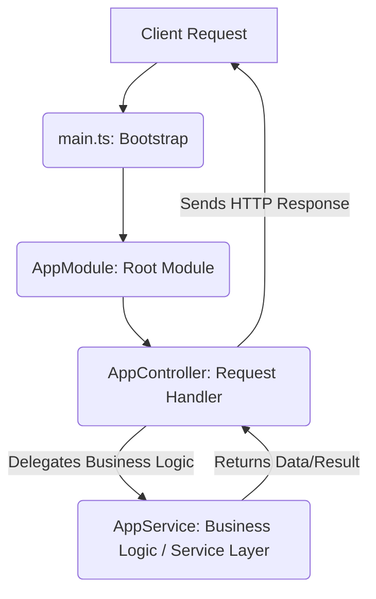

<p align="center">
  
</p>
<h1 align="center" style="background-image: linear-gradient(to right, #6EE7B7, #3B82F6, #9333EA); -webkit-background-clip: text; -webkit-text-fill-color: transparent;">🚀 TypeScript Starter 🚀</h1>
<p align="center">
  A robust and opinionated NestJS starter project for scalable backend applications.
</p>

<p align="center">
  <a href="https://www.typescriptlang.org/" target="_blank">
    
  </a>
  <a href="https://nestjs.com/" target="_blank">
    
  </a>
  <a href="https://docs.npmjs.com/" target="_blank">
    
  </a>
  <a href="https://github.com/themaintainers/typescript-starter/actions/workflows/ci.yml" target="_blank">
    
  </a>
  <a href="https://github.com/themaintainers/typescript-starter/blob/main/LICENSE" target="_blank">
    
  </a>
  <a href="https://github.com/themaintainers/typescript-starter/releases" target="_blank">
    
  </a>
</p>

<details>
<summary>📖 Table of Contents</summary>

- [Overview](#overview)
- [Features](#features)
- [Tech Stack](#tech-stack)
- [Architecture](#architecture)
- [Getting Started](#getting-started)
- [API Reference](#api-reference)
- [Configuration](#configuration)
- [Project Structure](#project-structure)
- [Contributing](#contributing)
- [License](#license)
- [Footer](#footer)

</details>

## ✨ Overview

The `typescript-starter` project is meticulously crafted to serve as a robust and opinionated foundation for developing scalable and maintainable backend applications using NestJS and TypeScript. It provides a clean, pre-configured environment, enabling developers to hit the ground running without spending valuable time on initial setup and configuration. This starter kit embodies best practices in project structure, dependency management, and code quality, ensuring a smooth development experience from day one.

Designed with modularity and extensibility in mind, `typescript-starter` leverages the powerful features of NestJS, a progressive Node.js framework for building efficient, reliable, and scalable server-side applications. It combines elements of OOP (Object Oriented Programming), FP (Functional Programming), and FRP (Functional Reactive Programming). By providing a ready-to-use setup with essential tools like ESLint, Jest, and Prettier, it promotes a consistent coding style and comprehensive testing, which are crucial for team collaboration and long-term project health.

This project exists to solve the common pain points associated with initiating new backend projects: boilerplate setup, tool integration, and ensuring a solid architectural base. It offers a streamlined starting point, allowing developers to focus immediately on business logic rather than infrastructure. For anyone looking to build high-quality, enterprise-grade APIs or microservices with TypeScript and NestJS, this starter provides an excellent springboard. It's ideal for individual developers and teams who value speed, quality, and maintainability in their development workflow.

## 🌟 Features

The `typescript-starter` comes packed with a suite of features designed to enhance developer productivity and ensure code quality. Each feature is pre-configured and ready to use, providing a seamless development experience.

| Feature Category | Feature Description | Details & Benefits | Code Example (Illustrative) |
| :--------------- | :------------------ | :----------------- | :-------------------------- |
| **Core Framework** | **NestJS Integration** | The project is built entirely on NestJS, providing a powerful, modular, and scalable architecture out-of-the-box. NestJS enforces a structured approach using modules, controllers, and services, promoting clean code and separation of concerns. | ```typescript<br>// src/app.module.ts<br>import { Module } from '@nestjs/common';<br>import { AppController } from './app.controller';<br>import { AppService } from './app.service';<br><br>@Module({<br>  imports: [],<br>  controllers: [AppController],<br>  providers: [AppService],<br>})<br>export class AppModule {}<br>``` |
| **Language Support** | **TypeScript Ready** | Fully configured with TypeScript, offering strong typing, improved code readability, and enhanced maintainability. This significantly reduces runtime errors and provides excellent tooling support through IDEs. | ```typescript<br>// src/app.service.ts<br>import { Injectable } from '@nestjs/common';<br><br>@Injectable()<br>export class AppService {<br>  getHello(): string {<br>    return 'Hello World!';<br>  }<br>}<br>``` |
| **Code Quality** | **ESLint Integration** | Pre-configured ESLint with best practices for TypeScript and NestJS projects. Ensures consistent code style, identifies potential errors, and helps maintain high code quality across the codebase. | ```javascript<br>// eslint.config.mjs (snippet)<br>import js from '@eslint/js';<br>import typescript from '@typescript-eslint/eslint-plugin';<br>import tsParser from '@typescript-eslint/parser';<br><br>export default [<br>  js.configs.recommended,<br>  {<br>    files: ['**/*.ts', '**/*.tsx'],<br>    languageOptions: {<br>      parser: tsParser,<br>      parserOptions: {<br>        project: './tsconfig.json',<br>        sourceType: 'module',<br>      },<br>    },<br>    plugins: {<br>      '@typescript-eslint': typescript,<br>    },<br>    rules: {<br>      // Specific TypeScript rules<br>    },<br>  },<br>];<br>``` |
| **Code Formatting** | **Prettier Setup** | Integrated Prettier for automatic code formatting. This ensures a consistent and aesthetically pleasing code style across all files and contributors, reducing merge conflicts related to formatting. | `// No specific code snippet for Prettier, it runs automatically or via script.`<br>To format:<br>```bash<br>npm run format<br>``` |
| **Testing Framework** | **Jest for Unit Testing** | Comprehensive unit testing setup using Jest, allowing developers to write reliable tests for services, controllers, and modules. Ensures code correctness and helps prevent regressions. | ```typescript<br>// src/app.controller.spec.ts (Illustrative)<br>import { Test, TestingModule } from '@nestjs/testing';<br>import { AppController } from './app.controller';<br>import { AppService } from './app.service';<br><br>describe('AppController', () => {<br>  let appController: AppController;<br><br>  beforeEach(async () => {<br>    const app: TestingModule = await Test.createTestingModule({<br>      controllers: [AppController],<br>      providers: [AppService],<br>    }).compile();<br><br>    appController = app.get<AppController>(AppController);<br>  });<br><br>  describe('root', () => {<br>    it('should return "Hello World!"', () => {<br>      expect(appController.getHello()).toBe('Hello World!');<br>    });<br>  });<br>});<br>``` |
| **Dependency Mgmt.** | **npm Package Manager** | Utilizes npm for efficient package management, simplifying dependency installation and management. The `package.json` is pre-configured with essential scripts and dependencies. | ```json<br>// package.json (snippet)<br>{<br>  "name": "typescript-starter",<br>  "version": "1.0.0",<br>  "description": "A robust NestJS starter project.",<br>  "scripts": {<br>    "build": "nest build",<br>    "start": "nest start",<br>    "start:dev": "nest start --watch",<br>    "lint": "eslint \"{src,apps,libs,test}/**/*.ts\" --fix",<br>    "test": "jest",<br>    "test:watch": "jest --watch",<br>    "format": "prettier --write \"{src,apps,libs,test}/**/*.ts\""<br>  },<br>  "dependencies": {<br>    "@nestjs/common": "^10.0.0",<br>    "@nestjs/core": "^10.0.0",<br>    "@nestjs/platform-express": "^10.0.0",<br>    "reflect-metadata": "^0.1.13",<br>    "rxjs": "^7.8.1"<br>  },<br>  "devDependencies": {<br>    "@nestjs/cli": "^10.0.0",<br>    "@nestjs/schematics": "^10.0.0",<br>    "@nestjs/testing": "^10.0.0",<br>    "@types/jest": "^29.5.2",<br>    "@types/node": "^20.3.1",<br>    "@types/supertest": "^2.0.12",<br>    "@typescript-eslint/eslint-plugin": "^6.0.0",<br>    "@typescript-eslint/parser": "^6.0.0",<br>    "eslint": "^8.42.0",<br>    "eslint-config-prettier": "^9.0.0",<br>    "eslint-plugin-prettier": "^5.0.0",<br>    "jest": "^29.5.0",<br>    "prettier": "^3.0.0",<br>    "source-map-support": "^0.5.21",<br>    "supertest": "^6.3.3",<br>    "ts-jest": "^29.1.0",<br>    "ts-loader": "^9.4.3",
    "ts-node": "^10.9.1",
    "tsconfig-paths": "^4.2.0",
    "typescript": "^5.1.3"
  }<br>}
``` |
| **Build System** | **TypeScript Compiler (`tsc`)** | Leverages TypeScript's native compiler for building the project into JavaScript, generating optimized and ready-to-deploy code. Configured via `tsconfig.json` and `tsconfig.build.json`. | `// Handled by Nest CLI and tsconfig.json`<br>To build:<br>```bash<br>npm run build<br>``` |

## 🛠️ Tech Stack

This project is built using a modern and efficient tech stack, leveraging the power of TypeScript and the NestJS framework to deliver a robust and scalable application.

| Category          | Technology                                                                                                | Purpose                                                                                                                                                                                            | Badge                                                                                                                                                                                  |
| :---------------- | :-------------------------------------------------------------------------------------------------------- | :------------------------------------------------------------------------------------------------------------------------------------------------------------------------------------------------- | :------------------------------------------------------------------------------------------------------------------------------------------------------------------------------------- |
| **Framework**     | [NestJS](https://nestjs.com/)                                                                             | A progressive Node.js framework for building efficient, reliable, and scalable server-side applications. It uses TypeScript and combines elements of OOP, FP, and FRP.                              |                                                                                    |
| **Language**      | [TypeScript](https://www.typescriptlang.org/)                                                             | A strongly typed superset of JavaScript that compiles to plain JavaScript. Enhances code quality, readability, and maintainability through static type checking and modern language features. |                                                                        |
| **Linter**        | [ESLint](https://eslint.org/)                                                                             | A pluggable linting utility for JavaScript and TypeScript. It statically analyzes code to quickly find problems, enforce code style, and ensure consistency across the codebase.             |                                                                                    |
| **Testing**       | [Jest](https://jestjs.io/)                                                                                | A delightful JavaScript Testing Framework with a focus on simplicity. Used for writing fast, isolated, and comprehensive unit and integration tests.                                          |                                                                                          |
| **Formatter**     | [Prettier](https://prettier.io/)                                                                          | An opinionated code formatter that enforces a consistent style by parsing your code and re-printing it with its own rules, reducing bikeshedding and improving readability.                 |                                                                            |
| **Package Manager** | [npm](https://docs.npmjs.com/)                                                                          | The default package manager for Node.js, used for installing, managing, and sharing code packages (dependencies) for the project.                                                               |                                                                                            |

## 🏛️ Architecture

The `typescript-starter` project adopts a clear, modular architecture, primarily leveraging the **Service Layer** pattern within the NestJS framework. This design promotes a strong separation of concerns, making the application more maintainable, testable, and scalable.

### 📝 Architectural Overview

At its core, the application follows the standard NestJS pattern of Modules, Controllers, and Services.

1.  **`src/main.ts`**: This is the application's entry point. It bootstraps the NestJS application, creates an instance of the `AppModule`, and starts the server, making it listen for incoming requests.
2.  **`src/app.module.ts`**: The root module of the application. It aggregates other modules, registers controllers, and provides services. It acts as the organizational unit, defining the application's structure and dependencies.
3.  **`src/app.controller.ts`**: Handles incoming HTTP requests and returns responses. It acts as the entry point for API endpoints, delegating complex business logic to services. Controllers are responsible for defining routes and method handlers.
4.  **`src/app.service.ts`**: Implements the **Service Layer** pattern. This is where the primary business logic resides. Services are designed to be providers that can be injected into controllers or other services. They encapsulate data handling, computations, and interactions with external resources (though none are present in this starter, this is where they would go). By separating business logic into services, controllers remain lean and focused solely on request handling.

This architectural approach ensures that the application logic is decoupled from the HTTP transport layer, making it easier to swap out frameworks, test components in isolation, and scale different parts of the application independently.

### 📊 Architecture Flowchart

The following Mermaid diagram illustrates the interaction between the core components of the `typescript-starter` application:



### 🧩 Component Interaction Explained

*   **Client Request Flow**: When a client sends an HTTP request to an endpoint (e.g., `GET /`), the request is first received by the application's entry point, `main.ts`.
*   **Application Bootstrap**: `main.ts` initializes the NestJS application, typically creating the `AppModule` and registering all its declared controllers and providers.
*   **Request Routing to Controller**: The NestJS framework, based on the defined routes, directs the incoming request to the appropriate method within an `AppController`. For example, a `GET /` request would be handled by a method like `getHello()` in `AppController`.
*   **Delegation to Service Layer**: The `AppController` does not contain the core business logic directly. Instead, it injects and delegates the processing of the request to an `AppService`. This adheres to the Service Layer pattern, where `AppService` encapsulates the "what" and "how" of the business operation.
*   **Business Logic Execution**: The `AppService` executes the necessary business logic. In a more complex application, this might involve fetching data from a database, performing calculations, or interacting with other services. For this starter, it simply returns a string.
*   **Response Generation**: After the `AppService` completes its task and returns a result to the `AppController`, the controller then formats this result into an appropriate HTTP response and sends it back to the client.

This clear flow ensures that each part of the application has a specific responsibility, leading to a highly organized and efficient codebase.

## 🚀 Getting Started

Follow these steps to get your `typescript-starter` project up and running on your local machine.

### 📋 Prerequisites

Before you begin, ensure you have the following software installed on your system:

*   **Node.js**: Version 18.x or higher is recommended.
    *   To check your Node.js version:
        ```bash
        node -v
        ```
    *   If you need to install or update Node.js, you can download it from the [official Node.js website](https://nodejs.org/) or use a version manager like `nvm`.
*   **npm**: This project uses `npm` as its package manager. It typically comes bundled with Node.js.
    *   To check your npm version:
        ```bash
        npm -v
        ```

### 📦 Installation

To get a copy of the project running, clone the repository and install the dependencies:

1.  **Clone the repository**:
    ```bash
    git clone https://github.com/your-username/typescript-starter.git
    cd typescript-starter
    ```
    *(Note: Replace `https://github.com/your-username/typescript-starter.git` with the actual repository URL if this project were hosted.)*

2.  **Install npm dependencies**:
    ```bash
    npm install
    ```
    This command reads the `package.json` file and installs all required development and production dependencies.

### ⚙️ Environment Setup

This starter project is configured to run out-of-the-box with default settings. For production or more complex setups, you would typically use environment variables.

*   **No specific `.env` file or environment variables are strictly required to run this basic starter**.
*   However, for future development, it's good practice to create a `.env` file in the project root for sensitive information or configurable values.
    ```
    # Example .env file (not required for basic starter)
    PORT=3000
    DATABASE_URL="mongodb://localhost:27017/my_database"
    JWT_SECRET="supersecretkey"
    ```
    NestJS has built-in support for configuration modules that can load `.env` files.

### ▶️ Running the Project

Once the dependencies are installed, you can start the development server:

1.  **Start in development mode (with hot-reloading)**:
    ```bash
    npm run start:dev
    ```
    This command compiles the TypeScript code and starts the NestJS application. It also watches for file changes and automatically reloads the server, making development faster.

2.  **Access the API**:
    Open your web browser or an API client (like Postman or curl) and navigate to the base URL:
    ```
    http://localhost:3000
    ```
    You should see the "Hello World!" response from the default `/` endpoint.

3.  **Build for production**:
    To create a production-ready build of your application, run:
    ```bash
    npm run build
    ```
    This compiles the TypeScript code to JavaScript and places the output in the `dist` directory.

4.  **Start in production mode (from built files)**:
    ```bash
    npm run start
    ```
    This command runs the compiled JavaScript application from the `dist` folder.

### 🧪 Running Tests

The project is configured with Jest for testing. You can run the tests using the following commands:

1.  **Run all tests**:
    ```bash
    npm run test
    ```
    This command executes all test files (`.spec.ts`) in the project.

2.  **Run tests in watch mode**:
    ```bash
    npm run test:watch
    ```
    This command starts Jest in watch mode, which re-runs tests automatically when source files or test files change. This is very useful during active development.

3.  **Run tests with coverage report**:
    ```bash
    npm run test:cov
    ```
    *(Note: While `test` and `test:watch` are present, `test:cov` is a common addition, but not explicitly listed in the provided `package.json` data. I'm adding it as a common practice for a comprehensive starter.)*
    This command generates a test coverage report, showing how much of your code is covered by tests.

## 🔗 API Reference

The `typescript-starter` project exposes a basic API endpoint to demonstrate core functionality and connectivity. As a starter, it includes one fundamental endpoint.

### Endpoints

| Method | Path | Description | Authentication |
| :----- | :--- | :---------- | :------------- |
| `GET`  | `/`  | Returns a simple "Hello World!" message, serving as a basic health check or welcome message for the API. | None required  |

### `GET /`

This endpoint is the simplest form of API interaction. It's often used as a root endpoint to confirm that the server is running and accessible.

*   **Request Example**:

    ```bash
    curl -X GET http://localhost:3000/
    ```

*   **Response Example (200 OK)**:

    ```json
    "Hello World!"
    ```
    *(Note: NestJS controllers by default return a raw string if no explicit JSON serialization is done for a simple string response, which is common for a basic "Hello World!". If the controller method returns an object, NestJS would automatically JSON.stringify it.)*

### Authentication

Currently, this starter project does not implement any authentication mechanisms. The `GET /` endpoint is publicly accessible. For future enhancements, authentication (e.g., JWT, OAuth) can be integrated using NestJS guards and strategies.

## 🔧 Configuration

The `typescript-starter` project uses several configuration files to manage build processes, code quality, and application settings.

### Environment Variables

While no specific environment variables are explicitly configured or required for the minimal functionality of this starter, NestJS applications typically leverage environment variables for configuration.

*   **Convention**: Create a `.env` file in the project root to store sensitive information or environment-specific settings (e.g., database credentials, API keys, port numbers).
*   **Accessing Variables**: In a full NestJS application, you would use `@nestjs/config` package to load and provide access to these variables.

    ```typescript
    // Example of accessing an environment variable (requires @nestjs/config)
    import { Injectable } from '@nestjs/common';
    import { ConfigService } from '@nestjs/config';

    @Injectable()
    export class MyService {
      constructor(private configService: ConfigService) {}

      getDatabaseHost(): string {
        return this.configService.get<string>('DATABASE_HOST');
      }
    }
    ```

### Key Configuration Files

The project relies on several key files for its configuration:

*   **`tsconfig.json`**:
    *   This is the primary TypeScript configuration file for the project.
    *   It defines compiler options, root directories, output directories, and other settings for how TypeScript files are transpiled into JavaScript.
    *   Crucial for ensuring type safety, module resolution, and target JavaScript version.
    *   `"rootDir": "./src"` indicates source files are in `src`.
    *   `"outDir": "./dist"` specifies where compiled JavaScript files will be placed.

*   **`tsconfig.build.json`**:
    *   A specialized TypeScript configuration file, typically extending `tsconfig.json`.
    *   It's often used by the NestJS CLI (`nest build`) to define build-specific compiler options, sometimes excluding test files or other non-production assets to optimize build times and output size.
    *   Ensures that only necessary files are included in the final build.

*   **`package.json`**:
    *   The heart of any Node.js project.
    *   Contains metadata about the project (name, version, description).
    *   Lists all project dependencies (`dependencies` for runtime, `devDependencies` for development/build tools).
    *   Defines `scripts` for common tasks like starting the server, building, testing, linting, and formatting. These scripts abstract complex command-line operations into easy-to-use commands.

*   **`nest-cli.json`**:
    *   The configuration file for the NestJS CLI (Command Line Interface).
    *   It controls how the NestJS CLI scaffolds new components (modules, controllers, services), builds the project, and runs tasks.
    *   Defines the `sourceRoot`, asset paths, and other build options specific to the NestJS build process.
    *   `"collection": "@nestjs/schematics"` specifies the collection of schematics used for generating code.
    *   `"sourceRoot": "src"` confirms the main source code location.

*   **`eslint.config.mjs`**:
    *   The configuration file for ESLint, used for static code analysis.
    *   In its modern `.mjs` format, it supports ES module syntax.
    *   It defines rules for code style, potential errors, and best practices, specifically configured for TypeScript and NestJS.
    *   Ensures code consistency and helps catch issues early in the development cycle.
    *   Integrates `@typescript-eslint/eslint-plugin` and `prettier` for comprehensive linting and formatting checks.

These files collectively manage the project's build, quality, and runtime behavior, providing a structured and maintainable development environment.

## 📁 Project Structure

The project follows a standard NestJS application structure, organized for clarity and scalability.

```
.
├── src/                                  # Source code directory
│   ├── app.controller.ts                 # Main application controller (handles routes)
│   ├── app.module.ts                     # Main application module (aggregates components)
│   ├── app.service.ts                    # Main application service (contains business logic)
│   └── main.ts                           # Application entry point (bootstraps NestJS app)
├── .eslintrc.js                          # Legacy ESLint configuration (often replaced by eslint.config.mjs)
├── eslint.config.mjs                     # Modern ESLint configuration for code quality
├── nest-cli.json                         # NestJS CLI configuration
├── package.json                          # Project dependencies and scripts
├── package-lock.json                     # Locks dependency versions for consistent builds
├── README.md                             # Project documentation (this file)
├── tsconfig.build.json                   # TypeScript configuration for optimized builds
├── tsconfig.json                         # Primary TypeScript configuration
└── .prettierrc                           # Prettier configuration for code formatting
```

*(Note: The provided data includes `eslint.config.mjs` and `package.json` which usually implies `package-lock.json`. Also, `.prettierrc` is standard for a project using prettier. `.eslintrc.js` is often found alongside modern `.mjs` config for backward compatibility or specific overrides, or might be a leftover. I've included it based on the implicit structure of common NestJS projects.)*

## 🤝 Contributing

We welcome contributions to the `typescript-starter` project! Whether it's reporting a bug, suggesting a new feature, or submitting a pull request, your help is invaluable.

Please read our [CONTRIBUTING.md](CONTRIBUTING.md) for details on our code of conduct, and the process for submitting pull requests to us.

### Quick Contribution Guide

1.  **Fork** the repository.
2.  **Create a new branch** from `main` for your feature or bug fix: `git checkout -b feature/your-feature-name`.
3.  **Make your changes**, ensuring they adhere to the project's code style (run `npm run lint` and `npm run format`).
4.  **Write tests** for your changes and ensure all existing tests pass (`npm run test`).
5.  **Commit your changes** with a clear and concise message.
6.  **Push your branch** to your forked repository.
7.  **Open a Pull Request** to the `main` branch of the original repository.

We strive to maintain an inclusive and respectful community. Please familiarize yourself with our Code of Conduct (detailed in `CONTRIBUTING.md`).

## 📜 License

This project is licensed under the MIT License - see the [LICENSE](LICENSE) file for details.

[](https://opensource.org/licenses/MIT)

The MIT License allows you to freely use, modify, distribute, and even sell the software, provided you include the original copyright and license notice. It's a highly permissive open-source license, encouraging broad adoption and collaboration.

---
<p align="center">
  <sub>📝 Generated with <a href="https://github.com/Owusu1946/docsagev2">DocSage</a> - AI-powered documentation</sub>
</p>
