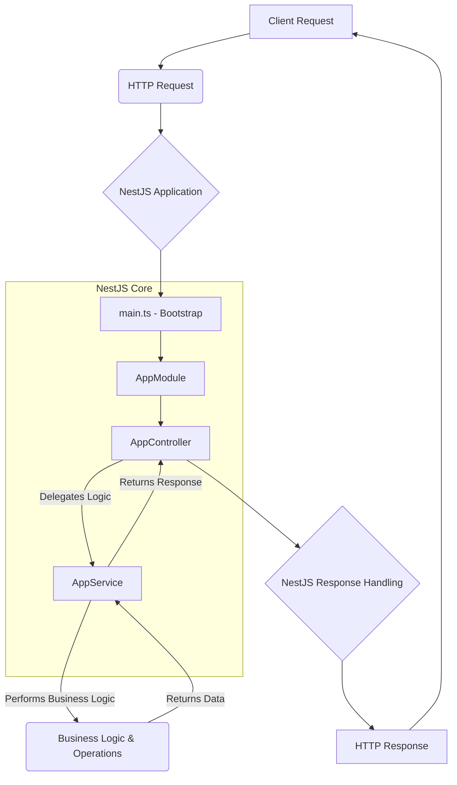

<p align="center">
  
</p>
<h1 align="center">
  <span style="background-image: linear-gradient(to right, #007ACC, #6A1B9A); -webkit-background-clip: text; -webkit-text-fill-color: transparent;">typescript-starter</span>
</h1>
<p align="center">
  A robust and opinionated starter template for building scalable applications with NestJS and TypeScript.
</p>

<p align="center">
  <!-- License Badge -->
  <a href="https://opensource.org/licenses/MIT">
    
  </a>
  <!-- NestJS Badge (example version) -->
  
  <!-- TypeScript Badge -->
  
  <!-- ESLint Badge -->
  
  <!-- Prettier Badge -->
  
  <!-- Jest Badge -->
  
  <!-- npm Badge -->
  
</p>

<details>
<summary>📖 Table of Contents</summary>

- [Overview](#overview)
- [Features](#features)
- [Tech Stack](#tech-stack)
- [Architecture](#architecture)
- [Getting Started](#getting-started)
- [API Reference](#api-reference)
- [Configuration](#configuration)
- [Project Structure](#project-structure)
- [Contributing](#contributing)
- [License](#license)

</details>

## 🚀 Overview

The `typescript-starter` project serves as a foundational boilerplate for developing modern, efficient, and maintainable server-side applications using NestJS and TypeScript. It is meticulously crafted to jumpstart development, offering a pre-configured environment that adheres to best practices and industry standards right out of the box. This starter kit aims to eliminate the initial setup overhead, allowing developers to focus immediately on business logic and feature implementation.

This project exists to solve the common challenge of setting up a new NestJS application from scratch, which often involves configuring various tools, linters, formatters, and testing frameworks. By providing a ready-to-use setup with essential development tools like ESLint for code quality, Prettier for consistent formatting, and Jest for robust testing, `typescript-starter` ensures a smooth and productive development experience from day one.

A key differentiator of `typescript-starter` is its focus on a robust development ecosystem coupled with architectural clarity. It integrates a well-defined Service Layer pattern, promoting separation of concerns and making the codebase easier to understand, test, and maintain. This structured approach, combined with the power of TypeScript for static typing, significantly reduces the likelihood of runtime errors and enhances developer productivity.

This starter project is ideal for developers and teams looking to quickly initiate new backend projects with NestJS. It caters to those who value strong typing, clean code, automated testing, and a well-organized project structure. Whether you are building RESTful APIs, microservices, or any other server-side application, `typescript-starter` provides a solid and reliable foundation to build upon.

## ✨ Features

`typescript-starter` comes packed with a set of pre-configured features designed to enhance developer experience and code quality:

| Feature Category | Feature | Description | Code Example |
| :--------------- | :------ | :---------- | :----------- |
| **Core Framework** | NestJS | A progressive Node.js framework for building efficient, reliable, and scalable server-side applications. It uses modern JavaScript, is built with TypeScript, and combines elements of OOP (Object Oriented Programming), FP (Functional Programming), and FRP (Functional Reactive Programming). | ```typescript\n// src/app.controller.ts\nimport { Controller, Get } from '@nestjs/common';\nimport { AppService } from './app.service';\n\n@Controller()\nexport class AppController {\n  constructor(private readonly appService: AppService) {}\n\n  @Get()\n  getHello(): string {\n    return this.appService.getHello();\n  }\n}\n``` |
| **Language Support** | TypeScript | A typed superset of JavaScript that compiles to plain JavaScript. It adds optional static typing to the language, improving code quality, maintainability, and developer tooling. | ```typescript\n// src/app.service.ts\nimport { Injectable } from '@nestjs/common';\n\n@Injectable()\nexport class AppService {\n  getHello(): string {\n    return 'Hello World!';\n  }\n}\n``` |
| **Code Quality** | ESLint | A pluggable linting utility for JavaScript and TypeScript. It helps identify and report on patterns found in ECMAScript/JavaScript code, with the goal of making code more consistent and avoiding bugs. | ```json\n// eslint.config.mjs excerpt\nexport default [\n  // ... other configs\n  {\n    files: ['**/*.ts', '**/*.tsx'],\n    plugins: { \n      '@typescript-eslint': tseslintPlugin\n    },\n    languageOptions: {\n      parser: tseslintParser,\n      parserOptions: { project: ['./tsconfig.json'] }\n    },\n    rules: {\n      '@typescript-eslint/interface-name-prefix': 'off',\n      '@typescript-eslint/explicit-function-return-type': 'off',\n      '@typescript-eslint/explicit-module-boundary-types': 'off',\n      '@typescript-eslint/no-explicit-any': 'off',\n    }\n  }\n];\n``` |
| **Code Formatting** | Prettier | An opinionated code formatter that enforces a consistent style by parsing your code and re-printing it with its own rules. It eliminates debates over style in code reviews. | ```json\n// package.json script\n"scripts": {\n  "format": "prettier --write \\"src/**/*.ts\\" \\"test/**/*.ts\\""\n}\n``` |
| **Testing Framework** | Jest | A delightful JavaScript testing framework with a focus on simplicity. It provides a complete and integrated testing solution, allowing for unit, integration, and snapshot tests. | ```typescript\n// src/app.controller.spec.ts\nimport { Test, TestingModule } from '@nestjs/testing';\nimport { AppController } from './app.controller';\nimport { AppService } from './app.service';\n\ndescribe('AppController', () => {\n  let appController: AppController;\n\n  beforeEach(async () => {\n    const app: TestingModule = await Test.createTestingModule({\n      controllers: [AppController],\n      providers: [AppService],\n    }).compile();\n\n    appController = app.get<AppController>(AppController);\n  });\n\n  describe('root', () => {\n    it('should return "Hello World!"', () => {\n      expect(appController.getHello()).toBe('Hello World!');\n    });\n  });\n});\n``` |
| **Architectural Pattern** | Service Layer | Implements a Service Layer pattern where business logic is encapsulated in services, promoting separation of concerns and reusability. | ```typescript\n// src/app.module.ts excerpt\nimport { Module } from '@nestjs/common';\nimport { AppController } from './app.controller';\nimport { AppService } from './app.service';\n\n@Module({\n  imports: [],\n  controllers: [AppController],\n  providers: [AppService], // AppService is provided here\n})\nexport class AppModule {}\n``` |

## 🛠️ Tech Stack

This project leverages a modern and robust tech stack to provide a solid foundation for development.

| Category | Technology | Purpose |
| :------- | :--------- | :------ |
| **Framework** | NestJS | A progressive Node.js framework for building efficient, reliable, and scalable server-side applications. |
| **Language** | TypeScript | A strongly typed superset of JavaScript that enhances code quality and maintainability. |
| **Code Linting** | ESLint | Used for identifying and reporting on patterns found in ECMAScript/TypeScript code to maintain code quality. |
| **Code Formatting** | Prettier | An opinionated code formatter that enforces a consistent style across the entire codebase. |
| **Testing** | Jest | A powerful and easy-to-use JavaScript testing framework for unit and integration tests. |
| **Package Management** | npm | The default package manager for Node.js, used for installing and managing project dependencies. |

## 🏛️ Architecture

The `typescript-starter` project is structured around the principles of modularity and separation of concerns, typical for NestJS applications, and explicitly incorporates the **Service Layer** architectural pattern.

### Architectural Diagram

Below is a simplified Mermaid flowchart illustrating the high-level architecture and how components interact within the application.



### Component Explanation

1.  **`main.ts` (Entry Point)**: This file serves as the main entry point of the NestJS application. It bootstraps the `AppModule`, which then initializes all other components. It's responsible for creating an instance of the NestFactory and starting the HTTP listener.

2.  **`AppModule` (Module)**: In NestJS, modules are used to organize application structure. `AppModule` is the root module, aggregating `AppController` and `AppService`. Modules encapsulate providers (like services) and controllers, defining a clear boundary for a feature or a part of the application.

3.  **`AppController` (Controller)**: Controllers are responsible for handling incoming client requests and returning responses. They act as the entry point for specific routes (e.g., `/`). Controllers delegate complex business logic to services, keeping themselves thin and focused on request-response handling.
    *   *Interaction*: `AppController` receives HTTP requests and calls methods on `AppService` to process the request.

4.  **`AppService` (Service Layer)**: This is where the core business logic resides. Services are designed to be singletons and are responsible for specific functionalities, data manipulation, or interactions with external resources. The detection of a **Service Layer** confirms that `src/app.service.ts` encapsulates the application's business rules, promoting reusability and testability.
    *   *Interaction*: `AppService` performs the actual work required by the controller, abstracting away the implementation details. It returns processed data or results back to the `AppController`.

5.  **HTTP Request/Response Cycle**: A client initiates an HTTP request, which is routed through the NestJS application. The `AppController` receives and processes the request, potentially involving the `AppService` for business logic. Finally, an HTTP response is sent back to the client.

This architecture ensures a clear separation of concerns: controllers handle the web layer, services handle the business logic, and modules organize these components into cohesive units.

## 🚀 Getting Started

Follow these instructions to get a copy of the project up and running on your local machine for development and testing purposes.

### Prerequisites

Before you begin, ensure you have the following installed on your system:

*   **Node.js**: `v18.x` or higher (LTS recommended)
    *   Verify with: `node -v`
*   **npm**: `v9.x` or higher (comes with Node.js)
    *   Verify with: `npm -v`
*   **Git**: For cloning the repository.
    *   Verify with: `git --version`

### Installation

1.  **Clone the repository**:
    ```bash
    git clone https://github.com/your-username/typescript-starter.git
    cd typescript-starter
    ```

2.  **Install dependencies**:
    ```bash
    npm install
    ```

### Environment Setup

This project uses configuration files like `nest-cli.json` and `tsconfig.json` which are handled automatically. For environment-specific variables, you might typically use a `.env` file, though no specific `.env` variables are required for this basic starter. If your application grows, you would add an `.env` file in the root directory and load it using a package like `@nestjs/config` or `dotenv`.

### Running the Project

To start the development server:

```bash
npm run start:dev
```

This command will:
*   Compile the TypeScript code.
*   Start the NestJS application in watch mode, automatically recompiling and restarting on file changes.
*   The application will typically be accessible at `http://localhost:3000`.

### Running Tests

To execute the test suite:

```bash
npm run test
```

This command will run all unit and integration tests configured with Jest.

For watching tests during development:

```bash
npm run test:watch
```

## 📋 API Reference

This section details the available API endpoints in the `typescript-starter` project.

### Endpoints

| Method | Path | Description |
| :----- | :--- | :---------- |
| `GET` | `/` | Returns a simple "Hello World!" message to confirm the API is running. |

### `GET /`

Returns a basic greeting. This endpoint demonstrates the core functionality of a controller and service interaction.

#### Request

```bash
curl -X GET http://localhost:3000/
```

#### Response

```json
"Hello World!"
```

#### Authentication

No authentication is required for this endpoint. This starter project does not include authentication mechanisms by default, focusing on providing a clean base for core application logic.

## ⚙️ Configuration

The `typescript-starter` project is configured through several key files. While many settings are provided out-of-the-box, you might need to adjust some for specific environments or development needs.

### Environment Variables

Although not explicitly used in the minimal setup, NestJS applications commonly rely on environment variables for sensitive data or deployment-specific settings. You would typically create a `.env` file in the project root.

Example `.env` (not required for initial run):

```ini
# Optional: Port for the application to listen on. Defaults to 3000.
PORT=3001
```

To access these variables within your NestJS application, you would use `@nestjs/config` module.

### Configuration Files

*   **`tsconfig.json`**: The primary TypeScript configuration file. It defines compiler options, root directories, and output targets for TypeScript compilation.
    *   Key options: `target`, `module`, `strict`, `outDir`, `rootDir`.
*   **`tsconfig.build.json`**: An extension of `tsconfig.json` specifically for production builds, often excluding test files or development-only types.
*   **`package.json`**: Contains project metadata, script commands (`start:dev`, `test`, `format`, `lint`), and lists all project dependencies (`dependencies` and `devDependencies`).
*   **`nest-cli.json`**: The Nest CLI configuration file. It defines project settings like source root, entry file, and asset paths for the NestJS command-line interface.
    *   Example: Defines `src` as the source root and `main` as the entry file.
*   **`eslint.config.mjs`**: The configuration file for ESLint, specifying linting rules, plugins (like `@typescript-eslint`), and parser options to maintain code quality and consistency.

## 📂 Project Structure

The project follows a standard NestJS directory structure, designed for modularity and scalability.

```
.
├── src/
│   ├── app.controller.ts    # Handles incoming requests and returns responses
│   ├── app.module.ts        # The root module, organizing controllers and services
│   ├── app.service.ts       # Encapsulates business logic (Service Layer)
│   └── main.ts              # Application entry point, bootstraps NestJS
├── test/                    # Contains end-to-end and unit tests
│   └── app.e2e-spec.ts
├── .eslintrc.json           # ESLint configuration
├── .gitignore               # Specifies intentionally untracked files to ignore
├── nest-cli.json            # NestJS CLI configuration
├── package.json             # Project metadata and dependencies
├── README.md                # This README file
├── tsconfig.build.json      # TypeScript configuration for building
├── tsconfig.json            # Base TypeScript configuration
└── eslint.config.mjs        # Unified ESLint configuration
```

## 🤝 Contributing

We welcome contributions to `typescript-starter`! If you're interested in improving this project, please consider the following:

*   **Reporting Bugs**: If you find a bug, please open an issue in the GitHub repository.
*   **Suggesting Enhancements**: Have an idea for a new feature or an improvement? Open an issue to discuss it.
*   **Submitting Pull Requests**:
    1.  Fork the repository.
    2.  Create a new branch (`git checkout -b feature/YourFeature`).
    3.  Make your changes.
    4.  Ensure your code adheres to the project's coding style (run `npm run format` and `npm run lint`).
    5.  Write or update tests for your changes.
    6.  Commit your changes (`git commit -m 'feat: Add new feature'`).
    7.  Push to the branch (`git push origin feature/YourFeature`).
    8.  Open a Pull Request.

Please refer to the `CONTRIBUTING.md` file (if present) in the repository for a more detailed guide on how to contribute. All contributors are expected to abide by the project's Code of Conduct.

## 📄 License

This project is licensed under the MIT License.

[](https://opensource.org/licenses/MIT)

The MIT License allows you to do almost anything with the software, including making it proprietary, as long as you include the original copyright and license notice. For more details, see the `LICENSE` file in the repository.

---
<p align="center">
  <sub>📝 Generated with <a href="https://github.com/Owusu1946/docsagev2">DocSage</a> - AI-powered documentation</sub>
</p>
