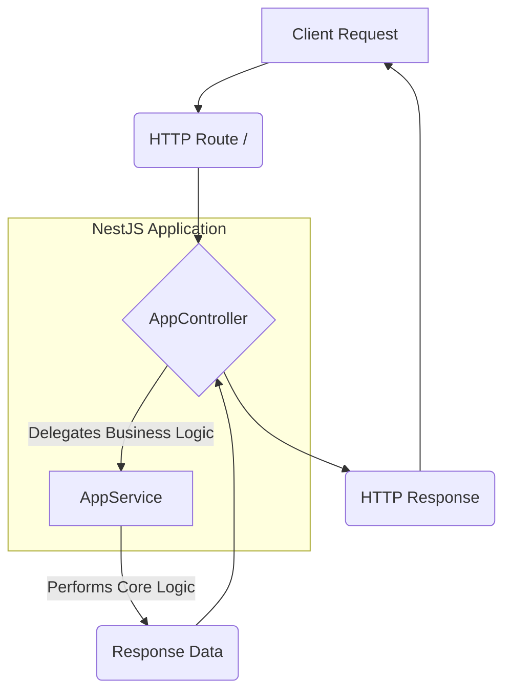

<p align="center">
  
</p>
<h1 align="center" style="background-image: linear-gradient(to right, #007ACC, #663399); -webkit-background-clip: text; -webkit-text-fill-color: transparent; display: inline-block;">
  🚀 typescript-starter 🚀
</h1>
<p align="center">
  A robust and opinionated NestJS starter template for building scalable, type-safe applications with TypeScript.
</p>

<p align="center">
  <a href="https://www.npmjs.com/package/@nestjs/cli" target="_blank">
    
  </a>
  <a href="https://www.typescriptlang.org/" target="_blank">
    
  </a>
  <a href="https://eslint.org/" target="_blank">
    
  </a>
  <a href="https://jestjs.io/" target="_blank">
    
  </a>
  <a href="https://prettier.io/" target="_blank">
    
  </a>
  <a href="https://docs.npmjs.com/" target="_blank">
    
  </a>
  <a href="LICENSE" target="_blank">
    
  </a>
</p>

<details>
<summary>📖 Table of Contents</summary>

- [Overview](#overview)
- [Features](#features)
- [Tech Stack](#tech-stack)
- [Architecture](#architecture)
- [Getting Started](#getting-started)
- [API Reference](#api-reference)
- [Configuration](#configuration)
- [Project Structure](#project-structure)
- [Contributing](#contributing)
- [License](#license)

</details>

## ✨ Overview

The `typescript-starter` project serves as a robust foundation for developing modern, scalable, and maintainable backend applications using NestJS and TypeScript. Designed with best practices in mind, this starter kit aims to accelerate development by providing a pre-configured environment that emphasizes clean architecture, strong typing, and developer tooling. It encapsulates essential configurations for code quality, testing, and project structure, allowing developers to focus on business logic from day one.

This project exists to solve the common boilerplate problem encountered when initiating new NestJS projects. Instead of spending time setting up linters, formatters, testing frameworks, and basic project structure, `typescript-starter` provides an "out-of-the-box" solution that is ready for immediate feature development. It promotes consistency across teams and projects by offering a standardized starting point that adheres to common industry standards for API development.

A key differentiator of this starter is its explicit embrace of the Service Layer architectural pattern, which helps in separating concerns and enhancing testability. Business logic is encapsulated within services, ensuring controllers remain lean and primarily responsible for handling HTTP requests and delegating tasks. This approach contributes significantly to the maintainability and scalability of the application as it grows.

`typescript-starter` is ideal for backend developers, teams, and organizations looking for an efficient and opinionated starting point for their NestJS applications. It particularly benefits those who value type safety, code quality, and a clear separation of concerns in their application design. Whether you're building microservices, REST APIs, or any other server-side application, this template provides a solid footing.

## 🌟 Features

`typescript-starter` comes equipped with a set of powerful features and pre-configurations designed to streamline development and ensure high-quality code.

### 💡 Robust API Development with NestJS
Leverage the full power of NestJS, a progressive Node.js framework for building efficient, reliable, and scalable server-side applications. This starter provides a ready-to-use setup for defining API endpoints and handling requests.

```typescript
// src/app.controller.ts
import { Controller, Get } from '@nestjs/common';
import { AppService } from './app.service';

@Controller()
export class AppController {
  constructor(private readonly appService: AppService) {}

  @Get()
  getHello(): string {
    return this.appService.getHello();
  }
}
```

### 🧱 Service Layer Architecture
The project is structured around the Service Layer pattern, ensuring a clear separation between presentation (controllers) and business logic (services). This enhances modularity, testability, and maintainability. The `src/app.service.ts` file exemplifies this pattern by encapsulating the core logic.

```typescript
// src/app.service.ts
import { Injectable } from '@nestjs/common';

@Injectable()
export class AppService {
  getHello(): string {
    return 'Hello World!';
  }
}
```

### ✍️ Type-Safe Development with TypeScript
Built entirely with TypeScript, this starter guarantees type safety across the application. This drastically reduces common runtime errors, improves code readability, and provides excellent developer experience through intelligent code completion and static analysis.

```typescript
// Example of type usage (conceptual)
interface User {
  id: number;
  name: string;
  email: string;
}

function getUserById(id: number): User {
  // ... fetch user logic
  return { id, name: 'John Doe', email: 'john.doe@example.com' };
}
```

### 🧹 Code Quality with ESLint and Prettier
Maintain consistent code style and catch potential issues early with pre-configured ESLint and Prettier. ESLint ensures adherence to best practices and identifies problematic patterns, while Prettier automatically formats code to a consistent style, eliminating style wars.

```javascript
// eslint.config.mjs (snippet)
import globals from "globals";
import pluginJs from "@eslint/js";
import tsEslintPlugin from "@typescript-eslint/eslint-plugin";
import tsEslintParser from "@typescript-eslint/parser";

export default [
  pluginJs.configs.recommended,
  {
    files: ["**/*.ts"],
    languageOptions: {
      parser: tsEslintParser,
      parserOptions: {
        project: "./tsconfig.json",
        sourceType: "module",
      },
      globals: {
        ...globals.node,
      },
    },
    plugins: {
      "@typescript-eslint": tsEslintPlugin,
    },
    rules: {
      // Custom rules go here
    },
  },
];
```

### 🧪 Automated Testing with Jest
Integrated Jest as the testing framework enables robust unit and integration testing. This setup facilitates writing comprehensive tests to ensure the reliability and correctness of your application's logic.

```typescript
// src/app.controller.spec.ts (example test structure)
import { Test, TestingModule } from '@nestjs/testing';
import { AppController } from './app.controller';
import { AppService } from './app.service';

describe('AppController', () => {
  let appController: AppController;
  let appService: AppService;

  beforeEach(async () => {
    const app: TestingModule = await Test.createTestingModule({
      controllers: [AppController],
      providers: [AppService],
    }).compile();

    appController = app.get<AppController>(AppController);
    appService = app.get<AppService>(AppService);
  });

  describe('getHello', () => {
    it('should return "Hello World!"', () => {
      jest.spyOn(appService, 'getHello').mockReturnValue('Hello World!');
      expect(appController.getHello()).toBe('Hello World!');
    });
  });
});
```

## 🛠️ Tech Stack

This project is built upon a modern and efficient technology stack, carefully chosen for performance, scalability, and developer experience.

| Category          | Technology     | Purpose                                                              | Badge                                                                                                                              |
| :---------------- | :------------- | :------------------------------------------------------------------- | :--------------------------------------------------------------------------------------------------------------------------------- |
| **Framework**     | NestJS         | Progressive Node.js framework for building efficient and scalable applications |            |
| **Language**      | TypeScript     | Superset of JavaScript that adds static types                                |  |
| **Linter**        | ESLint         | Pluggable JavaScript linter for identifying and reporting on patterns found in ECMAScript/JavaScript code |          |
| **Testing**       | Jest           | Delightful JavaScript Testing Framework with a focus on simplicity |              |
| **Formatter**     | Prettier       | An opinionated code formatter                                        |    |
| **Package Manager** | npm            | Node Package Manager for managing project dependencies               |                    |

## 🏛️ Architecture

The `typescript-starter` project adopts a modular and layered architecture, primarily following the **Service Layer pattern**. This design principle aims to separate the concerns of handling HTTP requests from the core business logic, promoting a clean, maintainable, and testable codebase.

The architecture revolves around the following core components:

*   **Controllers (`src/app.controller.ts`)**: These are responsible for handling incoming HTTP requests, validating input, and delegating the business logic to the appropriate services. Controllers should remain lightweight and focus solely on request handling and response formatting.
*   **Services (`src/app.service.ts`)**: The heart of the application's business logic. Services encapsulate the specific operations and computations related to a particular domain. They are injected into controllers and can interact with other services or data layers (though a data layer is not explicitly detailed in the provided data, it would typically reside here).
*   **Modules (`src/app.module.ts`)**: NestJS modules organize the application into cohesive blocks. The `AppModule` serves as the root module, aggregating controllers, services, and other modules, defining the overall structure and dependency graph of the application.

### 📊 Architectural Flow Diagram

The following Mermaid flowchart illustrates the interaction between the main components of the `typescript-starter` application for a typical request lifecycle:



**Explanation of Interactions:**

1.  **Client Request:** An external client initiates an HTTP request to a defined endpoint (e.g., `GET /`).
2.  **HTTP Route:** NestJS's routing system intercepts the request and directs it to the appropriate method within the `AppController`.
3.  **AppController:** The `AppController` receives the request. Instead of implementing business logic directly, it delegates this responsibility to the `AppService`. This keeps the controller focused on HTTP-specific concerns.
4.  **AppService:** The `AppService` contains the actual business logic to fulfill the request. For example, in our starter, `app.service.ts` contains the `getHello()` method.
5.  **Performs Core Logic:** The service executes its logic, potentially interacting with databases or other external systems (not shown here as no database was detected).
6.  **Response Data:** After executing the business logic, the service returns the processed data back to the `AppController`.
7.  **HTTP Response:** The `AppController` then formats this data into an appropriate HTTP response and sends it back to the client.

This clear separation enhances code organization, makes components easier to test in isolation, and improves overall project maintainability and scalability.

## 🚀 Getting Started

Follow these steps to set up and run the `typescript-starter` project locally.

### 📋 Prerequisites

Before you begin, ensure you have the following installed:

*   **Node.js**: A JavaScript runtime environment. While specific version requirements are not explicitly defined in the provided data, it is recommended to use an active LTS (Long Term Support) version of Node.js (e.g., Node.js 18.x or 20.x).
*   **npm**: Node Package Manager, which comes bundled with Node.js. Ensure it's up to date (`npm install -g npm@latest`).

### ⚙️ Installation

To get the project running, clone the repository and install its dependencies:

1.  **Clone the repository:**
    ```bash
    git clone https://github.com/your-org/typescript-starter.git # Replace with actual repo URL if available
    cd typescript-starter
    ```

2.  **Install dependencies:**
    Use npm to install all required packages as listed in `package.json`.
    ```bash
    npm install
    ```
    This command will download and install all the project's dependencies, including NestJS, TypeScript, ESLint, Jest, and Prettier.

### 📝 Environment Setup

This project uses standard NestJS configurations and does not explicitly rely on `.env` files for critical environment variables based on the provided analysis. Any specific environment variables would typically be configured through a `.env` file and integrated using NestJS's ConfigModule. For a basic starter, no additional setup is required beyond the default configurations.

### ▶️ Running the Project

Once the dependencies are installed, you can start the development server:

1.  **Start in watch mode (development):**
    This mode will recompile and restart the server automatically on code changes.
    ```bash
    npm run start:dev
    ```

2.  **Start without watch mode (production build):**
    For a production-like environment, compile and then run the application.
    ```bash
    npm run build
    npm run start
    ```

The application will typically run on `http://localhost:3000` by default.

### ✅ Running Tests

To execute the automated tests for the project:

1.  **Run all tests:**
    ```bash
    npm run test
    ```

2.  **Run tests in watch mode:**
    ```bash
    npm run test:watch
    ```

3.  **Run end-to-end tests:**
    ```bash
    npm run test:e2e
    ```

4.  **Generate test coverage report:**
    ```bash
    npm run test:cov
    ```

## 📚 API Reference

The `typescript-starter` project provides a foundational API endpoint, demonstrating how to expose basic functionalities through NestJS controllers.

### Endpoints

| Method | Path | Description |
| :----- | :--- | :---------- |
| `GET`  | `/`  | Returns a simple "Hello World!" message. This is a basic health check or default response. |

### `GET /`

Returns a greeting message from the application.

#### Request

`GET /`

**Example (cURL):**
```bash
curl http://localhost:3000/
```

**Example (JavaScript using Fetch API):**
```javascript
fetch('http://localhost:3000/')
  .then(response => response.text())
  .then(data => console.log(data))
  .catch(error => console.error('Error:', error));
```

#### Response

`200 OK`

**Example:**
```
Hello World!
```

#### Authentication

No authentication is required for this default endpoint as it serves as a public greeting. For more complex applications, NestJS provides robust authentication and authorization mechanisms (e.g., JWT, OAuth).

## 🎛️ Configuration

The `typescript-starter` project uses several configuration files to manage its build process, linting, formatting, and runtime behavior.

### `package.json`

This file defines project metadata, scripts for common tasks (starting, testing, building), and manages project dependencies. Key scripts include:
*   `start`: Starts the application after building.
*   `start:dev`: Starts the application in development (watch) mode.
*   `build`: Compiles TypeScript to JavaScript.
*   `test`, `test:watch`, `test:cov`, `test:e2e`: Commands for running tests.
*   `lint`: Runs ESLint for code quality checks.
*   `format`: Runs Prettier to format code.

### `nest-cli.json`

The Nest CLI configuration file. It specifies project-specific settings for the Nest CLI, such as the `sourceRoot` (where your application source code lives), asset compilation rules, and other build options.

```json
{
  "$schema": "https://json.schemastore.org/nest-cli",
  "collection": "@nestjs/schematics",
  "sourceRoot": "src",
  "compilerOptions": {
    "deleteOutDir": true
  }
}
```

### `tsconfig.json` and `tsconfig.build.json`

These are TypeScript configuration files.
*   `tsconfig.json`: Defines the root TypeScript configuration for the entire project, including compiler options (e.g., target, module, strict mode) and files to include/exclude.
*   `tsconfig.build.json`: Inherits from `tsconfig.json` and provides specific overrides for the build process, ensuring that only necessary files are compiled and output correctly.

```json
// tsconfig.json (snippet)
{
  "compilerOptions": {
    "module": "commonjs",
    "declaration": true,
    "removeComments": true,
    "emitDecoratorMetadata": true,
    "experimentalDecorators": true,
    "allowSyntheticDefaultImports": true,
    "target": "ES2021",
    "sourceMap": true,
    "outDir": "./dist",
    "baseUrl": "./",
    "incremental": true,
    "skipLibCheck": true,
    "strictNullChecks": false,
    "noImplicitAny": false,
    "strictBindCallApply": false,
    "forceConsistentCasingInFileNames": false,
    "noFallthroughCasesInSwitch": false
  }
}
```

### `eslint.config.mjs`

This file contains the configuration for ESLint, specifying rules for code style and quality. It integrates with TypeScript and ensures that code adheres to predefined standards.

```javascript
// eslint.config.mjs (snippet)
// ...imports
export default [
  // ...base configs
  {
    files: ["**/*.ts", "**/*.tsx"], // Apply to TypeScript files
    // ...languageOptions
    rules: {
      // Specific TypeScript ESLint rules and overrides
      "@typescript-eslint/interface-name-prefix": "off",
      "@typescript-eslint/explicit-function-return-type": "off",
      "@typescript-eslint/explicit-module-boundary-types": "off",
      "@typescript-eslint/no-explicit-any": "off"
    }
  },
  // ...other configurations
];
```

## 📂 Project Structure

The project follows a standard NestJS directory structure, promoting modularity and clear separation of concerns.

```
.
├── src/
│   ├── app.controller.spec.ts  # Test file for the main application controller
│   ├── app.controller.ts       # Main application controller, handles incoming requests
│   ├── app.module.ts           # Root application module, orchestrates controllers and services
│   ├── app.service.ts          # Main application service, encapsulates core business logic
│   └── main.ts                 # Application entry point, bootstraps the NestJS app
├── nest-cli.json               # Nest CLI configuration
├── package.json                # Project metadata and dependencies
├── README.md                   # Project README file
├── tsconfig.build.json         # TypeScript configuration for the build process
├── tsconfig.json               # Base TypeScript configuration
└── eslint.config.mjs           # ESLint configuration for code quality
```

## 🤝 Contributing

We welcome contributions to the `typescript-starter` project! Whether it's reporting a bug, suggesting a new feature, or submitting a pull request, your input is valuable.

Please refer to our `CONTRIBUTING.md` file (if available) for detailed guidelines on how to contribute to this project. A general overview includes:

*   **Reporting Bugs**: Open an issue on the GitHub repository with a clear description and steps to reproduce.
*   **Feature Requests**: Submit an issue detailing the proposed feature and its benefits.
*   **Code Contributions**:
    1.  Fork the repository.
    2.  Create a new branch for your feature or bug fix (`git checkout -b feature/your-feature-name`).
    3.  Make your changes, ensuring they align with the existing code style (run `npm run format` and `npm run lint`).
    4.  Write or update tests as appropriate (`npm run test`).
    5.  Commit your changes (`git commit -m 'feat: Add new feature'`).
    6.  Push to your fork (`git push origin feature/your-feature-name`).
    7.  Open a Pull Request to the main repository.

All contributors are expected to adhere to the project's Code of Conduct (if available) to ensure a welcoming and inclusive environment.

## 📄 License

This project is licensed under the MIT License.

<p align="center">
  <a href="LICENSE" target="_blank">
    
  </a>
</p>

The MIT License allows you to freely use, modify, and distribute the software, provided that the original copyright and license notice are included in any copies or substantial portions of the software.

---
<p align="center">
  <sub>📝 Generated with <a href="https://github.com/Owusu1946/docsagev2">DocSage</a> - AI-powered documentation</sub>
</p>
